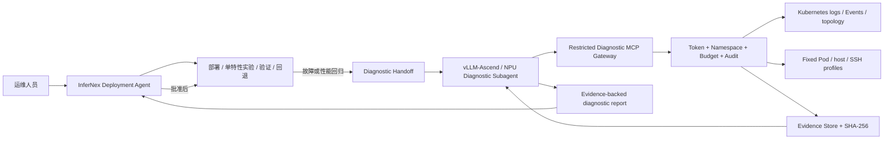

# 故障诊断 Subagent 架构设计

## 1. 角色边界



主 Agent拥有目标和事务，Subagent拥有诊断推理。Subagent不能自行部署新服务、修改 values、重启
实例或执行回退。这样后续诊断实现可以独立更换模型、框架和发布节奏，而不会形成第二套 InferNex
控制面。

## 2. 当前实现

`diagnose` 及以上模式可启用独立 Streamable HTTP MCP listener，默认：

```text
http://127.0.0.1:18082/mcp
/etc/infernex-agent/diagnostic-subagent-token
```

该 listener 使用独立 server identity `infernex-agent-diagnostic-delegate`，与主 Agent `/mcp` 不共享
工具目录。它具有：

- bearer token constant-time 校验；
- 1–64 的并发硬限制，安装默认 4；
- 安装发现 namespace 的严格 allow-list；
- 15 分钟/256 MiB 的事件采集默认值；
- 60 分钟/2 GiB 的委派采集硬上限；
- 完整 MCP schema 和 `infernex_get_diagnostic_delegate_contract` 能力协商；
- 复用主 Agent 的 Kubernetes client、CollectorRun、PlogCapture、Evidence Store 和 Skills。

受限端点不发布部署、恢复、实验、长期记忆写入和任意 resource read。即使第三方 Subagent 把
`confirm=true` 写入参数，也只能启动已被诊断委派策略允许、只写 Agent Evidence 的有界采集任务。

## 3. 跨节点和容器

Kubernetes stdout/Event 通过 API Server 读取，Pod 位于哪个 Node 不影响访问。CollectorRun 每轮重新
展开 label selector，记录 Pod UID、container、device ID 和时间，因此能覆盖滚动替换和多实例。

底层日志有三类通道：

| 通道 | 当前状态 | 使用方式 |
| --- | --- | --- |
| 业务 Pod | 已实现 | 固定 profile `pods/exec`；命令使用容器自身 UID |
| Agent 安装节点 | 已实现 | 隔离 root helper，只接受编译内 profile |
| 其他节点宿主机 | 部分实现 | 预授权 SSH alias；短命诊断 DaemonSet/Job 尚待实现 |

短命 DaemonSet/Job 后续必须使用批准镜像、固定 profile hash、节点/设备 scope、deadline、容量预算和
自动清理；不能向业务 Pod 注入 sidecar，也不能成为默认常驻组件。

## 4. 事件触发模型

后续 `DiagnosticTrigger` 根据以下事实判断是否委派：

1. 查询 Change Journal 和 configuration version，确定是否处于计划 rollout/upgrade；
2. 比较 owner generation、revision、Pod UID、restart count、termination reason 和 Node condition；
3. 计划变更期间只采部署验收必需证据；非计划 replacement 才触发 plog/previous logs 短窗口；
4. 性能回归使用同模型、同数据、同并发和同拓扑基线比较；
5. 触发事件、委派 ID、Evidence ID、报告 ID 和最终 deployment decision 双向关联。

当前版本已经提供手动/Agent 调用的有界采集与受限委派端点；自动 `DiagnosticTrigger` 和上述 ID
关联是下一迭代，不应在文档中伪装为已完成。

## 5. 兼容与演进

- MCP tool 名称和输入字段按兼容方式演进；新增可选字段不破坏旧客户端。
- Subagent 必须先读取 contract，不能根据 Agent 版本猜权限。
- 不兼容 schema 变更提升 `apiVersion`，至少保留一个 prerelease 兼容周期。
- 领域 Skill 可独立增加，但不授予工具或权限。
- 诊断报告是建议和证据索引；部署成功、稳定和回退仍由主 Agent 的确定性 gate 判定。

