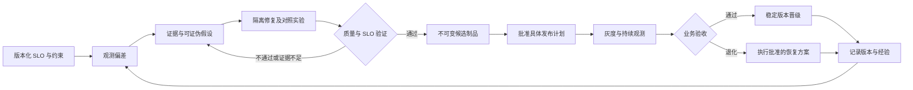

# 基础设施 Agent 业界洞察与 InferNex Agent 演进建议

调研日期：2026-09-20。项目比较基线：`infernex-agent-v0.5.0-alpha.15`，源码 `0292d752e74d5fc93707fa85f4db99f116325014`。

本文是研究与设计建议，不代表后续能力已经实现。排期统一维护在[当前路线图](https://github.com/lsjfy-open-com/infernex-agent/blob/develop/component/InferNex-Agent/docs/development/roadmap-zh.md)，原生部署边界见[Kubernetes 分层契约](https://github.com/lsjfy-open-com/infernex-agent/blob/develop/component/InferNex-Agent/docs/architecture/kubernetes-first-zh.md)。外部资料按访问日理解；`main`、`latest`、`dev` 文档会变化，接入前必须固定版本重新验证。

术语约定：K8s 指 Kubernetes；SLO（Service Level Objective）指服务级目标；MCP（Model Context Protocol，模型上下文协议）供 Agent 调用工具；CRD（CustomResourceDefinition，自定义资源定义）用于在 Kubernetes 中声明自定义资源类型，例如 InferNexService；RBAC（Role-Based Access Control）指基于角色的访问控制；OCI（Open Container Initiative）是制定容器镜像等规范的组织。推理指标 TTFT（Time To First Token）指首 token 延迟，ITL（Inter-Token Latency）指相邻 token 间延迟，TPOT（Time Per Output Token）指每个输出 token 的平均耗时；ITL 与 TPOT 仍需对齐具体统计口径。其余专用缩写在附近解释。

## 1. 核心判断

产品应从“帮助定位故障的工具 Agent”演进为“围绕 SLO 交付系统改进的工程 Agent”：发现问题之后，能够构造实验、修复或优化、构建候选制品、发布验证，并在退化时恢复已知稳定状态。自动部署与自动运维仍是两条业务主线，共用目标、证据、实验、版本和变更机制。

本次选择五类互补工作，而不把它们当作同类产品排名：智谱 Infra Agent 代表深层工程优化；AIOpsLab 代表可重复故障评测；kagent 代表 Kubernetes 工具与审批编排；Dynamo/AIConfigurator 代表推理容量规划和运行调节；Argo Rollouts 与 Monzo 实践代表基于指标的发布控制。OCI 则提供镜像制品基础。

我们的机会在于把这些方法接成可交付闭环，覆盖客户原有 K8s 平台及 GPU/NPU 差异。当前还没有证据证明我们的性能、修复率或运维效率优于这些方案，也没有跨方案同负载实测，不能制作胜负排名。

## 2. 智谱：从定位走向工程修改

智谱 2026-09-17 披露，GLM-5.3 Infra Agent 参与了推理基础设施建设。其方法是让 Agent 用正确性测试、时间线、微基准和端到端指标验证假设与代码修改；目标和关键风险仍由工程师负责。公开材料未提供可直接复用的独立 Agent 安装包或完整客户适配契约。[智谱原文](https://z.ai/blog/glm-built-its-inference-infrastructure)

下表只记录厂商报告的结果，不视为独立复现，也不将团队和系统优化收益全部归于 Agent：

| 案例 | 披露的效果与比较对象 | 解读边界 |
| --- | --- | --- |
| 整体建设 | 从初始适配到生产少于两周；端到端吞吐相对初始基线约 3 倍；基础设施规模超过 10 万国产加速卡 | 多项优化共同作用；不是随机对照的人效测量，也不是通用部署承诺 |
| KV 并发修复 | 同工作负载下，Prefill + KV Transfer 相对 Prefill-only 的性能差距从超过 20% 降至低于 1% | DeepEP v1.2.1 特定路径持有 GIL，阻塞同进程 Mooncake 任务提交；修复释放 GIL |
| KDA 算子优化 | 相对其 v2 实现约 1.71 倍加速 | 局部算子结果，不等于整个服务吞吐同比提升 |

上述数字及条件均来自[同一篇官方案例](https://z.ai/blog/glm-built-its-inference-infrastructure)。不能将这些倍数相乘。

### KV 传输为何受同进程线程阻塞影响

Prefill 处理输入并生成供后续使用的 KV，Decode 逐 token 生成输出；KV 传输应尽量与计算重叠。案例中的 DeepEP v1.2.1 `intranode_dispatch` / `intranode_combine` C++ 调用未释放 GIL（Python 全局解释器锁），使同进程 Mooncake 的 Python 提交线程无法及时运行。修复点在 DeepEP 的 Python/C++ 边界：调用期间释放 GIL，再用时间线及相同负载对照验证并发恢复。[智谱案例](https://z.ai/blog/glm-built-its-inference-infrastructure)

### KDA Decode 算子为何能减少重复计算

KDA 是 Kimi Delta Attention，一种带细粒度门控的线性注意力；其 Decode kernel 逐 token 更新状态并计算输出，属于推理计算算子。[KDA 实现](https://github.com/fla-org/flash-linear-attention/blob/main/fla/layers/kda.py)

智谱服务栈使用基于 SGLang 构建的定制推理引擎；这里优化的是引擎调用的底层 KDA Decode 计算内核，不能理解为已发布的 vLLM 通用补丁。[智谱引擎说明](https://www.zhipuai.cn/zh/research/163)

案例中 ReplaySSM 以计算换内存后，计算压力增大；V 维分块会重复归一化与门控工作，合并分块使中间值可复用，减少重复计算。案例未明确披露该优化的具体源码文件或提交。[智谱案例](https://z.ai/blog/glm-built-its-inference-infrastructure)

**我们的设计推论：** 把“等待提交”和“实际网络传输”分别观测，能够检验交换机归因是否成立；随后用可控修改做验证。当前客户栈可能是 Ascend、不同引擎及通信库，不能照搬 DeepEP 修复，更不能仅凭症状认定相同根因。对优化同样需要局部验证与业务验收两层门禁。

## 3. 业界互补工作

### 3.1 AIOpsLab：修复能力应在故障环境中评测

微软开源 AIOpsLab 将微服务环境部署、负载生成、故障注入、遥测和 Agent 交互组织起来，支持对运维任务进行评测。它是实验与评测框架，不是可直接替换生产运维体系的万能修复 Agent。[官方仓库](https://github.com/microsoft/AIOpsLab)、[研究论文](https://arxiv.org/abs/2501.06706)

**对我们的启发：** 用固定故障集评估发现、定位、修复和恢复验收；同时统计误操作、耗时、算力与模型成本。本次没有复跑其基准，不引用某模型分数为我们的预期成功率。通用微服务故障集也不能代替 HCCL、RDMA、Mooncake 和加速卡故障验证。

### 3.2 kagent：将工具调用与审批显式绑定

kagent 的官方示例将 Kubernetes 工具通过 MCP 暴露给 Agent，并以 `requireApproval` 为选定写工具配置人工审批，读工具可直接执行。[官方 HITL 示例](https://www.kagent.dev/docs/kagent/0.x/examples/human-in-the-loop/)

本仓库已有一个最小只读范式：把读取指定 Pod 日志注册为 MCP 工具。以下摘自[现有实现](https://github.com/lsjfy-open-com/infernex-agent/blob/develop/component/InferNex-Agent/internal/mcpserver/server.go)，只保留关键调用；`podLogInput`、`options`、`readOnly`、`server` 的定义和初始化均已省略，因此不是可直接编译的完整程序：

```go
mcp.AddTool(server, &mcp.Tool{
    Name:        "k8s_get_pod_logs",
    Description: "Read bounded, credential-redacted current or previous Pod logs",
    Annotations: readOnly("Get bounded Kubernetes Pod logs"),
}, func(ctx context.Context, _ *mcp.CallToolRequest, input podLogInput) (*mcp.CallToolResult, kubeops.PodLogResult, error) {
    if err := requireScopedNamespace(options, input.Namespace); err != nil {
        return nil, kubeops.PodLogResult{}, err
    }
    output, err := options.kubernetes.GetPodLogs(ctx, kubeops.PodLogRequest{
        Namespace: input.Namespace, Pod: input.Pod, Container: input.Container,
        Previous: input.Previous, SinceMinutes: input.SinceMinutes, TailLines: input.TailLines,
    })
    return nil, output, err
})
```

调用须限定命名空间及明确的 Pod 目标；容器参数可选，未指定时只读取有数量上限的容器日志。实现还限制时间和行数，并对凭据做脱敏。能否读取由所用 kubeconfig（Kubernetes 访问配置）或集群内 ServiceAccount（服务账号）的 RBAC 权限决定，MCP 工具本身不扩权。

**对我们的启发：** 执行接口与推理模型解耦，批准必须落在真实执行边界。root 是身份，full 是运行策略，二者均不自动授予生产变更权限。工具级批准之外，我们还要绑定目标、参数、计划摘要及有效期，避免批准内容与实际变更漂移。示例证明接口存在，没有给出修复率或性能提升，本次不为其虚构收益。

### 3.3 Dynamo / AIConfigurator：把 SLO 转换成可执行容量决策

AIConfigurator 将模型、硬件、输入输出长度、延迟约束等用于配置搜索，区分实测数据库与估算模式。Dynamo Planner 将 TTFT/ITL 目标与性能模型、负载信号结合进行调节，并支持先只输出建议的 advisory 模式。[AIConfigurator CLI](https://github.com/ai-dynamo/aiconfigurator/blob/main/docs/cli_user_guide.md)、[Dynamo Planner v1.4.0](https://docs.nvidia.com/dynamo/v1.4.0/knowledge-base/modular-components/planner/overview)、[模式与 advisory 说明（dev）](https://docs.nvidia.com/dynamo/dev/knowledge-base/modular-components/planner/choose-a-planner-mode)

advisory 仅输出建议；非 advisory 的 Kubernetes Planner 可修改其有权限管理的本地 DynamoGraphDeployment（DGD，Dynamo 推理部署资源）副本数。DynamoGraphDeploymentRequest（DGDR，Dynamo 自动部署请求资源）的 `autoApply` 可让 operator（Kubernetes 资源控制器）按建议创建 DGD。主机上的 root 身份不等于 Kubernetes API 写权限；集群内 ServiceAccount 及 RBAC 决定 API 权限，operator 按安装时授予的权限执行。因此生产写入必须同时受安装权限、资源归属和现场策略约束，不能假定每次都有人工审批。[Dynamo 安全部署指南](https://docs.nvidia.com/dynamo/dev/security/secure-deployment-guidelines)、[自动部署概览](https://docs.nvidia.com/dynamo/kubernetes/auto-deployment/overview)

**对我们的启发：** 不按“卡数 × 固定吞吐”承诺容量。Profile 需要记录测试负载、硬件/网络、引擎版本、质量要求及容量曲线；估算用于筛选候选，真实请求用于最终验收。已有 Planner 的环境应通过适配器协调，避免两个控制器同时扩缩同一服务。NVIDIA 生态的数据与支持矩阵不能直接当作 Ascend Profile。

其 DGDR 文档将快速模拟搜索描述为约 30 秒、无需占用 GPU 做性能剖析，实机搜索约 2–4 小时；后者当时还限定分离部署等条件。这是两种搜索方式的时间/成本差异，不是推理吞吐提升，模拟结果也不能视为现场测量。[官方 DGDR 说明（dev）](https://docs.nvidia.com/dynamo/dev/kubernetes/auto-deployment/dgdr-walkthrough)

### 3.4 Argo Rollouts / Monzo：把发布判断交给可审计指标

Argo Rollouts 使用 AnalysisTemplate/AnalysisRun（指标分析模板及其执行记录）驱动晋级、暂停或中止；官方示例中分析失败会把 canary（候选新版本）权重降为零。权重表示新旧版本各自分到的请求比例，不是模型权重。它是确定性的发布控制器，不负责自行找到代码根因。[官方分析机制](https://argoproj.github.io/argo-rollouts/features/analysis/)

Monzo 在 2022 年案例中介绍了向 2,100 多个服务推广自动回退的经历，并报告该机制挡住过不良发布。这个数字体现采用规模，不是故障率降低比例；该文没有提供可用于我们承诺的 MTTR（Mean Time To Recovery，平均恢复时间）降幅。本文若衡量 MTTR，以“已记录的 SLO 违约至持续恢复”为起止点。[Monzo 工程案例](https://monzo.com/blog/2022/11/02/argo-rollouts-at-scale)

**对我们的启发：** Agent 负责提出和验证候选，成熟控制器执行灰度和指标门禁。需要分别管理中止候选、恢复流量、恢复声明配置和数据兼容性；canary 权重归零不代表部署配置、数据库或驱动均已回退。仅当客户用 GitOps（以 Git 为声明配置来源的运维方式）管理部署时，才需同步处理 Git 配置。接入客户 GitOps/Operator 时，变更应经资源拥有者执行。

### 3.5 OCI：补丁需要固化为可寻址制品

OCI manifest 通过摘要引用配置和有序镜像层，并区分具体平台的镜像与多平台索引，为确定目标制品提供基础。[OCI Image Manifest](https://github.com/opencontainers/image-spec/blob/main/manifest.md)

**我们的设计建议：** 补丁以基础镜像 digest 为前提，在隔离构建环境生成新镜像；离线包携带目标 manifest、必要配置/镜像层及校验信息。只有目标环境已有的相同层才能复用，不能承诺所有补丁都是小包。OCI 本身不替我们完成补丁兼容验证、签名策略或运行回退。

## 4. 与我们当前能力的对比

本节来自 alpha.15 仓库实现与说明，不以路线图当作功能证据。“已有”表示实现存在，不代表所有客户硬件均已现场验收。

InferNex Bridge（下文简称 Bridge）是仓库已有的 Kubernetes Controller（按声明状态持续调节资源的控制器）与 Webhook（接收资源请求的扩展接口），基于 InferNexService CRD 管理服务，也可接入 KServe；这里不是泛指“桥接”概念。[Bridge 说明](https://github.com/lsjfy-open-com/infernex-agent/blob/develop/component/InferNex-Bridge/README-zh.md)

| 能力 | 当前基础 | 差距与演进方向 |
| --- | --- | --- |
| 执行与采集 | Host/SSH/Pod、plog、HCCN/PFC、HCCL/RDMA 工具路径；normal/root 与 manual/full 分离 | 现场依赖权限、工具、驱动和连通性；继续补应用阶段关联，不能将计数器相关性写成因果 |
| 渐进实验 | Bridge 下批准 Profile、独立候选、Ready/日志回归/浸泡门禁、持久记录和候选回退 | **并非没有实验框架**；缺 TTFT/TPOT、吞吐、质量的业务对照与原生执行适配 |
| 版本与回退 | Agent 离线发布包、安装恢复点；Bridge 的 InferNexService 状态、变更记录及受管候选回退 | Agent 升级与推理服务升级是两回事；完整组合版本管理仍是规划，缺服务补丁构建、组合版本清单、灰度晋级 |
| 原生部署 | K8s/Helm 发现、日志/事件、Service 后端检查；Bridge 模板写路径 | D1/D2 尚未实现：规格规划及不依赖 Bridge 的创建、扩缩、回退 |
| 流量验收 | EndpointSlice 配置风险诊断，`trafficVerified=false` | T1 尚未实现：真实请求分布、异规格容量权重、流式排空 |
| 运维闭环 | Bridge 相关巡检、诊断和受控恢复基础 | O1 通用工作负载闭环，以及修复后 SLO 验收尚待完善 |
| 经验积累 | 可读报告与记忆文件名、hash 索引 | 需关联实验/版本/环境，保存失败与反证；旧结论不能绕过新环境验证 |

实现依据：[alpha.15 发布说明](https://github.com/lsjfy-open-com/infernex-agent/blob/develop/component/InferNex-Agent/docs/releases/v0.5.0-alpha.15-zh.md)、[渐进实验现状及边界](https://github.com/lsjfy-open-com/infernex-agent/blob/develop/component/InferNex-Agent/docs/guides/progressive-experiments-zh.md)、[实验控制器](https://github.com/lsjfy-open-com/infernex-agent/blob/develop/component/InferNex-Agent/internal/experiment/controller.go)、[变更保护](https://github.com/lsjfy-open-com/infernex-agent/blob/develop/component/InferNex-Agent/docs/guides/change-safety-zh.md)、[原生能力契约](https://github.com/lsjfy-open-com/infernex-agent/blob/develop/component/InferNex-Agent/docs/architecture/kubernetes-first-zh.md)、[流量诊断实现](https://github.com/lsjfy-open-com/infernex-agent/blob/develop/component/InferNex-Agent/internal/kubeops/traffic.go)。

当前实验的回退主要是删除本阶段拥有的候选，保留基线；它既不会自动切生产流量，也不等于完成任意软件版本恢复。已有 CI 中的模型请求检查，也不能当作产品运行时已拥有通用 SLO 实验引擎。

修复流程分为采证与资料核对、隔离实验与交付两个步骤。第一步按环境选择知识来源：离线客户使用本地知识、已安装版本和日志，由人手动补入资料或补丁，或通过配套的授权联网工具在其他环境搜集后导入；不能在断网集群里自动对齐上游版本。允许联网且获得授权的客户，可通过只读工具查询上游发布、补丁和兼容矩阵，核验来源、签名或摘要及适用版本。若资料不足，列出缺口并请求补充，不凭猜测选补丁。第二步才将适用的修复候选用于隔离实验；默认先形成建议，实际部署仍走批准的变更流程。这是后续能力规划，不是当前可用的自动升级入口。

## 5. 统一工程闭环：我们的目标设计

以下均为建议，尚未作为完整功能交付。



核心维护七类记录：Objective（目标）、Evidence（证据）、Hypothesis（假设）、Experiment（实验）、PatchArtifact（补丁）、ReleaseManifest（组合版本）、Change（执行记录）。这是概念模型，不是现有 API。通过工作负载 UID、环境指纹、时间窗、版本和内容摘要关联，用户界面仍使用关键词与日期。

### 5.1 SLO 与实验判定

先约束正确性、成功率和尾延迟，再在预算内优化有效吞吐或成本。SLO 必须声明统计口径、分位数、时间窗和负载类别；ITL 与 TPOT 的具体计算方式需显式对齐，不能仅凭名称混用。

每次对照固定模型与精度、输入输出分布、并发/到达率、前缀命中率、预热、硬件拓扑及软件版本。记录请求级样本、重复运行波动、实验资源和模型调用成本。避免基线与候选资源争抢，以及不同缓存冷热程度制造假收益。

门禁至少区分通过、失败、证据不足；缺指标、样本太少、时钟不可比或观测链中断不能自动判为成功。局部加速后仍需验收真实入口的成功率、TTFT/TPOT、吞吐、质量和资源成本。

### 5.2 操作深度与环境适配分别解耦

| 维度 | 首批能力 | 后续扩展 |
| --- | --- | --- |
| 环境执行器 | 复用 Bridge 实验，补 Native K8s；识别 Helm/Operator 管理权 | 客户 CRD、平台 API、既有发布控制器 |
| 修复深度 | 配置、运行参数、批准 Profile 与组件版本 | 源码、通信并发、算子；驱动/固件/交换机独立适配 |
| 构建执行器 | 隔离构建、固定输入、输出候选制品 | 多架构、离线增量分发、兼容矩阵 |
| 验证执行器 | 日志健康加真实请求/质量/SLO 对照 | 硬件故障注入、长稳、多目标优化 |

“有 root”“能生成代码”“实验通过”“允许上线”是四个不同状态。可在明确预算下连续采证和隔离实验，但影响正常集群的压测、变更和发布仍需人工判定；自动回退须在批准计划中预先限定目标和动作。低层权限不能作为绕过 Core 变更记录的通道。

### 5.3 补丁、版本与恢复

ReleaseManifest 建议关联 Agent 兼容版本、模型权重所在路径、不可变 revision（固定修订号）或存储快照及校验值、推理引擎和通信库版本、镜像 digest（内容摘要）、部署配置、路由配置、Profile、SLO、实验结果及上一稳定发布。这份完整组合清单尚未交付；目前仅有 Bridge 的 InferNexService 状态、变更记录和受管候选回退，不能把它们称作已有的完整配置版本管理。

模型权重不纳入推理镜像。当前主 Chart 可通过 `global.cachePath` 将主机路径挂载到容器 `/root/.cache`，服务也可另配卷；现场生产可使用共享盘，让服务从盘上读取权重。[Chart 挂载模板](https://github.com/lsjfy-open-com/infernex-agent/blob/develop/charts/infernex/charts/inference-backend/templates/_helpers.tpl) 仓库另有小模型样例通过初始化容器下载并校验权重，因此具体交付路径仍按部署类型记录。现场的权重版本变化按重新拉起或滚动替换服务实例处理，即使镜像不变也要检查 Ready（就绪状态）并以真实推理请求验收；不预设框架支持热加载。回退前确认旧路径或快照仍可读取。

PatchArtifact 记录基础摘要、源码提交、差异、构建依赖和步骤、目标架构/驱动兼容范围、测试证据、目标镜像摘要及恢复方法。临时容器修改只能用于实验，不能作为正式交付状态。保留构建溯源；可重复构建结果需要实际校验，不能仅凭固定 Dockerfile 宣称一致。

配置/镜像兼容变更可以通过摘流、替换候选、恢复配置来撤销；数据迁移、驱动、固件或外部设备变更须单独恢复方案。发布前验证稳定制品仍可获取、剩余资源允许恢复、流式请求能排空，并明确回退失败后的停止条件和人工处理入口。

## 6. 第一条纵向案例：Mooncake prefix hit 超时到修复发布

1. 固定客户模型、引擎、Mooncake/CANN/HCCL 等版本、拓扑、复现请求与目标 SLO，不预设交换机根因。
2. 关联 prefix 查询、等待、传输提交、实际传输、远端完成和响应事件；同步采集相关节点及交换机证据，保留时钟偏差。应用没有埋点则明确缺口，必要时先构建仅增加观测的候选。
3. 分别检验主机线程/队列阻塞、通信路径异常、网络拥塞、远端资源压力等假设；只有在受控实验中观察到预期变化，才提高因果判断可信度。
4. 优先尝试最小配置修复；必要时修改依赖或源码，生成候选补丁镜像，复用现有实验控制器并扩展业务指标门禁。
5. 在相同负载下验证超时率和延迟改善，并检查吞吐、输出正确性及成本没有不可接受退化。结果不显著时继续调查，不强行宣布修复。
6. 经批准灰度、SLO 观察与恢复演练后晋级；保存失败候选及反证，供后续版本检索。

这条案例的完成标准是“有证据支持的改进及可恢复交付”，不是报告数量增加。若原因属于外部交换机，交付相应设备变更和验证方案，不能强行构造软件补丁。

## 7. 迭代取舍与可衡量收益

建议先扩展已有实验控制器，而不是另起一套实验平台；对成熟网关、发布控制器与性能规划工具优先适配。我们重点建设跨环境身份与变更契约、SLO 证据链，以及昇腾/Mooncake 场景的验证与修复能力。

| 顺序 | 可独立验收的增量 | 必须证明的效果 |
| --- | --- | --- |
| E1 目标与实验 | 版本化 SLO、工作负载基线、真实请求指标与对照判定；先复用 Bridge 候选 | 可识别真实改善、退化和证据不足；报告关联原始样本 |
| E2 修复制品 | 固定基础镜像的补丁构建、离线交付、组合版本记录与实验恢复 | 一次配置或组件修复能被重装、复验、撤销 |
| E2a/E2b 知识来源 | E2a 离线使用本地证据及经批准导入资料；E2b 在授权联网环境查询上游版本、补丁与兼容矩阵 | 离线不自动在线对齐；联网核验来源及版本后只建议，部署仍需批准 |
| D1/D2 通用执行 | 批准规格规划、Native K8s 部署事务及执行接口迁移 | 无 Bridge 场景可创建、验收并仅回退自有变更 |
| T1/R1 发布验收 | 真实分流、摘流排空、灰度、SLO 门禁和稳定晋级 | 业务流量实际经过多个合格实例，退化发布能恢复服务 |
| O1/O2 持续改进 | 故障恢复与周期性能/成本优化共用闭环 | 故障集与长稳负载中，修复成功率和改进收益可复现 |

完整排期与依赖以[路线图](https://github.com/lsjfy-open-com/infernex-agent/blob/develop/component/InferNex-Agent/docs/development/roadmap-zh.md)为准。E1/E2 可在现有 Bridge 实验环境先交付；原生路径生产灰度依赖 D1/D2/T1；客户已有发布与流量能力可通过适配器接入并单独验收。源码/算子优化随后逐场景接入，不先承诺覆盖所有底层组件。

本项目尚无以下收益的现场基线，因此不填宣传数字。每个试点应保存改动前后结果：

| 指标 | 衡量方式 | 防止误判 |
| --- | --- | --- |
| 恢复效率 | 从已记录的 SLO 违约到持续恢复的时间、人工作业时长 | 同类故障、同等观测条件；报告失败和未恢复样本 |
| 修复成功率 | 通过业务验收且观察期未复发的任务 / 全部纳入任务 | 同时报告误修复、无效操作和人工接管 |
| 性能与成本 | 满足质量/延迟约束的有效吞吐、每成功请求资源成本 | 不能用错误请求减少、降精度或超预算换取表面提升 |
| 交付质量 | 可复验补丁比例、退化拦截率、恢复成功率和耗时 | 摘流成功、配置恢复和数据恢复分开统计 |
| 跨环境成本 | 新客户适配工时、专有依赖数量、合同测试结果 | 在至少两个不同环境验证后再谈通用性 |

## 8. 资料与证据维护

本文优先使用官方文章、项目文档和原始代码；厂商实测、采用规模、接口存在性与我们的设计推论分别表述。公开材料没有披露的能力记作“未披露”，不推断为对方不支持。

涉及数值的主要来源是智谱 2026-09-17 案例、Monzo 2022 年案例及访问日的 Dynamo DGDR 文档。本文没有在现场复现其数字。后续更新应保留资料日期、版本、原始负载条件和本地实验链接；只有自己的实验数据才能支持自己的效果承诺。
