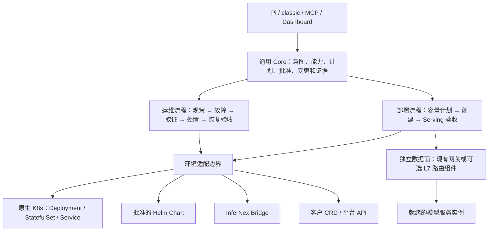

# Kubernetes 通用底座与环境适配

状态：架构决策与分期验收契约。本文明确区分已实现能力和待实现能力；不把设计中的接口、调度器或路由器写成产品已有功能。

## 当前结论

产品目标调整为：在原生 Kubernetes 上可独立部署和运维推理服务，InferNex 是可选适配器；其他公司的 Helm、自研 CRD 或平台 API 通过同一边界接入。无需客户安装 InferNex 才能使用通用能力。

| 能力 | alpha.13 | 本次底座增量 | 后续交付 |
| --- | --- | --- | --- |
| 原生 Kubernetes/Helm 发现、状态、日志、事件 | 已有 | 增加中立环境发现名称，兼容旧工具名 | 持续完善 |
| Pi、记忆、历史证据、固定诊断探针与采集 | 已有；具体探针有硬件/权限前提 | 保持现有功能 | 按能力探测显示 |
| 原生 Service 后端与分流风险检查 | 可通用读取原始资源，未有专用诊断 | 新增 EndpointSlice 逐端口就绪后端检查 | 实际请求分布验收 |
| 按需求、资源与批准规格生成部署计划 | 未实现 | 明确输入、约束、容量语义 | D1 |
| 不依赖 Bridge 的受控实例创建/扩缩/回退 | 未实现；现有写路径是 InferNexService | 明确 Native 适配边界 | D2 |
| 请求级均衡、异规格容量权重、流式排空 | 未实现 | 明确不能用 Service Ready 代替 | T1 |
| 原生工作负载的持续故障闭环 | 原生证据可读取；Supervisor/恢复仍以 Bridge 对象为主 | 明确通用故障对象和恢复契约 | O1 |
| InferNex 模板部署/受控恢复 | 已有，受批准与现场环境约束 | 保留适配路径 | 逐步迁入 adapter |

## 分层

Core 不导入客户 CRD，也不规定必须存在 InferNexService。Agent 不在自身进程中转发业务推理流量。
当前代码还没有完成上述物理拆包：`kubeops` 已只依赖原生 Kubernetes/LWS 读取；`deployer`、`observer`、`supervisor`、`remediator` 和 `changesafety` 的部分类型仍引用 Bridge。逐个纵向场景迁移，不能靠新增一个空接口宣布解耦完成。

### 适配边界

以下为待落地的契约，不是已注册的 MCP 工具：

| 契约 | 内容 |
| --- | --- |
| Discover / Capabilities | API 是否存在、当前身份是否有权限、可用规格/运行时、支持哪些写动作和指标；未知与禁止分别报告 |
| Inventory / Observe | 统一返回工作负载身份、实例边界、健康、资源、端点与证据，不输出客户专有对象作为 Core 主模型 |
| Plan / Validate | 返回确定性计划、资源与路由差异、版本 hash、成本/容量依据及未满足条件 |
| Apply / GetChange | 只执行已批准计划；重新验证源与目标身份、配置、授权；记录持久 change ID，支持幂等恢复 |
| Rollback | 仅回退自己拥有的变更；检查 UID/版本与漂移，明确保留现场资源时的冲突结果 |

适配器选择按**每个工作负载的管理权**决定：同一集群既可有 InferNex，也可有 Helm 和客户 CRD。看到 Bridge CRD 不能把整个集群强制切换为 Bridge 路径。Helm/Operator 管理的 Deployment 不由 Native 适配器直接改写；应回到其拥有者执行计划。

第三方最低接入材料：一种稳定的工作负载身份映射、一份批准的规格/模板目录、读写 API 与权限清单、就绪/失败状态映射、撤销或回退方法、服务端点和指标映射。先只读接入，再以一个创建/回退场景跑适配合同测试；禁止通过自由 shell 或任意 YAML 绕过边界。

## 规格与容量规划

“单实例规格”和“服务实例数”分开：一个 TP=4 实例可占 4 张卡；两个这样的实例需至少两组可满足拓扑约束的四卡资源，不能只把 replicas 写成 8。

1. 用户描述模型/版本、精度、上下文、并发或吞吐目标、TTFT/TPOT、可用性、副本上下限和预算。
2. 管理员提供经验证的运行 Profile：镜像摘要、启动参数、探针、模型访问方式、CPU/内存、GPU/NPU 资源键、每实例卡数、并行方式、节点/驱动/网络约束及基准容量。实例可选不同 Profile，但必须语义兼容。
3. 读取可调度节点与 allocatable，扣除实际已调度 Pod 的 requests，包括 init/sidecar/overhead 与正在退出但仍占用的 Pod；区分配额、污点、亲和性、故障域、PV、设备拓扑、MIG/DRA 与多节点成组调度。没有读取权限或无法计算的约束不能当作空闲。
4. 在批准 Profile 中做容量与放置估算，给出满足需求的组合及备选。缺模型基准时只能报告资源可容纳性，不能推导吞吐或延迟承诺；不把显存不足的四卡 Profile 自动缩成两卡。
5. 输出计划 hash、观测版本、每实例规格、实例数、逐节点资源需求、路由方案和回退对象。应用前重新计算；规划不是资源预留，最终调度以 Kubernetes/已选成组调度器为准。
6. 经本机批准创建，通过控制面 Ready、模型加载/预热、真实 serving 与负载验收后才宣告部署成功。原生第一期只支持可独立运行的 Deployment；StatefulSet/LWS/多机实例各自声明能力，不能默认支持。

完整原生写路径需要处理多对象部分成功、持久日志中断恢复、执行前二次检查、失败补偿和并发编辑。资源不足时返回缺口和可选方案，不暗中超卖、降级或修改现有生产实例。

## 负载均衡是部署验收的一部分

Kubernetes Service 提供稳定入口和连接级分配，不能保证同一 HTTP keep-alive / HTTP2 连接里的请求均匀分布；流式响应也不能在生成过程中拆到不同实例。

- **入口与数据面**：优先复用客户已有 Gateway/Ingress/服务网格，适配其显式后端和均衡策略。纯 Kubernetes 路径提供可选的 L7 网关 Deployment + Service，无需 InferNex CRD；应采用成熟路由实现与固定镜像摘要，避免把 Agent 做成推理代理。
- **同规格**：默认按在途请求/流数量选择就绪实例；明确连接池行为，不能把“所有请求转发到同一个 ClusterIP 的长连接”当作端点级均衡。
- **异规格**：只把模型/协议兼容的实例放进同一池，依据压测容量配置权重，并结合队列/在途负载；不按 Pod 数或卡数直接假设等容量。
- **端点资格**：模型完成预热且探针就绪才纳入；退出或故障先摘流、排空已有流，升级后逐步加入。TP/PD worker 不等于独立可请求的 serving endpoint。
- **重试**：已输出 token 的流不能透明重放；POST 推理的重试必须有去重/幂等协议及预算，避免重复计费或双执行。
- **验收**：在同一入口、同一客户端长连接和并发流下，记录每实例请求数、在途量、TTFT/TPOT、错误率和容量权重偏差；验证多个实例实际接到请求，再摘除一个后端验证新流转移。比较容量归一化后的偏差，不要求每个短窗口请求数完全相同。
- **结论分开**：`resource-created`、`ready`、`serving-verified`、`traffic-distribution-verified`；一个 Service 有两个 Ready 地址不是最后一项通过。

本次 `k8s_inspect_service_backends` 是只读配置诊断：按 Service 端口匹配 EndpointSlice、排除退出端点和旧 Service UID、按 Pod UID 去重双栈/重复切片，并提示单后端、ClientIP、Local、拓扑、无头 Service 等风险。权限不足直接返回错误，截断计数仅作为下界，`trafficVerified` 始终为 false。它不会改变流量，也不替代流量指标/压测。

## 通用自动运维

通用 Incident 以集群指纹 + 工作负载 UID + 配置版本为根，关联 Deployment/StatefulSet rollout、Pod/Event/日志、Service 后端、应用指标与已有变更。InferNex 状态是可选证据。

先识别故障与计划内 rollout，再有界采集、生成诊断和恢复计划。恢复动作经相同适配器和变更记录执行；候选 Ready 后仍须验证真实入口和流量分布，才能关闭故障。Kubernetes 自身的 Pod 重建不能被 Agent 重复“修复”；Operator 管理的资源也不能被底层绕写。

## 验收与依据

通用场景在不安装 Bridge、KServe、openFuyao CRD 的 Kind 集群验收；另跑“Bridge 存在但目标是原生 Deployment”的混合环境。客户适配器跑相同合同测试。CPU Kind 不代表 GPU/NPU 运行时和网络验收完成，各硬件 Profile 另留现场证据。

- [Kubernetes Service](https://kubernetes.io/docs/concepts/services-networking/service/)
- [EndpointSlice、重复端点与就绪条件](https://kubernetes.io/docs/concepts/services-networking/endpoint-slices/)
- [Pod/容器资源与调度](https://kubernetes.io/docs/concepts/configuration/manage-resources-containers/)
