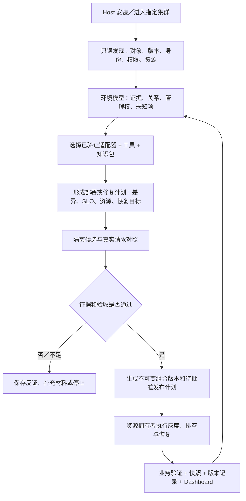
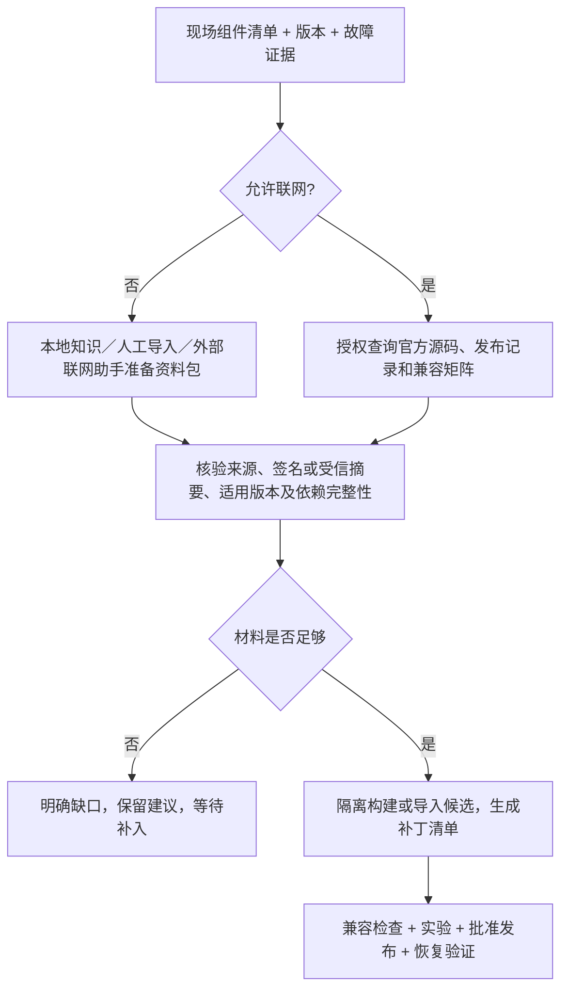

# 面向异构 Kubernetes 推理集群的环境感知与可验证运维 Agent

副题：基于轻量领域模型、可插拔适配器和在线／离线制品管理的部署—诊断—修复—回退闭环。

日期：2026-09-23。本文是下一大版本的**课题与验收建议**，不是功能发布说明。第一阶段冻结当前 `0.5.0-alpha.19`（提交 `b535ba97e721aa22cb4f6b7b3cee043a37b84bfd`）作为基线；第二阶段定义下一大版本应交付的增量，版本号另行确定。文中数字是建议验收门槛，尚不是实测成绩。正式开测前固定环境、样本、预算和阈值，不得根据结果临时放宽。

排期仍以[唯一当前路线图](https://github.com/lsjfy-open-com/infernex-agent/blob/develop/component/InferNex-Agent/docs/development/roadmap-zh.md)为准；本文规定做什么、怎样验证，不建立另一套排期。

## 1. 背景与问题

当前 Agent 已能在管理 Host 安装，通过现有 Kubernetes 凭据发现原生资源、读取日志和网络证据，并支持 InferNex Bridge 下的部署、实验及受管源对象／自有候选范围内的恢复；这不包含通用生产切流和任意组件版本恢复。alpha.16 增加了有限的 SLO 对照和 Git／snapshot 关联记录，alpha.17–19 补充 Dashboard 及安装兼容性。客户环境却不一定安装 InferNex：同一集群可能同时由原生 Deployment、Helm、Operator 和客户平台管理不同服务，硬件也可能包含 GPU、NPU 以及不同网络和驱动组合。

真正的痛点不只是“缺几个工具”：

| 痛点 | 现场后果 | 下一版必须解决的具体问题 |
| --- | --- | --- |
| 发现资源，但不知道资源由谁管理 | 绕过 Helm／Operator 修改子资源，随后被覆盖或造成配置漂移 | 工作负载级管理权、依赖和可执行能力映射 |
| 工具、知识与 InferNex 类型绑定 | 换客户平台要重复实现部署和运维流程 | 稳定的领域契约，适配器承接平台差异 |
| 只知道卡数，不知道拓扑与运行约束 | 把四卡 TP 实例误当四个副本，或推荐无法启动的组合 | 经验证的硬件／运行 Profile 与资源约束 |
| 找到疑似问题，但没有可验证修复 | 报告很多，无法判断 SLO 是否改善、能否撤销 | 受控候选、真实请求对照、发布和恢复证据 |
| 联网和断网交付方式不同 | 现场无法取得补丁、依赖不全，或版本误配 | 同一种制品清单，两种资料获取／分发入口 |
| Git、快照、镜像、权重引用各自独立 | 无法明确“回到哪一套组合”，也难验证恢复完成 | 组合版本索引与按资源拥有者执行的恢复计划 |

术语：SLO（Service Level Objective）为服务等级目标；TP（Tensor Parallelism）为张量并行；CRD（CustomResourceDefinition）为 Kubernetes 自定义资源类型定义；Operator 为围绕期望状态持续协调资源的控制器。Bridge 指本项目已有的 InferNex 控制器组件，不是 Kubernetes 必需组件。

## 2. 哪些判断正确，哪些需要收敛

| 提议 | 判断与边界 |
| --- | --- |
| 做本体建模 | **需要轻量领域模型**：明确实体、关系、身份、状态和约束，先服务实际决策。暂不要求完整 RDF／OWL 本体、通用知识图谱数据库或复杂推理引擎。使用有版本的 JSON schema、关系索引与契约测试即可起步 |
| 进入集群自动识别环境 | **必要**。读取 API、CRD、对象管理关系、Helm 元数据、镜像和获准的版本探针；结合证据识别。名字或镜像 tag 只提供线索，无法确认版本时标为未知 |
| 自动构建 MCP tool 和 Skill | **改为自动匹配和装配已验证能力包**。发现 CRD 不足以推断其业务语义和安全回退方式；可生成适配草稿，但不能自动发布任意写工具到生产 |
| 加载领域知识 | **必要**。按组件、版本、硬件和故障场景选择带来源的知识；知识是建议，不能赋予执行权限或覆盖现场证据 |
| 支持异构资源 | **必要但分层**。先完成 CPU／GPU／NPU 识别和分别可运行的批准 Profile；不承诺任意 GPU 与 NPU 混合组成同一 TP 实例，也不重做 Kubernetes 调度器 |
| 联网／离线组件 patch 更新 | **必要**。先交付配置和用户态组件镜像的可校验候选、实验与恢复；驱动、固件、交换机变更另走设备专属方案，下一版不承诺自动升级所有底层组件 |

MCP（Model Context Protocol，模型上下文协议）提供工具接口；Skill 是带版本的诊断指导与参考资料。两者都不能代替实际 API 权限和变更批准。工具注解也不能自行成为可信授权，见[MCP 官方工具说明](https://github.com/modelcontextprotocol/modelcontextprotocol/blob/main/docs/specification/2026-07-28/server/tools.mdx)。

## 3. 目标架构与交付形态

### 3.1 最小领域模型：先回答能否行动

| 模型对象 | 必须包含的内容 | 对决策的用途 |
| --- | --- | --- |
| 环境与工作负载 | 集群身份、namespace、对象 UID、服务边界、期望配置来源 | 防止跨集群、同名重建对象和副本边界混淆 |
| 组件与管理者 | 引擎、KV 缓存、通信库、Helm／CR／平台拥有者，版本证据 | 决定诊断链路与唯一写入口 |
| 资源与 Profile | 架构、设备资源键、每实例卡数、并行方式、节点／网络／存储约束、实测容量 | 检查可容纳性，区分实例数量与设备数 |
| 能力与权限 | 能发现、能读、能计划、能执行、能回退，分别记录依据 | 区分 unsupported、unknown、forbidden、available，不能将“插件安装了”视为“能执行” |
| 目标、证据与实验 | SLO 口径、观测时间、来源、样本引用、假设、三态结果 | 证据过期则重采；资料不足不晋级 |
| 制品、版本与变更 | 基础／目标摘要、适用矩阵、Git commit、前后 snapshot、批准范围和恢复目标 | 可追溯交付、幂等执行、漂移检查和恢复验证 |

关系至少表达 `managedBy`（由谁管理）、`dependsOn`（依赖谁）、`runsOn`（运行于何资源）、`routesTo`（流量去向）、`usesArtifact`（使用何版本）和 `verifiedBy`（由何证据验证）。这些是设计字段，不是今天已有 API。每条重要事实保留观测时间、原始对象版本或内容摘要、采集方法及确定／推断／未知状态；模型推断不得覆盖确定事实。Secret 内容不进入公开拓扑或 Git。

示例：一个 Helm 管理的 vLLM 服务使用 Mooncake 和挂载的权重目录。模型应关联“服务 → Helm release → 工作负载 → serving 端点 → TP workers → GPU/NPU 资源”，并记录依赖版本。执行升级时通过批准的 Chart／values；不能直接修改其 Deployment。只看到 Mooncake 镜像时，不能声称已经确认 KV 热路径或跨 TP 读写方式。

### 3.2 能力包：自动装配，不自动发明生产接口

一个能力包应提供：识别规则、支持版本、原生对象到领域模型的映射、结构化读写接口、权限要求、操作影响、前置检查、幂等／恢复合同、Skill 和测试样例。能力包自身也固定版本与摘要。

识别结果驱动工具可用性：已支持且权限足够的工具可调用；权限不足显示缺口；未知客户框架进入通用只读模式并生成接入清单。客户可补入 CRD schema、API 说明、脱敏样例、批准模板和恢复方法，在隔离环境通过合同测试后启用写能力。无需为每个客户复制一整套 Core 或重新命名全部 MCP 工具。

### 3.3 异构资源：识别和执行分别验收

资源来自 Kubernetes、设备插件和已授权探针；支持动态资源分配的环境可补充 DRA（Dynamic Resource Allocation）设备信息，不支持或无权限时必须降级说明。不能把“未读到设备”当成“剩余资源为零”，也不能只按卡数推算性能。[Kubernetes DRA 官方说明](https://kubernetes.io/docs/concepts/resource-management/dynamic-resource-allocation/)

第二阶段支持 NVIDIA GPU 与 Ascend NPU **各自独立的**至少一个推理 Profile；识别 CPU 架构、设备类别、驱动／运行时兼容性和关键网络条件。跨节点 TP、复杂成组调度及任意设备混合训练／推理不作为通用承诺，逐 Profile 增量验收。模型权重存储位置及不可变 revision 单独登记，镜像只承载引擎和依赖；权重更新默认重建／滚动替换实例并验证加载结果。

### 3.4 在线与离线：共享一套制品和验收流程

断网环境不假装已查询上游最新版；联网环境也不能以“版本更高”代替兼容性证明。互联网隔离与模型推理入口是两回事：离线验收使用内网模型服务，外部 DNS／HTTP 出口被阻断并留证。

补丁清单应关联基础镜像 digest、目标 digest、源码提交／补丁差异、架构、引擎／通信库／驱动约束、所需依赖、来源校验、实验结果和恢复方式。OCI（Open Container Initiative）镜像清单可提供按摘要引用配置和镜像层的基础，但不能替代兼容性与功能验证。[OCI Image Manifest](https://specs.opencontainers.org/image-spec/manifest/)

离线包须在目标已有基础层不满足时携带完整所需层，不能承诺任何 patch 都很小。损坏包、错误架构、基础版本不符、依赖缺失、来源验证失败均在修改前阻断。在线和离线导入同一制品时，目标 digest 与验收合同相同。驱动／固件／交换机问题在本期可交付带依据的人工处置单，不包装成普通容器补丁自动应用。

### 3.5 用户必须看得见的结果

Dashboard 至少提供：环境拓扑和未知项、组件与管理者、资源及实例规模、工具／知识包可用性、原始模板／Helm values 的登记来源及修订、当前生效 YAML、SLO 基线与候选结果、补丁库存、发布／恢复状态。

原始配置的路径只能来自明确登记或实际可读来源；未登记时显示“未知”，不从当前对象猜测。Git 保存期望配置；snapshot 保存可核验现场状态；组合版本清单关联二者及镜像、权重引用和验收证据。恢复要经过资源拥有者并重新验证业务，不等于 `git checkout`，也不等于删除候选。

## 4. 两阶段验收环境与证据规则

| 环境 | 第一阶段：当前能力复核 | 第二阶段：下一大版本 |
| --- | --- | --- |
| E-N 原生环境 | 无 Bridge 的 Kind，Deployment／Service／Helm fixtures；Linux Host | 无 Bridge，原生部署和批准 Helm 写路径；同一入口至少 2 个独立 serving 实例 |
| E-M 混合环境 | Bridge 受管服务及原生工作负载并存，记录当前全局模式限制 | 同集群混合 Native／Helm／Bridge／一个有真实接口的客户 CRD 或平台；按工作负载分配管理权 |
| E-H 硬件环境 | 若有可接入的 Ascend＋Mooncake 现场则按权限采证；当前尚未提供可核验现场结果 | 一个 NVIDIA GPU Profile 和一个 Ascend NPU Profile 分别实机验证；不以模拟设备替代 |
| E-O 连通环境 | Agent 安装包离线安装；已安装本地 Skill 读取 | 同一场景分别在授权联网和阻断互联网出口的内网运行；离线依赖预置，内网模型可用 |

测试清单冻结 Kubernetes／Helm／引擎／驱动版本、节点及设备清单、模型与权重摘要、存储、网络、角色权限、测试负载和模型调用预算。CPU Kind 仅验控制逻辑，不能证明 GPU/NPU 性能、RDMA 或交换机行为。小模型自动测试不能证明生产 Mooncake 已修复。

每个用例至少交付：测试 ID、环境指纹、Agent 提交及配置、命令或工具调用、预期与实测值、原始证据摘要、起止时间、通过／失败／未测。模拟测试、真实集群和硬件现场三类证据分列。没有测试环境的必选项算未完成，不能换成截图或推断通过。

## 5. 第一阶段：冻结并验收当前水平

以下用例主要复核已实现能力；通过阈值是本次课题建议，不能把 alpha.19 的一次 CI 成功视作所有组合已通过。

| ID | 用例与环境 | 建议量化门槛与交付物 |
| --- | --- | --- |
| A1 安装兼容 | E-N／E-O；Host 首装、升级、普通 HOME、sudo HOME、常规 admin 路径、失效环境候选回退、显式错误参数 | 正向和反向至少 8 个固定用例，预期结果 100% 一致；默认不要求 kubeconfig 参数；显式错误不改选集群；Linux amd64/arm64 分列实装或仅构建证据 |
| A2 通用只读与 Dashboard | E-N；原生对象、Helm 元数据、日志、Service 后端、只读权限不足 | 至少 10 个资源/错误 fixtures 结果正确；后端配置检查保持 `trafficVerified=false`；不得将裁剪 YAML 显示为原始 Chart；秘密值泄漏 0 次 |
| A3 身份与批准 | normal/root × manual/full，读命令、采集、部署、压测及未知命令 | 至少 12 个批准/拒绝测试结果正确；集群影响操作未批准执行 0 次；本机 UID 不冒充远端身份或 Kubernetes 权限 |
| A4 受管实验 | E-M；Bridge 基线、独立候选，Ready 成功、候选失败、源对象漂移 | 三类测试各重复 3 次；仅撤销本次拥有的候选；基线误删 0 次，漂移时停止并报告 |
| A5 当前 SLO | E-M 或接口 fixtures；固定串行、非流式请求；通过、退化、证据不足 | 三态各至少 3 个确定性用例判定正确；真实模型另跑一次批准的有界实验。记录完整响应 p95、成功率、串行成功请求/秒；不宣称 TTFT、TPOT 或饱和吞吐 |
| A6 记录与知识 | Git／snapshot record/list/show/verify；报告/记忆；本地 Skill 和引用读取 | 合法记录可查，至少 3 种证据篡改被检出；验证不修改集群；知识来源/摘要可查，知识文件不得获得执行权限 |
| A7 现场诊断边界 | E-H；Host／SSH／Pod plog、PFC 等采集 | 对每种现场具备条件的通道各完成一次有时间戳采集；不可用通道返回原因。阶段成果是证据链和缺口，不要求证明交换机根因或自动修复 |

当前证据必须与上述建议门槛分开登记：

| 用例 | 截至本稿可核验的证据 | 按本课题门槛的实测与状态 |
| --- | --- | --- |
| A1 | alpha.19 对应 GitHub Actions run 已通过 Linux amd64 Kind/Host 首装、重装及失效候选回退；arm64 有构建/包校验证据 | 完整 8 用例及 arm64 实装组合未按本表汇总，阶段验收待执行 |
| A2 | 原生读取/后端诊断单测及 Kind Dashboard YAML smoke 测试 | 本表 10 个冻结 fixtures 尚未逐项出报告，待执行 |
| A3 | Pi 模式、工具批准有代码和自动测试 | 本表 12 个批准矩阵尚未汇总实测，待执行 |
| A4 | Bridge 控制器单测及 Kind 合成状态/事件用例；CPU 小模型部署另有真实请求测试 | 不能把合成实验状态当成硬件实验；三类各 3 次的验收报告待执行 |
| A5 | SLO 单测使用测试 HTTP 服务检验样本和判定；CPU 小模型推理 CI 不等于真实 SLO 对照实验 | 三态固定用例可复核；批准的现场有界实验尚无验收结果 |
| A6 | config-version 和 Skill 注册器已有单测、操作指南 | 对照本表篡改/知识边界清单的实测报告待执行；未实现恢复执行器 |
| A7 | 现有采集工具和 Mooncake 场景指南 | 未提供可核验硬件现场结果，未测 |

第一阶段出口：一份当前能力与未测项清单、一组可重复测试记录、一份已知限制。测试代码存在、某次自动化 run 通过、现场验收通过是三种不同证据。原生写路径、通用补丁更新和自动恢复不纳入“当前已完成”描述。

## 6. 第二阶段：下一大版本的必选验收

以下范围合成一个完整闭环，而非独立堆积工具数量。所有负向用例必须通过；任何未经批准的生产变更、跨拥有者误写、稳定基线误删或凭据泄漏均为发布阻断。

| ID | 测试场景 | 建议量化门槛 |
| --- | --- | --- |
| B1 环境识别与管理权 | E-N/E-M；冻结至少 30 种组件/版本/拥有者组合，包含未知 CRD、冲突标签、陈旧事实及禁读权限 | 已支持且可观测对象识别 precision/recall 均 ≥95%；未知和禁读用例 100% 正确标注；写入目标拥有者判定 100% 正确，否则拒绝写入。20 次全量发现，在 ≤10 节点、≤200 工作负载、API 往返 ≤100ms 下 p95 ≤60s |
| B2 能力与知识装配 | 已支持版本、错版本、缺工具、权限不足、未知框架、恶意知识指令 | 至少 20 个正反例，装配结果 100% 符合预先清单；未知框架不自动启用写工具；知识不能改变批准策略；环境版本变化后旧匹配失效并重新检查 |
| B3 真正解耦与适配 | E-N 完全不安装 InferNex CRD；E-M 混合管理 | Native 和一套批准 Helm Chart 分别完成计划→批准→部署→业务验证→恢复；Bridge 保持回归。另接一个客户 CRD/API 跑同一合同。每种路径正常、超时、部分失败、漂移各 3 次；Core 不导入 Bridge／客户 API 类型，新增客户适配不修改通用流程 |
| B4 资源与异构 Profile | CPU/GPU/NPU 识别；GPU 和 NPU 独立实机部署；资源不足、卡数、架构、内存、配额、污点及拓扑不匹配 | ≥12 个规划正反例全部符合人工基准；资源不可见不判作空闲；每种硬件至少 1 个真实模型连续运行 30 分钟。无基准的 Profile 只给资源可容纳性，不输出性能承诺 |
| B5 请求级分流与排空 | 单客户端长连接、至少 2 个同规格后端；再测 1:2 批准容量权重、摘流、流式响应 | 每轮 ≥1,000 个请求，3 轮；同规格各后端份额在 40%–60%，1:2 容量权重偏离目标份额 ≤10 个百分点。固定均衡策略与负载，非缓存亲和场景；摘流确认后新请求命中被摘后端 0 次；排空上限 60s，未完成流按预定策略处理并计错，不透明重放已输出流 |
| B6 在线／离线补丁 | 同一配置补丁及同一用户态组件镜像更新，分别在线获取和离线导入 | 两种模式至少各 1 次成功安装、1 次恢复；同一制品目标 digest 一致。损坏、错基础版本、错架构、缺依赖、来源不可信 ≥5 类负例全部在变更前阻断；断网环境外网连接成功数为 0，网络审计留证 |
| B7 Git＋snapshot 组合恢复 | 期望配置、前后对象快照、镜像/权重引用、路由、实验关联；进程中断和并发修改 | ≥5 类失败注入，各 3 次；重试不重复创建，越权恢复 0 次，漂移全部阻断。固定测试模型 ≤20GiB、镜像/权重预置条件下，批准恢复触发至完成连续 100 个验收请求且全部正确、窗口 p95 满足预定 SLO ≤10min；新流量摘除 ≤60s，完整恢复另核验配置与请求结果 |
| B8 SLO 与修复效果 | 固定并发和流式/非流式样本；至少 1 个真实推理服务的可复现软件/配置瓶颈 | 3 组交替基线/候选对照，每侧每组 ≥1,000 请求，预热不计；候选 p95 端到端延迟各组均改善 ≥20%，成功率 ≥99% 且不低于基线，预先指定质量评分下降 ≤1 个百分点，资源预算不增加。无法证明时失败或证据不足，不宣称已优化 |
| B9 Mooncake 根因对照 | E-H；软件提交/并发阻塞、可控网络退化，以及缺少交换机证据三类案例 | 分别提供等待提交、实际传输、远端完成等可获得的分段证据，缺埋点须明确；三类各重复 3 次，与事先封存的注入原因对照，不能全部归因交换机。至少软件路径交付并验证修复；真实交换机路径无条件时记未测，不以网络注入冒充设备修复 |
| B10 可见性与接入成本 | Dashboard展示 B1–B9 产物；未参与适配器实现的工程师按文档接入上述客户 API/CRD | ≥10 个用户任务均可从界面找到来源、当前/候选/稳定版本、配置来源和恢复状态；缺失来源标未知。接入耗时作为试点过程指标：资料和环境齐备后，只读适配目标≤2人日、含受控写入及恢复合同累计≤5人日；记录人数、实际投入和等待时间，不以一个人的一次结果宣称普遍效率提升 |

识别 precision = 正确识别条目／所有已给出识别结果条目，recall = 正确识别条目／冻结真值中应识别且授权可见条目；版本和管理者也算结果字段。已支持对象错误标成未知算漏报；未知、权限不足另设必测集合，不能用剔除困难样本提高成绩。误写不得被总体 95% 掩盖。

TTFT（Time To First Token）为首 token 延迟；TPOT（Time Per Output Token）为首 token 后每输出 token 的平均耗时；两者需冻结采样定义。B8 除端到端延迟外须保存 TTFT、TPOT、请求成功率、正确输出 token/秒及满足全部 SLO 的有效请求/秒，不能混用单位。并发、输入输出长度、前缀命中率、冷热缓存、精度和权重版本必须相同；对照顺序交替，防止缓存预热产生假改善。

B8 按每组对照分别判定，不合并三组以掩盖某组退化；成功率门槛采用该组点估计，并同时报告请求总数、失败数和置信区间。资源预算至少固定每侧 CPU/内存 requests 与 limits、设备型号/数量、实例数和最长运行时间；未测功耗不得声称节能。B9 的故障真值由评估者封存，Agent 不可读取注入标签；软件修复仍需同负载复测及恢复演练。

B8 的 20% 是用于**事先选定、有真实可修复瓶颈的验收案例**，不是对所有客户、所有故障承诺提升。若业务目标重在成本，可在开测前另签成本目标及延迟/质量护栏，但不允许测后挑选更好看的指标。B9 与 B8 可复用同一软件案例；网络/交换机案例必须独立判断归因证据。

## 7. 必须做、可后置与交付顺序

**下个大版本必选**：轻量模型与管理权 → 能力包契约和知识版本匹配 → 原生/Helm写路径与 Bridge 迁移 → GPU/NPU Profile → 真实 SLO 与请求分流 → 同合同的在线/离线补丁、组合版本和恢复 → 可见界面与客户接入验证。分别对应现有 K0/A1、D1/D2/D3、E1/E2a/E2b、T1/R1、O1；开发时以一条真实案例贯穿，避免先造完所有抽象再验证。

**明确后置**：自动生成并直接信任未知框架写工具；通用重型本体推理平台；任意源码/算子自动优化；通用驱动/固件/交换机在线刷写；任意混合设备 TP；自行开发新调度器或 L7 数据面；无边界全自动生产批准。

最终交付物：领域 schema 与迁移规则、适配器 SDK/合同测试、能力与知识包清单、两类硬件 Profile、在线/离线制品及兼容清单、组合版本/恢复记录、Dashboard、两阶段测试报告和实测指标表。第一阶段不得因“能力已有代码”跳过现场证据，第二阶段不得用“能生成计划”代替成功执行与恢复。

## 8. 当前依据

- [alpha.19 安装与兼容说明](https://github.com/lsjfy-open-com/infernex-agent/blob/infernex-agent-v0.5.0-alpha.19/component/InferNex-Agent/docs/releases/v0.5.0-alpha.19-zh.md)
- [alpha.19 GitHub Actions Kind／Host 安装验证（非客户现场）](https://github.com/lsjfy-open-com/infernex-agent/actions/runs/35558439199)
- [当前通用 Kubernetes 分层契约](https://github.com/lsjfy-open-com/infernex-agent/blob/develop/component/InferNex-Agent/docs/architecture/kubernetes-first-zh.md)
- [当前 SLO 与 Git/snapshot 实现边界](https://github.com/lsjfy-open-com/infernex-agent/blob/infernex-agent-v0.5.0-alpha.19/component/InferNex-Agent/docs/guides/slo-and-config-versions-zh.md)
- [当前 Skill 注册与受限加载](https://github.com/lsjfy-open-com/infernex-agent/blob/infernex-agent-v0.5.0-alpha.19/component/InferNex-Agent/internal/skills/registry.go)
- [智谱与业界工作洞察：原始研究背景](https://github.com/lsjfy-open-com/infernex-agent/blob/develop/component/InferNex-Agent/docs/architecture/infra-agent-industry-insights-2026-09-20-zh.md)
