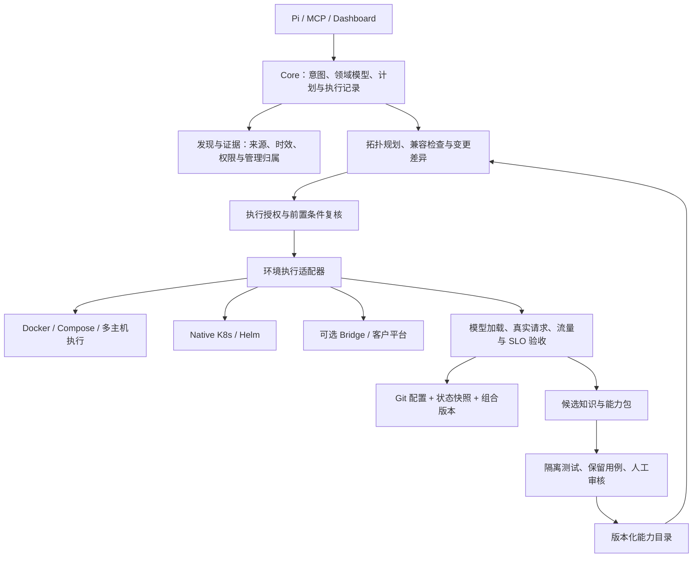
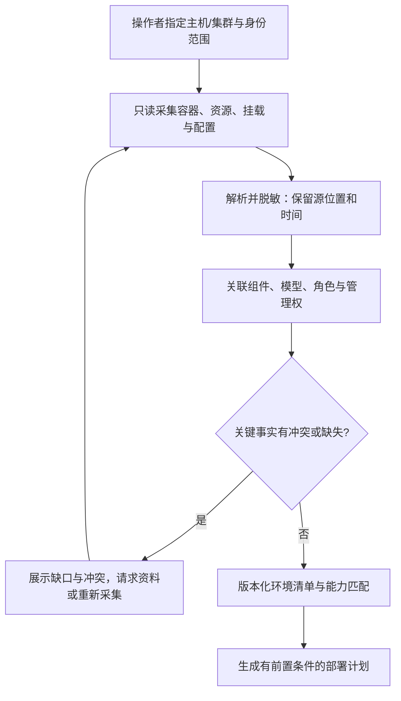

# 私域跨环境部署：领域模型与受控自演进设计

状态：设计草案，2026-10-02；基于 alpha.22，尚未实现本文新增的发现、Docker 执行和能力晋级接口。持续演进分支为 `codex/private-deployment-evolution`。本设计扩展既有 Kubernetes 分层契约，保留 Core、环境适配、变更保护、实验验收的边界；不要求客户安装 InferNex Bridge，也不把 Host shell 已能执行 Docker 命令视为 Docker 部署适配器已交付。

## 1. 目标与首批范围

客户既有纯 Docker 聚合部署、Docker Prefill/Decode 分离部署，也有 Kubernetes 部署。模型参数、启动模板、设备约束、组件兼容信息往往只存在于私域。第一目标是把这些事实转换成可检查、可复现、可回退的部署方案；能力演进围绕减少下一次部署的适配成本展开。

PD 指 Prefill（提示词计算）与 Decode（逐 token 生成）分离；KV 指注意力 Key/Value 缓存；TP 指 Tensor Parallelism（张量并行）；SLO 指 Service Level Objective（服务等级目标）。MCP 是 Model Context Protocol，工具调用接口；Skill 是版本化操作知识；subagent 是有任务、预算与权限边界的子任务执行者。

首批按一个客户已确认的引擎版本和硬件组合贯穿 Docker 聚合、Docker PD，再迁移相同意图与验收契约到原生 K8s。框架、镜像摘要、设备与 PD 协议在开工前由现场清单冻结；缺失时只能形成待补充方案。多种硬件和框架按支持矩阵逐项验收，不能用普通 CPU 容器测试证明 GPU/NPU 的 PD 服务可用。

非首批目标：通用知识图谱数据库、自动训练模型、任意源码自主上线、替代业务网关/调度器、自动修改驱动或交换机。领域模型先用版本化 JSON 记录、关系索引和现有证据存储承载；新增数据库需要实际查询规模与一致性需求证明。

## 2. 承接现有架构

Agent 不转发业务推理流量。请求路由与 KV 数据传输是部署对象及验收对象，由相应组件实现。Docker daemon、K8s API 与客户平台各自保留实际权限；本机 root 可能已有本地 Docker socket 的技术访问权，但这不等于 Agent 的变更授权，也不能证明远程 daemon 或 K8s 的权限。

| 现有模块 | 已有基础 | 演进方式与边界 |
| --- | --- | --- |
| `internal/deploymentplan` | 同构单实例 Profile 的 K8s 只读资源估算 | 保持现有 CLI/MCP 契约；新拓扑规划转成受支持的资源请求，不能假定已有 PD 或 Docker 放置能力 |
| `internal/kubeops`、`internal/mcpserver`、Pi Host 工具 | 原生资源发现、工具执行和权限模式 | 新增类型化发现/执行适配；任意 shell 不作为“已验证能力”的替代证明 |
| `internal/changesafety` | 快照、变更保护，部分类型依赖 Bridge | 引入中立 ResourceRef，逐个场景迁移；保留旧记录读取与原保护语义 |
| `internal/experiment` | Bridge 候选与基础 SLO 门禁 | 复用实验记录及三态结果，分离候选执行器和业务测量器 |
| `internal/configversion` | Git、快照、文件摘要关联 | 当前仅本地关联/完整性校验；新增语义差异与恢复执行，不能把已有记录称作全栈恢复 |
| 报告与语义记忆 | 可读名称、hash 索引、知识检索 | 增加来源、环境/版本范围与验证记录引用；历史记忆不覆盖现场事实 |

新类型建议先位于 `internal/domain`，新增契约建议位于 `internal/adapters`；这些目录和接口尚未建立，不要求一次性迁移所有旧模块。旧接口通过转换层维持兼容，不在此设计分支改变安装包或发布分支。

## 3. 领域模型：事实、意图、能力与运行记录分别保存

新规范记录拟包含 `schemaVersion`、`kind`、稳定 `id`、`revision`、`tenantScope`、创建时间和内容摘要。旧 `apiVersion/kind` 记录通过显式转换读取，不宣称已有这些新字段。引用采用 `{tenantScope, kind, id, revision}`，环境内对象另绑定 environment；禁止隐式跨租户引用。显示名采用关键词加日期，hash 用于索引与完整性。schemaVersion 管数据格式，组件版本和能力包版本分别管理，不混用。摘要规则必须版本化：UTF-8 JSON、对象键排序、数组保留语义顺序、缺失与 null 区分、数值只使用有限整数，计量小数采用规范单位字符串；计算时排除自身 digest 字段。计划以规范化执行载荷另算摘要，不能仅用展示文本或时间戳代替。示例文件的短引用仅在同一示例作用域中解析，正式持久化需展开为完整引用。

| 对象 | 必需信息与主要关系 |
| --- | --- |
| Environment | 类型、显式接入端点引用、身份范围、联网策略、管理域；包含 Host 或 Cluster，可共存 |
| Resource | CPU/内存、设备、显存、拓扑、磁盘/挂载、网络能力；关联所在 Host/Node 和占用证据 |
| Component | 引擎、运行时、通信库、KV 组件、路由器及管理平台的名称/精确版本/制品引用；版本未知不可补成 latest |
| ModelArtifact | 模型标识、权重修订、格式/精度、tokenizer/配置修订、来源及存储引用；权重在共享盘/对象存储/本地缓存，运行时加载到内存或显存 |
| Configuration | 期望模板、渲染产物、观察到的有效参数分别存储；记录字段来源、默认值解析版本和 SecretRef |
| DeploymentIntent | 模型、拓扑、资源预算、实例上下限、SLO、质量约束、发布范围与授权要求；用户要求不冒充现场事实 |
| ServingTopology | 实例组、角色、每实例并行规格、请求入口和 KV 边；聚合与 PD 是拓扑类型，不是环境类型 |
| Ownership | 对每个目标声明 manager、外部 UID/ID、管理作用域、可执行动作；发现冲突时阻止写入 |
| Observation / Evidence | 观察值、源对象版本、采集身份与时间、证据位置/摘要、覆盖范围、过期规则；明确 observed/declared/inferred/unknown/conflict |
| CapabilityPackage | 工具 schema、Skill、适配规则、依赖和支持矩阵、测试证据；能力存在、已启用、可授权执行是不同状态 |
| Plan / Change | 不可变计划、差异、前置条件、批准或预授权记录、步骤状态、幂等键、证据、恢复计划 |
| ReleaseManifest / Snapshot | 配置 Git commit、渲染摘要、镜像 digest、外部权重引用、能力包版本、目标清单与观测快照；关联验收结果与上一稳定版本 |
| KnowledgeRecord | 租户与访问控制、敏感级别/出域策略、来源及信任等级、内容或引用摘要、组件/框架/版本/环境适用范围、证据、验证状态、过期/失效/撤销条件；关联候选和发布版本 |
| Experiment / KnowledgeCandidate | 对照基线、负载、预算、结果/反例；候选知识的适用条件、来源与失效条件 |

身份规则：K8s 采用接入时登记的集群身份 + namespace + GVK + UID；Docker 采用管理域 + 登记的主机身份 + daemon 身份 + container ID。IP、容器名或 Compose 服务名只作定位属性。逻辑服务 ID 跨重建保持，物理实例 ID 随重建变化；计划绑定两者。主机身份从受信登记/握手确认，不靠扫描结果或 hostname 猜测；指纹变化必须重新确认目标。

关系包括 `runsOn`、`managedBy`、`usesModel`、`configuredBy`、`dependsOn`、`routesTo`、`transfersKVTo`、`verifiedBy`。字段级来源保留多条声明：现有 YAML 与实际进程参数不一致时同时展示，产生 drift；文档中“支持某选项”也不能覆盖实际二进制版本检查。缺权限、未采集、字段不存在和实际为零分别编码。

## 4. 私域发现与知识加载

发现分层：Host 系统/设备与 Docker inspect 或 K8s 资源；工作负载命令、参数、挂载和端口；版本化引擎规则解析聚合/PD/TP 语义；最后才加载匹配版本的私域说明、Skill 和历史案例。不会递归扫描所有磁盘，也不默认读取任意环境变量或 Secret 明文。敏感值保存凭据引用，原始证据按私域访问与留存策略管理；发给模型的是最小必要的脱敏摘要，外部模型调用还需符合该环境的数据出域策略。

每种观察定义新鲜度与再验证条件：资源余量、端口占用、路由后端在执行前重读；镜像/权重按不可变引用核对；组件兼容规则绑定版本；旧知识必须在新环境再验证。超时和部分读取产生 partial/unknown，不能把缺数据解释为空闲。跨主机扫描记录各自观察时间，非原子快照通过执行前比对与占用锁弥补，不宣称拿到了全局原子状态。

知识检索先按租户、调用身份授权和出域策略过滤，再做语义排序，不能先检索所有私域资料再隐藏结果。能力包和交换包默认不能携带其他作用域的私域知识；跨域复制需明确授权、脱敏与独立审计。撤销或过期的知识不进入有效候选，历史记录保留用于追溯。

首批加载白名单配置字段并保留未解析键；未知引擎参数或混合启动脚本只给出解释候选，不据此自动部署。导入的人类说明与日志视为证据，不作为提高权限或改变执行规则的指令。

## 5. 拓扑与资源规划

| 组合 | 方案必须包含 | 特别约束 |
| --- | --- | --- |
| Docker 聚合 | 逻辑服务、每实例容器组、设备映射、权重挂载、启动参数、端口与请求入口 | 多主机无统一调度假设，检查外部占用；Compose 不是多主机调度器 |
| Docker PD | P/D 实例组、各自并行规格、连接/传输协议、KV 内存预算、路由与发现机制 | P/D 角色不是普通副本，必须由对应引擎/连接器版本契约定义 |
| K8s 聚合 | 模板/Helm 引用、资源请求、放置约束、存储、Service/网关、探针 | 尊重 Helm/Operator 管理权，不能直接覆盖被其管理的子对象 |
| K8s PD | P/D 角色组、必要的成组/多机资源、KV 路径、网络配置、业务路由 | 只在已验收的引擎与执行器组合中开放；普通 Deployment 可用不等于多机 TP 可用 |

单实例是一组协作 worker，不是一张卡或一个容器；TP=4、replicas=2 表示两个四卡实例。P/D 可有不同 TP，但不能默认允许；KV 分片布局、缓存数据类型、层/块粒度、读写端数量、传输和重分片能力必须由版本契约声明并验证。不能简单按 P/D 卡数比转换配置。模型权重、tokenizer 和关键服务语义必须兼容。

规划约束至少包括资源/显存余量、权重可达、端口、设备拓扑、跨机网络、依赖就绪、故障域、P/D 容量配比与路由。没有实测 Profile 时只输出资源可行性与待测项，不承诺吞吐或时延。Docker 执行前再查设备/端口，并对本 Agent 的目标持有租约；租约不能阻止外部管理员占用，发现漂移则重规划。K8s 最终放置仍由调度器决定。

PD 验收必须关联请求 ID、P 完成、KV 提交/完成、D 消费及首 token，避免只用容器 Ready 判定成功。通信细节由连接器适配，无法观测某阶段时明确不具备该证明。当意图包含至少两个完整、可路由的服务拓扑副本时，聚合与 PD 均验证长连接下多实例实际命中、容量权重、摘流与流式排空；单一拓扑不宣称已证明跨副本均衡。不要求把 P/D worker 当成独立的对外请求实例。

## 6. 执行契约与恢复

以下是设计契约，尚非注册的 MCP 工具。环境 adapter 管资源生命周期；引擎 adapter 管参数、角色、KV 与兼容语义；制品 resolver 管镜像/权重/补丁；验证器管请求和 SLO，避免一个客户插件包揽所有职责。

| 契约 | 输入 / 输出与拒绝条件 |
| --- | --- |
| Discover / Observe | 限定作用域和身份 → 带来源、时效、未知项的 Inventory；不足权限不返回完整成功 |
| Capabilities / Validate | 环境、引擎版本、需求 → 支持动作与前置条件；区分 unsupported / forbidden / unknown |
| Plan / Render | Intent + Inventory revision + Profile + 能力版本 → 确定性 Plan 与渲染配置；不执行、不预留、不批准 |
| Apply / GetChange | Plan digest + 目标身份 + 授权引用 + 幂等键 → 持久 Change；先记录意图、再执行、再观察实际结果 |
| Verify | Change + 冻结负载与目标 → pass / fail / inconclusive + 原始样本；Ready 不代替服务验证 |
| Recover | Change + 明确恢复目标 → 预检、摘流、恢复步骤与再验收；不能恢复的对象明确列出 |

计划摘要绑定环境/物理身份、源配置与观测版本、目标参数、动作及影响范围、制品摘要、能力包版本、验收与恢复计划。任何实质变化产生新计划并重新判定授权；模型文字同意不等于授权记录。兼容当前 manual/full 与精确的 `/mode_change root risk`：manual/full 的生产变更仍需批准；root risk 仅为当前 Pi 会话/任务免逐次对话框的预授权，新建或恢复会话回到 normal/manual，不作为可复用的计划批准凭证，也不传递到 Dashboard/API。未来 Apply 需另持久记录与计划摘要、目标、参数、时间及授权来源绑定的审计引用；执行时不能绕过参数、身份、管理归属、版本和漂移检查。生成新能力包与生产变更分开授权。

Change 状态：planned → authorized → preflight → applying → verifying → succeeded；失败可进入 recovering → recovered 或 recovery_failed；取消与结果未知单独记录。执行进程重启后按持久步骤账本对账，未知结果先读取实际资源，不盲目重复 create/start。锁与幂等键按逻辑工作负载及作用域隔离，多对象无法原子提交时记录部分成功并按依赖逆序补偿；原有客户资源默认不属于可删除范围。

Git 保存期望模板及渲染版本，Snapshot 保存变更前后可观察状态，ReleaseManifest 关联三者和制品。快照不是运行进程内存、模型权重副本或所有外部设备状态的备份。权重版本变更通常需要启动新实例加载并预热，使用不可变目录/存储版本引用，不原地覆盖共享权重；回退前确认旧权重、镜像和资源仍可用。

Docker 恢复需要旧容器配置、镜像、挂载与外部卷恢复策略；K8s/Helm 通过资源拥有者恢复。配置回退、路由恢复、数据恢复分别验收。磁盘数据迁移、驱动、固件、交换机变更需独立恢复契约，首批不自动执行。没有回退容量时必须在执行前报告中断风险或阻止要求无中断的方案。

## 7. 能力与知识的受控自演进

能力包不是一个万能工具：工具声明参数 schema、实现 digest、权限和副作用；Skill 声明适用组件/版本、指导和证据；subagent 声明任务、输入范围、工具白名单、成本/时间预算及输出结构。凭据由执行侧提供受限引用，子任务不继承超出委派范围的权限。核心模型与环境证据独立于某个 agent harness，后续可通过接口接入；本文不声称已实现上游论文能力。

候选状态：proposed → built → tested → reviewed → enabled；失败标为 rejected，已启用版本可 revoked。环境识别不等于允许加载任意插件；能力启用必须匹配信任来源、明确版本和支持矩阵。修复候选在不持有生产写凭据的隔离环境生成，静态检查、合同测试、保留用例和现场候选验收通过后，再登记不可变版本供后续会话使用。在途任务绑定版本，撤回能力时禁止新调用并对运行中动作按其取消/恢复契约处理，不能删除账本。

学习输入来自部署意图、版本与环境快照、计划、实际执行结果、验收及人工纠正。成功案例形成带适用条件的规则候选，失败保留反例；模型推断、客户文档与实际验证结论分级存储。禁止自动把一次“容器启动”记为性能达标，或把用户输入变成可执行代码发布。模型权重微调不在此阶段范围。

## 8. 联网与离线知识/补丁

联网是 Environment 的能力与策略，不与 root/full/risk 混为一谈。离线模式本地匹配规则、知识和已安装版本；资料不足生成缺口清单，由人导入或由授权联网辅助端搜集。辅助端接收脱敏组件指纹与问题，不默认获取原始日志、凭据和模型文件。联网模式也先核对官方或客户认可来源、具体修订、发布时间与适用矩阵，再形成候选。

统一 ExchangeBundle 记录 manifest 版本、基础与目标镜像 digest、架构、驱动/运行时范围、来源、依赖闭包、权重引用、签名与校验信息、实验结果和恢复方法。补丁在隔离构建端生成不可变镜像；增量层依赖准确基础镜像，不能保证每个 patch 都很小。导入先进入隔离区，校验摘要/批准的签名信任、依赖完整性与版本兼容；摘要只能证明字节一致，不能证明来源可信或运行兼容。离线撤销信息以最近导入的信任清单为界，过期或缺失必须显式报告。

## 9. 可见形式与实施顺序

Dashboard 延用 Host IP 部署方式，逐步增加“环境清单、服务拓扑、配置来源/有效差异、计划与步骤、版本与恢复、能力候选”视图。以同一服务串起：权重挂载 → 运行配置 → 实例/角色与卡 → 请求入口/KV 路径 → 当前表现 → 最近变更。原始模板/Compose/YAML 给出路径、版本及脱敏内容，未知和过期状态可见；页面就绪不等于底层能力已完成。

实施仍在唯一路线图排期，按可独立验收的变更交付：

1. K0/A1：领域记录、字段来源与中立身份；Docker/K8s 只读发现，未知组件及冲突处理。
2. D1/D2：首个 Docker 聚合 Profile、计划渲染、执行账本与恢复；复用 E1 验收和 E2 Git/快照关联。
3. D3/T1：同引擎 Docker PD 角色与 KV 契约、入口分流、真实硬件验证。
4. A1/D2/D3：原生 K8s 聚合及经过确认的 PD 适配；沿用相同 Intent、Plan、证据与验收，不重新造另一套 Core。
5. E2a/E2b/R1：离线物料闭包、授权联网核对、组合版本升级与恢复。
6. O2/A1：候选能力构建与晋级；第二个框架/版本和保留环境检验复用价值。

每个阶段同时包含负例、恢复和可视化所需读接口。客户急需 K8s 时可调整 Docker/K8s 执行顺序，但不跳过管理权、计划及验收契约。第一批需要客户补充：现有两种 Docker 启动配置、K8s 模板、引擎/镜像版本、设备拓扑、权重路径与修订、入口/KV 配置、身份与联网范围、健康部署基线及 SLO。提交脱敏样例即可，不收集密钥。

## 10. 示例与验收入口

- [四种部署组合的设计样例](https://github.com/lsjfy-open-com/infernex-agent/blob/codex/private-deployment-evolution/component/InferNex-Agent/docs/architecture/examples/private-deployment-model.json)：用于评审领域关系，不可直接 apply，缺现场 Profile 时为 blocked。
- [私域部署两阶段验收补充](https://github.com/lsjfy-open-com/infernex-agent/blob/codex/private-deployment-evolution/component/InferNex-Agent/docs/development/private-deployment-acceptance-zh.md)：环境、数据、案例、量化门槛与未测项。
- [既有 Kubernetes 分层契约](https://github.com/lsjfy-open-com/infernex-agent/blob/codex/private-deployment-evolution/component/InferNex-Agent/docs/architecture/kubernetes-first-zh.md)：保留原生资源/管理归属与流量边界。
- [唯一开发路线图](https://github.com/lsjfy-open-com/infernex-agent/blob/codex/private-deployment-evolution/component/InferNex-Agent/docs/development/roadmap-zh.md)：持续交付与依赖。

评审结论待确认项：首个实际引擎/硬件与 PD 连接器、客户配置和权重版本提供方式、私域模型访问边界、真实流量指标来源。它们影响适配实现和容量结果，不影响 Docker/Kubernetes 与聚合/PD 两个正交维度（四种组合）的接口边界；未确认前不得声称覆盖客户现场。
