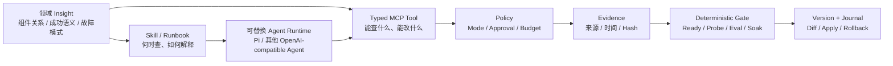
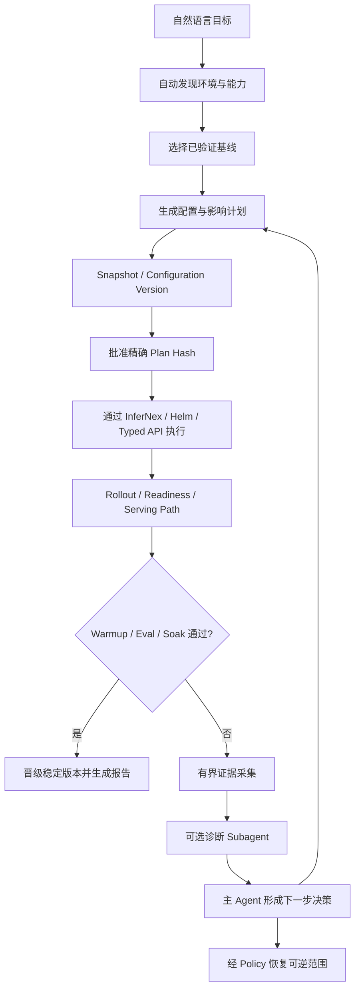

> 历史资料：不代表当前功能或排期。以[文档入口](../README.md)和当前路线图为准。

# InferNex Agent 领域 Insight、设计原则与治理边界

本文是 InferNex Agent 的统一认知入口，用来回答三个问题：

1. 项目已经沉淀了哪些通用 Agent 不具备的 InferNex 领域 Insight；
2. 这些 Insight 如何变成可执行、可验证的 Agent 能力；
3. 模型、工具、Subagent 和运维人员各自能做什么、不能做什么。

本文是总览，不替代具体工具契约。能力现状以
[MCP 工具目录](../reference/mcp-tool-catalog-zh.md)、[安全边界](../reference/security-boundaries-zh.md)和代码为准；
路线图以[运行模式与配置版本设计](../architecture/policy-modes-config-versions-zh.md)为准。

## 1. 一句话定位

InferNex Agent 是 InferNex 的智能部署与长期运维入口。它把 openFuyao、Kubernetes、Helm、
InferNex 和推理技术栈的领域认知，固化为“证据获取—计划—批准—执行—验证—回退”的工程闭环。

它不是另一个 Kubernetes Controller，也不是给通用聊天模型增加几段提示词。其长期价值位于模型
和现有控制面之间：模型 Runtime 可以替换，InferNex Controller 继续拥有 desired state，而领域工具、
成功语义、安全 Policy、证据协议和稳定基线方法由 InferNex 社区维护。

## 2. 什么是本项目的 Insight

这里的 Insight 不是一份 FAQ，而是经过现场问题、官方接口和验证过程沉淀的可执行认知：

| Insight 类型 | 已沉淀的核心认知 | 如何进入产品 |
| --- | --- | --- |
| 环境与权威边界 | 引导、管理、业务集群是不同 API 视角；主 Chart、Bridge/KServe 是不同部署入口 | 环境 discovery、能力门控、工具动态发布 |
| 组件因果关系 | Gateway、Hermes、PD、vLLM-Ascend、Mooncake、CANN、HCCL/HiXL、NPU 共同构成 serving path | 组件拓扑、owner graph、关联时间线、专项 Skill |
| 部署成功语义 | Pod Running 不等于服务可用；还需 readiness、serving probe、warmup、eval 和 soak | 确定性 gate、Evidence、验收报告 |
| 稳定演进方法 | 从 last-known-good 基线开始，一次只增加一个特性，再比较性能与稳定性 | 渐进实验、候选隔离、阶段 checkpoint |
| 故障取证方法 | stdout、previous logs、plog、Event、节点/NPU/通信证据必须按 UID 和时间关联 | PlogCapture、CollectorRun、Evidence Store |
| 现场数据规律 | 日志体量大、探针噪声多、Pod 重建会丢证据、模型上下文有限 | 本地落盘、SHA-256、分页读取、噪声过滤、压缩 |
| 变更安全 | 读取范围和修改权限必须分离；批准必须绑定具体计划、目标版本和参数 hash | Mode、Policy、approval、budget、change journal |
| 回退边界 | 只能对 Agent 纳管、具备逆操作且所有权可证明的变更承诺自动回退 | snapshot、configuration version、ownership、冲突拒绝 |
| 模型兼容 | OpenAI-compatible 不等于 tool-call、流式字段和 reasoning 行为完全一致 | endpoint 探测、重试、预算、循环阻断、兼容适配 |

这些认知共同构成“领域内核”。单独复制某个 Skill、prompt 或 CLI 界面，不能复制完整闭环。

## 3. 从 Insight 到 Agent 能力

各层职责不能混淆：

- **Runtime** 负责自然语言、会话、计划和工具循环，不拥有集群权限；
- **Skill** 负责领域诊断方法，不授予权限，也不替代实时证据；
- **Typed Tool** 把目标、输入、结果、上限和副作用变成稳定契约；
- **Policy** 决定在当前模式、范围和预算下是否允许、是否需要批准；
- **Evidence** 保存可追溯材料，防止大日志直接淹没模型上下文；
- **Deterministic Gate** 用可观测事实判断是否继续，不以模型意见代替 Ready 或测试结果；
- **Version/Journal** 记录变更前状态、精确 diff、执行结果和可恢复范围；
- **InferNex/openFuyao 控制面** 仍是资源生命周期权威，Agent 不建立第二套真相。

## 4. 已形成的设计原则与工程取舍

### 4.1 管理节点优先，而不是默认侵入集群

第一形态是在已有管理、master 或引导节点安装 systemd Agent，复用当前 kubeconfig 和已有运维网络。
这符合真实运维入口，也避免为了管理集群先安装新的高权限 Controller、CRD 或常驻 Pod。确有合规或
生命周期托管需求时，才选择集群内 Helm 形态。

### 4.2 自动发现优先，用户只提供业务目标

Agent 应像 k9s 一样从当前 context 自动发现 API Server、namespace、Helm Release、LWS、Gateway、
Bridge 和工作负载。安装时不要求用户理解 `model-a`、固定 namespace 或内部 CRD 模板。无法确定的
业务信息才通过对话追问。

### 4.3 读宽写严

当前 kubeconfig/RBAC 可见的非敏感资源可以通过 discovery + GET/LIST 广泛读取；Secret payload
始终排除。修改必须使用独立 typed tool，并绑定目标、版本、diff、批准、验证和回退。广读取不意味着
绕过 Kubernetes RBAC，也不意味着可以通过通用 API 工具写入。

### 4.4 执行通道不等于动作权限

`pod-exec`、`host-process` 和 `ssh` 只是通道。`diagnose` 模式可以通过这些通道运行编译进 Core 的
固定只读探针，但同一通道中的 `kill`、写文件、安装软件、任意 shell 或任意脚本仍被拒绝。Policy
同时判断 channel、action class、side effect、target 和 budget。

### 4.5 证据不等于上下文

大日志、plog 和工具结果先保存到 Agent 自有目录，记录来源、时间和 SHA-256；模型只按问题渐进
grep 和分页读取。`/metrics`、`/health*` 等高频噪声默认过滤并报告计数。这样既保留原始证据，又
避免日志任务快速耗尽模型上下文。

### 4.6 故障采集默认事件触发，而不是永久全量抓取

正常运行只采必要状态。非计划 Pod replacement、部署失败或性能回归时，启动有时限、容量和并发预算
的 burst capture；Pod UID 改变后保留旧 segment 并开始新 segment。现场已经部署 Loki/Eagle-Eye
等日志系统时优先复用，不重复建设常驻采集面。

### 4.7 稳定基线加单变量实验

新特性从已验证配置克隆到独立候选，每阶段只改变一个变量。readiness、日志类别、serving probe、
性能或 soak 回归就停止后续阶段，并只处理当前候选，不破坏稳定基线。

### 4.8 模型负责推理，确定性系统负责授权和验收

模型可以解释证据、提出计划、选择工具和建议恢复版本；模型不能自行提高模式、伪造批准、判定资源
Ready 或绕过所有权检查。成功、继续、停止和回退由明确状态、探针结果和 Policy 决定。

### 4.9 回退承诺必须限定在可逆范围

Agent 对自己创建、带 ownership/change ID、具有完整恢复输入且未发生并发漂移的对象执行精确回退。
它不承诺恢复 etcd、Secret/PVC 数据、外部系统副作用、硬件状态或其他操作者的并发修改。不可逆动作
必须提前分类为阻断、人工批准加补偿操作，或明确的人工恢复流程。

### 4.10 离线、可替换、可合入

发行包应包含静态 Agent、TUI Runtime、必要工具、Skill、许可证和校验和，内网安装不依赖编译环境。
Pi、OpenCode 或其他 Runtime 可以替换，但 MCP、Policy、Evidence 和配置版本契约保持稳定。实现优先
放在 `component/InferNex-Agent`，复用 InferNex 组件接口，避免形成无法合入主仓的平行产品。

## 5. 部署主闭环与诊断支线

集群接入、0-day 模型部署、服务验收、特性实验、稳定晋级、故障处置和长期运维中的角色变化，详见
[推理服务全生命周期](../architecture/deployment-lifecycle-zh.md)。

故障诊断是部署闭环的支线，不是产品最终定位。当前优先建设诊断能力，是因为新模型、PD 分离和加速
特性部署中的故障密度最高，且没有可靠证据就无法安全自动部署。主 Agent始终拥有部署事务；专项
Subagent 只拥有受限证据和诊断推理，不拥有修改、安装或回退权限。

## 6. 权限与边界矩阵

| 边界 | 允许 | 必须批准或更高模式 | 明确禁止/不承诺 |
| --- | --- | --- | --- |
| Kubernetes 读取 | discovery、GET/LIST、Event、明确 Pod 的有界日志 | 敏感日志导出按组织策略 | Secret payload、绕过 RBAC |
| 宿主机文件 | 当前 workspace 读取；登记 Evidence Root 的 glob/grep/read | workspace 写入和报告创建 | 符号链接逃逸、特殊文件、任意后台全盘扫描 |
| Pod/节点执行 | 固定只读 probe，目标由发现结果或 SSH alias allow-list 给出 | 持续采集、负载测试 | 模型提供 shell、IP、用户名、密钥、任意路径 |
| 集群修改 | 独立 typed modify/install/recover tool | 精确 diff、scope、版本和计划 hash 批准 | 通用 patch/YAML、借 exec 绕过 Policy |
| 删除 | 仅 Agent ownership 和 change ID 可证明的对象 | 破坏性操作逐次确认 | 删除非 Agent 对象、猜测所有权 |
| 回退 | Agent 管理的可逆配置和已保存版本 | 恢复前保存当前版本并再次 diff | etcd/PVC/业务数据灾备、覆盖并发修改 |
| 模型 | 选择工具、分析、计划、解释、追问 | 含业务数据的外部模型调用遵循组织策略 | 接触 kubeconfig/API key、成为成功判据 |
| Dashboard/MCP | 默认回环或认证代理后访问 | Gateway 发布、hostname/TLS/管理 IP | 匿名公网暴露 |
| Subagent | 受限观察、主动读取、Evidence、Skill、报告 | 启动 burst capture | deploy、modify、recover、实验、记忆写入 |

## 7. 能力状态矩阵

状态含义：**已实现**表示代码和工具契约存在；**部分实现**表示已有纵向切片但仍缺现场/组件适配；
**设计中**表示有明确契约和边界但不得在演示中声称已执行。

| 能力域 | 状态 | 当前事实 | 下一阶段 |
| --- | --- | --- | --- |
| openFuyao/K8s/Helm 资产发现 | 已实现 | 集群角色、Node/NPU、工作负载、网络字段、API discovery、Helm metadata | 多 kubeconfig/多 API 视角引导 |
| Bridge 服务拓扑与日志关联 | 已实现 | 服务、status、owner graph、Event、current/previous logs | 更多主 Chart owner/serving 适配 |
| 主动诊断 probe | 已实现 | local、Pod exec、SSH alias、安装节点 root helper；固定 NPU/CANN/HCCN/PFC/HCCL preflight | 官方 checker 结构化适配 |
| plog 与周期采集 | 部分实现 | Pod UID 分段、预算、持久任务、Evidence | 镜像路径兼容、Loki/hostPath、事件自动触发 |
| 本地历史日志与报告 | 已实现 | root allow-list、glob、grep、分页、噪声过滤、Markdown 报告 | 报告模板与证据图谱 |
| CANN/HiXL Skill | 已实现 | 离线内置、渐进读取、用户可扩展 | 版本化 FAQ 和更多组件 Skill |
| 诊断 Subagent 委派 | 已实现 | 独立 token/listener、namespace/并发/字节预算、无写工具 | 联调第三方 vLLM-Ascend/NPU Subagent |
| Bridge 来源部署与实验 | 已实现但路径受限 | 固定 workspace、稳定 source、change journal、候选回退 | 与主 Chart/Helm 事务统一 |
| Helm/主 Chart 配置版本 | 设计中 | 存储布局、事务和边界已定义 | capture/diff/upgrade/rollback typed tools |
| serving warmup/EvalScope/soak | 设计中 | 验收语义和预算已定义 | 真实 serving path 与报告工具 |
| Prometheus/Eagle-Eye 关联 | 设计中 | 明确复用原则 | metrics adapter 与跨节点时间线 |
| Dashboard Gateway 发布 | 设计中 | 网络、TLS、认证和回退条件已定义 | 认证完成后发布 typed tool |
| 长期语义记忆与上下文治理 | 已实现 | 集群隔离记忆、token 统计、压缩、Artifact 渐进读取 | 可重建索引和更细 retention |
| 完整硬件压测/HCCL benchmark | 设计中 | 只实现布局 preflight | 维护窗口、设备和负载预算任务 |

## 8. Insight 的来源、验证与演进

每条领域 Insight 应记录：

- 来源：InferNex/openFuyao 官方接口、组件文档、公开 Issue、现场 Evidence 或维护者确认；
- 适用版本：InferNex、Chart、vLLM-Ascend、CANN、硬件和 Kubernetes 范围；
- 证据要求：证明或排除该判断需要哪些工具结果；
- 置信度与反例：不能把一次现场结论永久固化为事实；
- 执行动作：只读检查、批准式变更、验证和恢复路径；
- 生命周期：新增、已验证、过期、被替代。

静态知识进入 Skill/reference；实时状态必须由工具重新发现；经用户确认和工具验证的现场事实才可进入
跨 Session 记忆。知识更新不能自动提升工具权限。

## 9. 文档与实现的治理规则

1. 总纲解释产品取舍，MCP catalog 定义当前工具事实，路线图定义计划项；三者不得混写。
2. 新工具必须同时定义 schema、action class、数据上限、Evidence、Policy、验证和失败语义。
3. 新 Skill 必须列来源和适用版本；Skill 不得要求不存在的工具或自行扩大权限。
4. 宣称“自动部署成功”前，必须有 readiness、serving-path 和验收 Evidence，而非只有模型回复。
5. 宣称“可回退”时，必须明确恢复对象、逆操作、所有权、并发冲突和不可恢复数据。
6. 介绍材料中的每项能力必须对应本文件状态矩阵，演示中明确区分现状与路线图。
7. 任何设计优先考虑复用和合入 InferNex 主仓，不新建重复控制器、状态模型和采集系统。

## 10. 相关详细文档

- [推理服务全生命周期](../architecture/deployment-lifecycle-zh.md)
- [产品设计](../architecture/product-design-zh.md)
- [MCP 工具目录与组件映射](../reference/mcp-tool-catalog-zh.md)
- [安全边界](../reference/security-boundaries-zh.md)
- [Policy、模式与配置版本](../architecture/policy-modes-config-versions-zh.md)
- [渐进式实验](../guides/progressive-experiments-zh.md)
- [变更保护与回退](../guides/change-safety-zh.md)
- [故障诊断 Subagent 架构](../architecture/diagnostic-subagent-architecture-zh.md)
- [本地 Evidence 与报告](../guides/local-evidence-and-reports-zh.md)
- [CANN/HiXL Skill](../guides/skills-and-cann-hixl-zh.md)
- [openFuyao 对齐基线](../architecture/openfuyao-alignment-zh.md)
