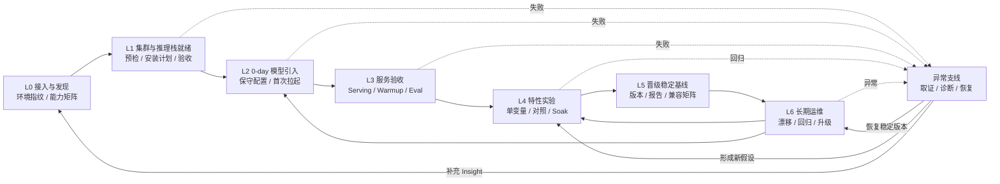

# InferNex Agent 推理服务全生命周期

本文描述 InferNex Agent 从集群接入、模型首次部署、特性实验、生产晋级、故障处置到长期运维的角色
变化。这里的“生命周期”不是一条执行完即结束的流水线，而是围绕稳定基线持续迭代的闭环。

“0-day 模型”在本文中特指刚发布或现场首次引入、尚无本环境验证配置和故障经验的新模型，不是信息
安全领域的 0-day 漏洞。

## 1. 生命周期总览



贯穿所有阶段的四条控制轴是：

1. **Policy**：当前 mode、scope、approval、budget 和维护窗口；
2. **Evidence**：事实来源、时间、对象身份、日志/指标和 SHA-256；
3. **Configuration Version**：稳定版本、候选版本、diff、父子关系和恢复输入；
4. **Deterministic Gate**：用 Ready、serving probe、评测和 soak 结果决定是否前进。

## 2. 各阶段的 Agent 角色

| 阶段 | 触发条件 | Agent 角色 | 工作侧重点 | 关键输出 | 给用户的帮助 |
| --- | --- | --- | --- | --- | --- |
| L0 接入与发现 | 首次安装、切换 kubeconfig、接入新集群 | 环境侦察员与边界解释者 | 识别 API Server、集群角色、BKE/Helm/Bridge/LWS/Gateway、节点/NPU 和权限 | 环境指纹、能力矩阵、风险与缺失项 | 不再要求用户预填内部资源名，避免把管理面当业务面或把 Bridge 当唯一入口 |
| L1 集群与推理栈就绪 | 建设或扩展 InferNex 推理集群 | 部署架构助手与变更守门员 | 复用 BKE/InferNex 安装入口，做 preflight、容量/网络/存储检查、安装计划和验收 | 安装计划、配置版本、diff、就绪报告 | 降低跨组件安装遗漏，安装失败时保留现场并回到明确状态 |
| L2 0-day 模型引入 | 新模型首次进入当前硬件与软件栈 | 模型接入工程师 | 查找最接近基线，识别模型架构与 runtime capability，生成保守配置，小规模首次拉起 | 初始 recipe、候选服务、未知项清单、首轮 Evidence | 缩短从“模型发布”到“当前环境首次可运行”的时间，避免直接套用不匹配模板 |
| L3 服务验收 | 实例拉起或配置变更完成 | 服务验收工程师 | 验证控制面状态、serving path、流式/非流式、warmup、单轮/多轮 eval 和基础稳定性 | 验收报告、性能起点、失败分类 | 把“Pod Running”提升为“服务确实可用”，减少带病上线 |
| L4 特性实验 | 开启 PD、Mooncake、量化、调度、通信或其他优化 | 实验编排者 | 从稳定版本克隆候选，一次只改变一个变量，执行相同数据与负载的对照实验 | 实验计划、阶段 Evidence、性能差异、回归原因 | 自动化重复试验，保持变量和测试口径一致，减少人工终端操作 |
| L5 晋级稳定基线 | 候选通过功能、性能和 soak 门槛 | 发布门禁与基线管理员 | 检查证据完整性、兼容范围和回退输入，标记 last-known-good | 稳定版本、兼容矩阵条目、验收报告、回退点 | 让下一次部署和实验从可复现基线开始，而不是依赖个人记忆 |
| L6 长期运维 | 服务稳定运行、版本升级、容量和 SLA 变化 | SRE 助手与知识管家 | 监测配置漂移、健康/性能回归、版本兼容、升级窗口和历史 incident | 健康摘要、漂移 diff、升级计划、趋势与记忆 | 降低日常巡检成本，把现场经验转化为可复用、可验证的组织知识 |
| 异常支线 | 任一阶段失败、非计划 Pod replacement、性能回归 | 证据协调者与 Incident Copilot | 保留首发现场、跨 Node/Pod/container/NPU 关联证据，调用专项 Subagent，提出恢复或下一实验计划 | Evidence bundle、时间线、根因假设、置信度、恢复建议 | 减少人工搬运日志和知识盲区，缩短定位与恢复时间 |

Agent 的角色会随阶段变化，但不会变成资源 Controller 或业务决策人。

## 3. L0：接入与环境发现

### 目标

先回答“我连接的是哪个集群、能看到什么、谁拥有这些资源”，再讨论部署。

### Agent 重点

- 输出 API Server 指纹，而不是只显示本机 hostname；
- 区分 openFuyao 引导、管理和业务集群视角；
- 自动发现 BKE、Helm Release、Bridge/KServe、LWS、Gateway、监控和弹性能力；
- 汇总节点架构、OS、NPU/GPU 容量和当前工作负载；
- 说明当前 kubeconfig/RBAC 能做什么，不能把缺权限解释成资源不存在；
- 生成集群级 Evidence/Memory scope，防止跨集群误用稳定配置。

### 帮助

把安装手册中的静态参数转化为环境事实，减少因 context、namespace、CRD 和部署形态理解错误造成的
第一类失败。

## 4. L1：集群与 InferNex 推理栈部署

这一阶段的边界必须讲清：InferNex Agent 不重写 BKE、Cluster API、Helm 或 InferNex Controller。
它负责理解目标、调用受支持入口、记录配置并验证结果。

### Agent 重点

1. 复用 infernex-checker 和官方 preflight，检查 NPU、驱动/CANN、DNS、存储、网络与资源容量；
2. 识别在线/离线 Chart、镜像和现有组件，避免重复安装或版本冲突；
3. 在执行前生成 Configuration Version 和语义 diff；
4. 将安装拆为有依赖关系的阶段，每阶段设置 readiness 和超时；
5. 失败时保留 Event、日志和配置，不用下一次重试覆盖首发现场；
6. 只通过 BKE、Helm 或 InferNex 的稳定入口修改 desired state。

### 当前状态

环境发现和安装 Agent 本身已经实现；InferNex 主 Chart 的完整 install/upgrade/rollback typed tools 仍在
设计中。因此当前介绍应说“已经具备部署前发现与纵向验证基础”，不能声称已自动建设完整 openFuyao
业务集群。

## 5. L2：0-day 模型实例部署

0-day 模型没有当前集群的稳定 recipe。Agent 的价值不是猜一个“万能参数”，而是系统化缩小未知空间。

### Agent 重点

- 识别模型架构、权重格式、上下文、并行和硬件容量约束；
- 检查当前 vLLM/vLLM-Ascend、CANN、tool-call parser、量化和 PD/Mooncake capability；
- 从相似模型和当前稳定服务中选择最近基线，明确“复用项”和“未知项”；
- 首次以最小规模、保守参数和最少特性启动；
- 记录 image/chart/model digest、环境指纹和完整配置；
- 先证明基础 OpenAI-compatible serving，再开启性能特性；
- 对 stream、reasoning、tool-call、长上下文等模型特有行为建立兼容探针。

### 帮助

- 将隐性的专家排查路径变成可重复工作流；
- 减少反复编辑 values、重建实例和手工比对日志；
- 形成该模型在特定硬件/软件组合下的第一份可复现基线；
- 为社区快速支持后续同类部署积累兼容矩阵和回归用例。

## 6. L3：从“拉起”到“验收”

验收分为由浅到深的门禁：

```text
控制面 observed generation
→ Pod/Rank readiness
→ Gateway/Router/PD serving path
→ OpenAI-compatible 非流式与流式请求
→ warmup
→ EvalScope 单轮/多轮正确性
→ 并发性能与资源状态
→ soak 与故障恢复
```

Agent 在这里扮演验收工程师，而不是让模型读日志后主观回答“看起来正常”。每个 gate 都应保存输入、
输出、持续时间、环境指纹和阈值。某一层失败时停止后续高负载测试，转入异常支线。

## 7. L4–L5：特性实验与稳定晋级

### 实验原则

- 从 `last-known-good` 克隆独立候选，不原地修改生产基线；
- 每阶段只增加一个可命名变量；
- 基线和候选使用同模型、数据集、并发、拓扑和测试窗口；
- 同时比较正确性、TPS、TTFT、TPOT、错误率、资源和关键日志类别；
- 性能提升不能掩盖正确性、稳定性或可恢复性回归；
- 失败候选保留配置和 Evidence，但不晋级。

### Agent 角色转换

实验期间 Agent 是“实验编排者”，负责保证变量和证据口径；晋级时转换为“发布门禁”，检查：

1. 所有必需 gate 已通过；
2. Evidence 可追溯且没有被截断的关键失败；
3. 配置版本、Chart/image/model digest 完整；
4. 回退输入经过验证；
5. 适用范围和未验证组合已经说明；
6. 最终晋级得到运维人员批准。

晋级不是简单把 candidate 标成 success，而是产生下一轮可复用的稳定基线、报告和兼容矩阵条目。

## 8. 异常支线：故障分析与恢复

故障分析贯穿所有阶段，但采集策略不同：

| 场景 | 默认采集重点 | 不建议默认做什么 |
| --- | --- | --- |
| 安装/首次拉起失败 | config diff、Event、current/previous logs、rank/CANN/HCCL 初始化 | 长时间全量性能压测 |
| 非计划 Pod replacement | termination、previous logs、plog、Pod UID、Node/NPU 状态 | 等 Pod 再次重建后才取证 |
| 正确性异常 | 请求/响应摘要、流式帧、parser 配置、相关 runtime 日志 | 把完整业务 prompt 无差别发送外部模型 |
| 性能回归 | 同口径基线、路由/PD/KVCache、PFC/HCCN、NPU 和资源指标 | 不控制变量地同时修改多个参数 |
| 长期运行异常 | 漂移、版本、变更记录、趋势、首个异常时间点 | 默认永久抓取全部容器底层日志 |

主 Agent组织 Evidence、部署上下文和恢复事务；专项 vLLM-Ascend/NPU Subagent 分析受限材料并返回
报告。Subagent 不拥有修改、安装、实验或回退工具。模型给出的根因是有置信度的假设，必须由工具或
实验验证；恢复动作仍受主 Agent Policy 控制。

## 9. L6：长期运维与持续学习

长期运维不是永久对话，而是低成本确定性观察加事件触发 Agent 工作流。

### 正常状态

- 周期读取健康、版本、资源和配置摘要；
- 发现 drift、容量风险和兼容矩阵变化；
- 对关键服务定期运行低负载 serving probe；
- 按策略安排评测、升级和稳定版本复验；
- 不默认持续抓取所有 plog 或把全部指标发送给模型。

### 事件发生时

- 以 change ID、Pod UID 和时间窗口创建 incident；
- 短时提升采集强度并启动对应 Skill/Subagent；
- 关联最近配置版本、实验和升级；
- 恢复后执行验证并关闭 incident；
- 将经过确认的根因、处理步骤和适用版本写入长期记忆或 Skill 候选。

### 帮助

Agent 把“某位工程师记得上次怎么处理”转化成带来源、版本和验证状态的组织能力，同时在每次使用前
重新读取实时环境，避免历史经验变成过期指令。

## 10. 人、Agent、Subagent 与控制器的责任

| 主体 | 始终负责 | 不应负责 |
| --- | --- | --- |
| 运维人员 | 业务目标、风险容忍度、维护窗口、外部系统授权、最终晋级和破坏性批准 | 手工搬运所有日志、重复执行固定检查 |
| InferNex Deployment Agent | 环境发现、计划、工具编排、Evidence、版本、门禁、报告和受控恢复 | 绕过批准、替代资源 Controller、决定业务 SLA |
| Diagnostic Subagent | 在授权 Evidence 和固定工具内做专项诊断推理 | 部署、修改、回退、提高自身权限 |
| InferNex/openFuyao Controller | desired state reconcile、资源生命周期和组件权威 status | 自然语言需求理解、跨组件 incident 推理 |
| 模型服务 | 规划、解释、归纳和假设生成 | 持有 kubeconfig、成为权限或成功的最终判据 |

## 11. 如何衡量生命周期价值

不应只统计“模型调用了多少工具”。建议跟踪：

| 价值方向 | 指标示例 |
| --- | --- |
| 新模型接入效率 | 从模型/镜像就绪到首个通过基础 serving gate 的时间 |
| 部署质量 | 首次验收通过率、失败 rollout 被自动限制在候选范围的比例 |
| 实验效率 | 单个特性完成同口径对照所需人工步骤和墙钟时间 |
| 稳定性 | 晋级后回归率、last-known-good 可复现率、回退验证通过率 |
| 故障效率 | Evidence 完整率、MTTD、MTTR、需要人工跨节点登录次数 |
| 知识复用 | 已验证 Insight/Skill 的复用次数、重复 incident 减少比例 |
| 安全治理 | 未经批准写操作数、越界访问拒绝数、配置漂移冲突阻断数 |

这些指标需要先建立基线再观察趋势，不在尚未真实验收前承诺固定百分比收益。

## 12. 当前实现映射

| 生命周期阶段 | 当前成熟度 | 说明 |
| --- | --- | --- |
| L0 接入与发现 | 已实现 | openFuyao/K8s/Helm/Bridge discovery 和通用读取已具备 |
| L1 集群与推理栈部署 | 部分实现 | preflight/观察基础已具备；完整主 Chart typed install/upgrade 尚待实现 |
| L2 0-day 模型引入 | 部分实现 | Agent loop、证据和 Bridge 来源部署纵向切片已具备；模型 capability/serving recipe 尚待扩展 |
| L3 服务验收 | 设计中 | readiness 基础存在；serving/warmup/EvalScope/soak 工具尚待实现 |
| L4–L5 实验与晋级 | 部分实现 | Bridge 路径单变量实验和 change journal 已实现；主 Chart 配置版本待统一 |
| 异常支线 | 当前最完整 | 日志、Evidence、固定 probe、plog、CollectorRun、Skill、受限 Subagent 已具备 |
| L6 长期运维 | 部分实现 | Supervisor、Dashboard、语义记忆已有；metrics、告警、升级闭环待实现 |

这张表也解释了当前开发顺序：先把观察和异常处置做深，再把相同 Evidence、Policy 和版本基础复用于
0-day 模型部署、主 Chart 变更、验收、实验晋级和长期运维。
