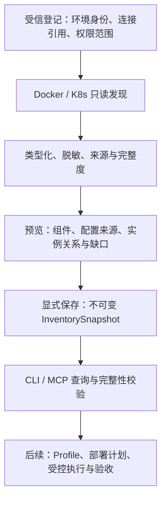

# 私域部署演进：实现顺序与开工判定

状态：2026-10-02，设计分支 `codex/private-deployment-evolution`。结论：**首批环境建模与只读清单已具备开工条件；客户部署执行按明确的后续准入门禁推进。** 本页是[唯一路线图](https://github.com/lsjfy-open-com/infernex-agent/blob/codex/private-deployment-evolution/component/InferNex-Agent/docs/development/roadmap-zh.md)中私域演进增量的实施细化，不创建另一套优先级或发布版本号。2026-10-06 实施更新：前三个增量已落入演进分支，包含受限 CLI/stdio 入口；测试与使用边界见[使用指南](https://github.com/lsjfy-open-com/infernex-agent/blob/codex/private-deployment-evolution/component/InferNex-Agent/docs/guides/private-inventory-zh.md)。尚未发布安装包，真实客户硬件及生产部署仍按后续门禁验收。

## 1. 先形成可使用的最小纵向能力

客户已有 Docker 聚合、Docker PD 和 K8s 服务，首先需要知道实际用了什么组件、参数、设备与配置，以及哪些事实尚未拿到。首批交付后，Host 上的 Agent 可在没有 InferNex、甚至没有 kubeconfig 的 Docker 环境中产生可查询清单；K8s 沿用原身份发现方式。清单带来源、范围、时间和缺口，下一阶段规划器才能可靠使用。

首批不让发现结果直接触发部署，也不自动生成并启用工具。对未知框架保留未知，仍能完成容器、工作负载、配置来源和资源声明的盘点。GPU/NPU 型号与设备请求只能证明观察到的声明，不能凭此承诺模型能加载或 SLO 达标。

## 2. 已冻结的技术决策

| 决策 | 选择和理由 | 变更条件 |
| --- | --- | --- |
| 数据形态 | 先用两个严格类型记录及快照内实体；文件存储和关系索引足够承载首批规模 | 查询规模、并发写入或事务需求经测量后再考虑数据库 |
| 环境与拓扑 | Docker/K8s 与聚合/PD 正交；一个服务可有多个 worker，不能按容器数算实例数 | 新 runtime 增 adapter，不改已有意图语义 |
| Docker 接入 | 本机 Unix socket 的固定只读 Engine API；不新增 SDK，不运行任意 shell | 远端 TLS/SSH 各以独立安全与身份测试增量接入 |
| K8s 接入 | 复用 kubeops 读取与原 kubeconfig 发现；依赖按启用环境初始化 | 不能要求 Docker-only 用户先安装 K8s 或 Helm |
| 摘要与修订 | 固定规范化算法；快照每次新 ID，revision=1；登记 revision 用 CAS | schema 升级要有显式迁移与黄金向量 |
| 权限 | 首批 scope 固定本机拥有者 UID，CLI/stdio 使用；工具参数只能缩小范围 | 多主体远端服务须先提供身份映射，不能信任请求里的 tenant |
| 演进方式 | 观察、候选生成、隔离验证、批准启用分别记录 | 任意模型提议不直接成为生产插件或可信知识 |

字段、上限、存储和命令细节以[首批实现合同](https://github.com/lsjfy-open-com/infernex-agent/blob/codex/private-deployment-evolution/component/InferNex-Agent/docs/architecture/private-deployment-contracts-zh.md)为准；这几项不再留给编码阶段临时选择。

## 3. 前三个 PR：逐个可合入

| 顺序 | 范围与代码落点 | 完成出口 | 明确不包含 |
| --- | --- | --- | --- |
| PR1：中立记录 | 新 `internal/domain`：Environment、InventorySnapshot、实体/来源/完整度、完整引用、严格解码、规范摘要、限额 | 黄金 JSON fixture、篡改/未知字段/重复键/Secret/跨域负例、无 Bridge 依赖；纯 Go 测试可离线执行 | 数据库、部署计划、通用知识检索 |
| PR2：只读适配 | 新 `internal/adapters/dockerdiscovery` 与 `kubernetesdiscovery`，窄 API/Reader；版本化白名单字段投影 | 两环境的确定性 fixture，partial/缺权限/替换身份/超限/取消测试；全过程无变更调用 | 容器创建、PD 连通、设备性能、任意插件加载 |
| PR3：可使用入口 | 新 `internal/domainstore`、CLI `private-inventory`、stdio MCP 查询与显式保存、Pi `host-tools.ts` 受信本地保存名单及来源校验；服务按环境初始化依赖 | 原子保存与重启，scope/预览 handle 校验；无 kubeconfig 的 Docker-only 启动；原 K8s 配置发现不回归 | 新 Dashboard 页面、HTTP 清单入口、多租户服务、生产写入、自动升级 |

PR1 合入后 PR2 才以正式类型开发；PR3 可先用 fake Reader 实现存储，集成必须等 PR2 通过。每个 PR 附验证证据及未测项，在本演进分支持续提交；需要合入 develop 时按这三个逻辑边界组织，不把设计、全新执行器和发布包混成一个变更。

首批完成的演示脚本必须能解释：登记一个 CPU 合成 Docker 环境 → 发现 → 看到一个无法确认角色的容器和一个配置来源 → 显式保存 → 重启进程 → 查询相同摘要 → 模拟 inspect 失败并看到 partial。K8s 同样演示一个 namespace 可读而另一个无权；失败不掩盖可见对象。合成环境不得展示为客户真实设备/性能结果。

## 4. 后续 PR 的输入与准入条件

| 增量 | 输入和必须先确定的内容 | 可以交付的结果及停止条件 |
| --- | --- | --- |
| PR4：只读视图与差异 | 已持久清单；同环境不同快照；脱敏配置来源；先冻结并实现 HTTP 主体认证/ACL | Dashboard 沿用 Host IP，显示来源、模板/Helm/Compose 路径引用、角色/规模、未知与漂移。原始配置正文需单独授权采集，不能假装首批已保存 |
| PR5：首个引擎 Profile 与 Plan | 精确引擎/镜像 digest、设备、权重引用、启动模板、健康基线；先 Docker 聚合 | 确定性渲染与差异、前置条件、验收/恢复计划；缺失兼容/容量证据时 blocked，无 apply |
| PR6：Docker 聚合生命周期 | PR5、执行身份、隔离资源、端口/设备约束、现有稳定版本可用 | Apply/GetChange/Recover，持久步骤、幂等、重启对账、外部占用漂移、模型就绪与请求验收；故障注入证明可恢复 |
| PR7：Docker PD | 精确 P/D 引擎+连接器契约、TP/KV 布局、路由和可观测阶段；真实硬件 | 角色组、KV 路径及真实请求证据；必须按冻结负载验收，不能用普通容器 Ready 通过 |
| PR8：原生 K8s 执行 | 同一 Intent/Plan 语义，模板与 Helm/Operator 管理权；确认原生聚合后再 PD | 经拥有者创建/升级/恢复；没有 Bridge 也可验收，受支持资源外明确拒绝 |
| PR9：组合版本和交换包 | 配置 Git commit、前后快照、外部权重版本、镜像/能力 digest、依赖闭包与信任策略 | 联网核对和离线导入共用验证；先隔离验证再变更，不原地覆盖权重；断网时不伪造最新信息 |
| PR10：受控自演进 | 前述真实部署记录与反例、私域 ACL、隔离构建器、保留测试、候选 registry | 生成候选规则/Skill/工具，测试后审核启用；独立第二环境测迁移收益，不用训练案例证明泛化 |

PR4–PR10 是后续逻辑增量，允许各自再拆，但不能跳过输入门禁。客户若先要求 K8s，可把 PR8 的聚合执行提前到 PR6 位置；沿用同一持久计划/恢复合同，不再造 K8s 专用 Core。

2026-10-07 PR4 实施：独立 `private-inventory dashboard` 读取已存记录，提供固定 scope 的 Bearer 认证、非回环 HTTPS、分页清单与保守快照差异；不依赖 kubeconfig 或 Helm，不修改原公开总览。此阶段 ACL 是单个令牌对应一个本机管理范围，尚不提供多人细分授权。配置只展示已采到的来源，原始 YAML 与实时采集均未接入。操作与限制见[Dashboard 指南](https://github.com/lsjfy-open-com/infernex-agent/blob/codex/private-deployment-evolution/component/InferNex-Agent/docs/guides/private-inventory-dashboard-zh.md)。

## 5. 写操作进入编码前的检查表

后续执行器以本文总体边界为基础，但不能仅拿一条启动命令就开始自动升级。进入 PR5/PR6 前，以下输入必须落为版本化 fixture：

1. **目标**：登记身份、逻辑服务 ID、物理对象 ID、管理拥有者、作用域与明确可执行动作。
2. **制品**：镜像 digest、外部权重/模型配置/tokenizer 版本、设备与驱动范围，回退版本确实可获取。
3. **计划**：参数 schema、渲染结果、只包含受支持动作的步骤依赖图、计划 digest、过期/漂移条件。
4. **授权**：批准或当前任务预授权绑定目标、参数摘要、影响范围；不得把 root/risk 字符串当永久授权。
5. **账本**：每步 pending→running→observed-success/failed/unknown；调用前记意图，重启先读取外部状态，幂等键与资源归属绑定。
6. **恢复**：前置资源/镜像/权重检查、摘流与流式排空、逆序补偿、旧实例和数据恢复范围；外部资源不在自动删除范围。
7. **验收**：模型请求正确、服务成功率、吞吐与 TTFT/TPOT，失败/证据不足的处理；至少验证取消、响应丢失、服务重启及外部漂移。

Git 记录期望模板，Snapshot 记录观察，ReleaseManifest 关联不可变版本；三者组成恢复依据，不等于运行内存或业务数据备份。就算 root risk 跳过交互，也不跳过身份、数据完整性、参数和管理权校验。

## 6. 验收与待补资料

前三个 PR 的必选测试完全使用脱敏合成 fixture 和临时状态目录，不需要网络、Docker daemon、K8s 或加速卡；实际 daemon/Kind 作为另外标注的 smoke。详细命令、用例和阻断项见[可执行验收规范](https://github.com/lsjfy-open-com/infernex-agent/blob/codex/private-deployment-evolution/component/InferNex-Agent/docs/development/private-deployment-implementation-acceptance-zh.md)。要求 0 次运行时变更调用、0 个测试密钥泄漏、0 次跨 scope 访问、100% 负例被正确拒绝；所有已返回 partial 状态在保存和重启后保持。

生产能力按[两阶段现场验收](https://github.com/lsjfy-open-com/infernex-agent/blob/codex/private-deployment-evolution/component/InferNex-Agent/docs/development/private-deployment-acceptance-zh.md)计量：各环境/拓扑独立统计部署与升级成功率，固定负载下比较吞吐、p95 TTFT/TPOT、质量和绝对 SLO；不能用清单测试通过代替这些结果。

| 资料 | 提供方/记录责任 | 最晚需要时间 | 缺失处理 |
| --- | --- | --- | --- |
| Docker 聚合/PD 启动配置及 K8s 模板的脱敏版本 | 客户环境负责人提供，适配实现者登记摘要 | PR5 Profile 冻结前 | 前三个 PR 继续；不能生成生产可执行计划 |
| 引擎、连接器、镜像、驱动、设备和拓扑 | 客户平台负责人提供，适配实现者核对 | PR5；PD 字段在 PR7 前 | 仅列未知项，不选 latest 或推断 TP 兼容 |
| 权重存储引用、修订与回退可用性 | 模型服务负责人提供，版本管理实现者核对 | PR5/PR6 前 | 不读权重正文，不承诺可恢复 |
| 主体/权限、联网及数据出域策略 | 客户管理员提供，执行边界实现者登记 | 真实环境接入前 | 本地 fixture 可继续；不得连接未登记目标 |
| 健康服务、压测负载、SLO 和质量口径 | 业务负责人给目标，验收负责人冻结样本 | PR6 真实验收前 | 可测控制逻辑，现场能力仍为未验收 |

这些是后续开工依赖，不要求客户现在提交凭据。登记依赖时再落实人员姓名和实际日期；本文不虚构客户排期。

## 7. 就绪结论

可开始 PR1，并按合同推进 PR2、PR3：模型、身份、摘要、发现传输、限额、存储、权限、入口、兼容和测试均已明确，无须等待本体平台、知识图谱数据库或客户硬件。执行器及自演进的边界、顺序和输入门禁已列清；它们的现场 Profile 和部署参数需要上述客户证据后冻结。本次规划到此收敛，下一次实施应交付前三个 PR，而不是继续增加无验证输入的概念对象。
