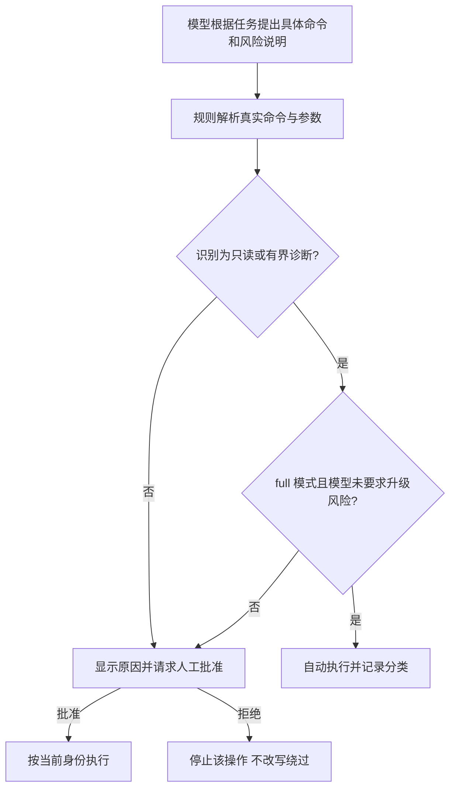

# Host manual / full / risk 模式与命令审批

命令分类增强与 `root risk` 已包含在 alpha.21 安装包中。它修复常见 Kubernetes 查询因为参数位置、输出格式或只读管道未被识别而反复弹出审批的问题。适用于 Host Pi TUI，不改变后台服务的 Kubernetes RBAC 或集群变更保护；risk 模式可以取消当前 TUI 的 Host 和 MCP 逐次批准。

```text
/mode_change root full
```

`root` 选择本机身份，`full` 选择执行策略。normal + full 也使用同一套分类，但仍受普通用户权限限制。模式不跨会话保存，执行中不能切换身份。

## root risk：取消逐次批准

由操作者在空闲的交互式 TUI 中输入：

```text
/mode_change root risk
```

该命令本身表示对当前会话任务的风险操作授权，不再附加一次弹窗。TUI 必须以 root 身份启动，进入 root 前会检查真实 UID；仅修改命令参数或模型输出不能开启此模式。进入后状态栏明确显示高风险及不逐次审批。

| 访问策略 | Host 命令 | MCP 调用 |
| --- | --- | --- |
| manual | 逐次批准 | 只读自动，写操作逐次批准 |
| full | 已识别只读和有界诊断自动；变更及未知命令需批准 | 只读及明确列出的本地采集/报告操作自动，集群变更需批准 |
| root risk | 任意命令、脚本、集群变更及压测均不逐次询问 | 包括写操作在内，均不弹出 TUI 批准对话框 |

risk 下仍记录命令分类与模型风险意见，但它们不触发逐次批准。模型继续完成当前任务和验证，不因操作有写入影响而口头再次索要许可；目标或需求不明确时仍需澄清。工具所需的 `confirm` 字段由模型在核对目标和参数后按本次会话授权填写，执行层不会静默改写参数。

risk 是取消 TUI 审批，不是保证任何操作都能成功：实际 Linux 身份、SSH 远端身份、Kubernetes RBAC、工具参数校验、并发锁、超时/取消以及后台快照与资源一致性检查继续生效。后台服务不会因此自动切换为 root，模型不能以 risk 为由绕过后台拒绝。

退出方式：

```text
/mode_change root full
/mode_change root manual
/mode_change normal
```

从 risk 单独切回 normal 时自动恢复 manual。`normal risk` 不合法；进入 risk 必须明确指定 `root risk`。新建或恢复会话始终重置为 normal + manual，risk 不持久保存。

## full 的操作分类

| 分类 | 示例 | full 下的行为 |
| --- | --- | --- |
| 只读 | kubectl get/describe/logs、Helm list/status/history/get values、已识别的 Pod/SSH 读取、只读过滤管道 | 规则确认后自动执行，无需逐次弹窗 |
| 有界诊断 | 固定参数网络探针、PFC 采样，以及规则支持的有界观察 | 自动执行；工具本身的参数、时间和输出上限继续生效 |
| 集群变更 | apply、patch、delete、scale、rollout restart/undo、drain | 展示命令和判定原因，由用户批准 |
| 未识别 | 任意脚本、未知参数、命令替换、重定向、规则不支持的组合 | 请求批准；模型的“低风险”声明不能直接放行 |

例如，下列查询应直接执行：

```bash
kubectl --kubeconfig /etc/infernex-agent/kubeconfig -n models get pods -o wide
kubectl get pods -n models -o json
kubectl -n models logs model-0 --tail=100 | grep -n timeout
helm -n models list
```

只读不等于零开销，也不意味着所有可读取数据都适合交给模型。规则只覆盖明确的命令和参数形式；权限拒绝、资源不存在和超时仍原样返回。分类以现场安装的可执行文件、kubeconfig 和 SSH 配置可信为前提：Kubernetes 认证插件和 SSH 连接配置可能自行运行辅助程序，命令分类不会审计这些配置的全部行为。此分类器不是抵御被篡改可执行文件、恶意连接配置或恶意扩展的沙箱；不应将外部导入的未知配置当成可信连接直接使用。

## manual / full 下规则与模型如何配合



模型可以先调用 `infernex_classify_command` 查询分类；这个工具不执行命令、不授予权限、不创建批准记录。`infernex_host_exec` 接受可选的 `riskAssessment`，由当前任务模型提供分类和简短理由。规则在实际执行前重新检查原始命令；模型只能提高风险等级，不能把规则判为变更或未知的操作降为自动执行。该实现不另启一个独立模型评审服务。

执行结果记录规则分类、模型意见和实际批准方式，审批提示展示需要人工介入的具体原因。模型应优先使用已识别命令或结构化诊断工具，避免对已自动放行的读取再次口头索要确认。

## 为什么 full 下部分可回退的操作仍需确认

重启可以重新启动，扩缩容可以改回副本数，但执行当时仍可能中断流式请求、清空缓存或挤占设备。可回退不是自动放行生产变更的充分条件。full 不缓存任意集群写命令的批准，也不将一次确认推广成整个 namespace 的写权限。操作者确实需要取消这些逐次确认时，可显式选择上面的 root risk。

后续若引入“一次批准执行整组变更”，需要把批准绑定到明确计划、目标、参数摘要、有效期和恢复动作，并在资源变化时失效；这属于受管变更事务，不是本次分类修复已经交付的能力。

安装和诊断身份的更多说明见 [Host 权限与网络诊断](https://github.com/lsjfy-open-com/infernex-agent/blob/develop/component/InferNex-Agent/docs/guides/host-network-diagnostics-zh.md)。
