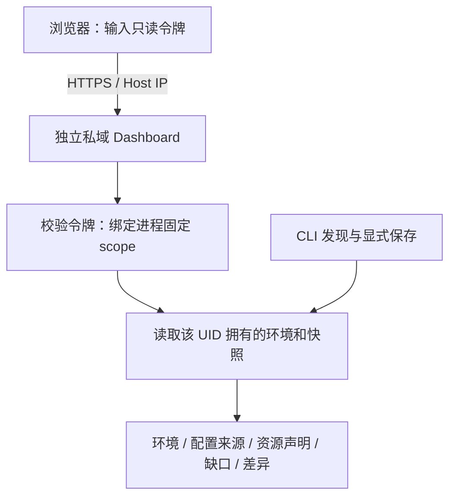

# 私域清单 Dashboard：Host 访问与快照差异

本页对应演进分支的 PR4 只读视图。先按[私域清单指南](https://github.com/lsjfy-open-com/infernex-agent/blob/codex/private-deployment-evolution/component/InferNex-Agent/docs/guides/private-inventory-zh.md)登记环境、发现并保存快照，再启动页面。页面读取已保存记录，不主动扫描 Docker/K8s，不部署、升级或删除实例。它不要求安装 InferNex Bridge、Helm 或 kubeconfig；状态目录仍要求 Linux 本地文件系统。

## 访问形式与权限



该入口是单一管理范围的只读视图。令牌持有者可以读取此范围内全部已存环境和快照；尚不提供按用户、namespace 或环境细分的账户系统。HTTP 请求不能指定 scope、连接地址、kubeconfig 或本机文件路径。页面与静态资源可以公开加载，数据 API 必须认证；不会把已有公开总览变成私域清单的无认证入口。

使用初始化状态目录时的同一 Linux 用户运行。root 不会接管普通用户的目录。访问令牌仅保留在页面内存中，刷新后重新输入，退出会清空视图；不会写入浏览器存储或 URL。更换令牌文件后需重启服务使旧令牌失效。

## 启动与外部直访

以下路径及 IP 均需替换。首次创建一个独立令牌文件，避免覆盖正在使用的令牌：

```bash
STATE_DIR=/ABSOLUTE/PRIVATE-STATE
TOKEN_FILE=/ABSOLUTE/PROTECTED/inventory-dashboard.token
(umask 077; set -C; openssl rand -hex 32 > "$TOKEN_FILE")
chmod 600 "$TOKEN_FILE"

# 本机访问；不连接 Docker 或 Kubernetes。
infernex-agent private-inventory dashboard \
  --state-dir "$STATE_DIR" \
  --token-file "$TOKEN_FILE" \
  --listen-address 127.0.0.1:8082
```

浏览器访问 `http://127.0.0.1:8082/`，在登录框输入令牌。默认端口是 8081；示例用 8082 避免与原 Dashboard 冲突。命令在前台运行，可由客户现有进程管理器托管；本增量不会修改原 systemd 服务或替用户开放防火墙。

从其他机器直接访问 Host IP，使用客户 CA 签发、证书 SAN 包含该 IP 的证书，并让浏览器信任该 CA：

```bash
infernex-agent private-inventory dashboard \
  --state-dir "$STATE_DIR" \
  --token-file "$TOKEN_FILE" \
  --listen-address 192.0.2.10:8082 \
  --tls-cert /ABSOLUTE/TLS/host.crt \
  --tls-key /ABSOLUTE/TLS/host.key
```

将文档示例地址 `192.0.2.10` 换成实际 Host IP，通过 `https://实际HostIP:8082/` 访问；只需目标端口可达，不需要隧道。非回环监听强制要求 TLS，防止私域数据和令牌经明文网络传输。监听参数使用 IP 字面值，不接受主机名；证书和私钥成对配置。启动失败时先检查端口占用、文件所属用户、0600 令牌权限、证书与私钥是否匹配；不要通过关闭认证或复制凭据到 URL 绕过。

## 页面能展示什么

| 视图 | 用户能看到的内容 | 解释边界 |
| --- | --- | --- |
| 登记与记录 | Docker/K8s 环境、修订、快照时间、摘要、分页记录 | 记录顺序不是采集时间顺序；手动选择对比方向 |
| 资源 | 容器、工作负载、节点等实体及事实来源 | 容器数不是服务实例数；CPU/设备/副本声明不是实测容量 |
| 配置来源 | 已采集的模板、Helm/Compose 路径或配置来源引用 | 不读取任意路径，不返回原始 YAML、连接凭据或配置正文；未采到则显示未知 |
| 覆盖与问题 | complete/partial、资源与 namespace 覆盖、失败和未知事实 | 空记录不自动等于空集群；采集时间不代表实时状态 |
| 差异 | 实体、字段和关系的前后变化，以及登记修订变化 | 仅比较同一已登记环境、相同运行时与物理身份 |

两个快照覆盖范围相同且都完整时，缺失对象可以归为“移除”；有权限缺口、超时、分页续扫或覆盖范围不同时，只能归为“未观测到”。同理，基线不完整时新增观测不能声称是刚创建的资源。单纯采集时间改变不算配置漂移。这里的移除是观测差异，不是 Dashboard 执行了删除，也不能推断变更操作者。

当前还没有生产部署按钮、实时性能曲线、组合版本发布或自动恢复。后续 Profile/Plan 和版本管理按[实施顺序](https://github.com/lsjfy-open-com/infernex-agent/blob/codex/private-deployment-evolution/component/InferNex-Agent/docs/development/private-deployment-implementation-plan-zh.md)接入。

## API 与验收

只开放以下 GET 请求，均通过 `Authorization: Bearer …` 认证：

- `/api/v1/inventory/records`：按记录类型分页，后续页使用服务器返回的游标。
- `/api/v1/inventory/record`：读取确定的类型、UUID 和修订。
- `/api/v1/inventory/diff`：比较两个快照 UUID，revision 固定为 1。

写方法、重复或未知参数、跨域请求、篡改游标与非法引用被拒绝。返回体限制为 256 KiB；超过限制会明确报错，不静默截断成完整记录。大快照可先用本机 CLI 查询，后续细粒度实体分页另行扩展。

开发验收使用合成环境与临时目录：无令牌/错误令牌返回 401 且不读取存储；正确令牌只读固定 scope；连接及凭据引用不出现在响应；不完整清单不产生确定删除；特殊字符按文本展示；退出清空数据；Docker-only 启动不创建 Kubernetes client。执行：

```bash
go test -race ./internal/inventoryview ./cmd/infernex-agent
go vet ./internal/inventoryview ./cmd/infernex-agent
```

这些检查证明页面、鉴权、差异和启动行为，不替代客户网络、真实 Docker/K8s、加速卡、PD 或业务 SLO 验收。

2026-10-07 本地验证：全仓 Go race 测试 527 项、30 个包通过，vet 通过；浏览器用合成记录验证登录、快照详情、不完整差异、刷新重新认证和退出清空；Node 行为测试覆盖转义与鉴权错误。实际 Linux 结果以本分支 PR 检查为准，未发布新版安装包。
