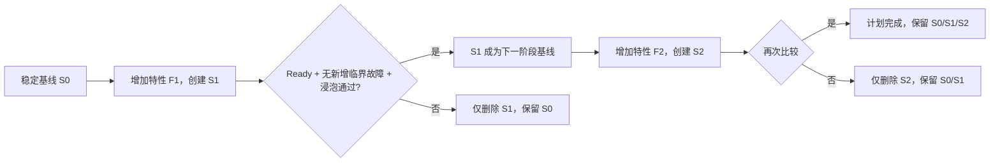

# 渐进式特性实验与跨节点故障关联

## 1. 解决的问题

InferNex 同时承载 vLLM、vLLM Ascend、Mooncake、PD 分离、HCCL/RDMA、
Hermes 等组件。单个开关往往是安全的，但多个版本、参数和组件组合后，可能出现：

- engine/worker 异常退出、请求流中断或响应被截断；
- UTF-8、JSON、流式分片或 tokenizer/协议不一致导致的乱码；
- NPU、CANN、HCCL、RDMA、Mooncake、Prefill/Decode 之间的级联故障；
- 候选配置未 Ready、短暂 Ready 后再次失效，或只在部分节点发生问题；
- 人工逐节点收集日志时丢失时间关系，把下游症状误当成根因。

Agent 将这类工作拆成两个确定性能力：

1. 对一个 `InferNexService` 的受管 Pod、当前/上一次容器日志和 Kubernetes
   Event 做有界采集、脱敏、分类和跨节点时间线关联；
2. 从一个稳定服务开始，每一阶段只前置一个管理员批准的特性 profile，创建
   独立候选服务；候选尚未 Ready 时出现新增临界故障会提前回退，只有经过
   Ready、基线对比和浸泡门禁后才进入下一阶段。

模型分析仍然只是建议。实验创建、健康门禁和回退不使用模型输出。

## 2. 工作流



每个阶段都有独立 `changeId`。Agent 在创建候选前先追加写入计划和变更记录；
进程重启后会从持久状态恢复未完成阶段。删除候选前必须同时匹配实验 ID、
`changeId` 和 Agent 所有权，名称碰撞、spec 漂移或所有权变化都会拒绝覆盖。

当前模式是“并行候选”，不会修改基线或切换生产流量，因此目标集群必须有足够的
空闲 NPU、内存和网络资源。已通过的候选会作为下一阶段基线并保留，原始稳定服务
也始终保留；计划失败时只回退当前阶段。

一个 Agent 实例同一时间只运行一个渐进计划。这样可以限制日志读取和并行候选的
资源冲击，也能让阶段因果关系保持清晰；已有计划结束前，新计划会被拒绝。

## 3. 配置合并与基线约束

实验复用 InferNex Bridge 的 `InferNexServiceConfig` 和 `baseRefs`，不实现第二套
vLLM/Mooncake 编排器。Bridge 当前采用“先出现的已设置字段优先，后续模板只补
空字段”的合并行为，所以 Agent 将本阶段 profile 放在现有 `baseRefs` 最前面。

为了保证单变量实验可解释，基线必须：

- 当前 generation 已被 Bridge 观察且状态为 Ready、非 Degraded；
- 至少有一个 `baseRef`；
- `engine`、`components` 和 `intelligentGatewayRouting` 不在服务内联定义，
  而是由 `baseRefs` 提供；
- 可以继续保留原有的 `model` 或 `sourceRef`。

特性 profile 必须位于与 Bridge 相同的模板命名空间，且：

- 带 `agent.infernex.io/approved-experiment-feature=true`；
- 只包含该特性的稀疏字段；
- 不包含 `sourceRef`、`model` 或新的 `baseRefs`；
- 由部署人员按实际 InferNex/vLLM Ascend/Mooncake 版本提前验证和审批。

一个最小示例：

```yaml
apiVersion: infernex.infernex.io/v1alpha1
kind: InferNexServiceConfig
metadata:
  name: feature-mooncake-v1
  namespace: infernex-bridge-system
  labels:
    agent.infernex.io/approved-experiment-feature: "true"
spec:
  components:
    mooncake:
      enabled: true
```

实际启用 Mooncake 通常还需要 engine 容器参数、KV connector、配置挂载和网络
设置。应将“完成一个原子特性所需的全部字段”放入同一个版本化 profile，而不是
让 Agent 猜测不同框架版本的参数。复杂 profile 可直接从现有已验证的
`InferNexServiceConfig` 拆出差异层。

建议命名：

```text
feature-vllm-v1-engine-v1
feature-vllm-ascend-prefix-cache-v1
feature-mooncake-kv-transfer-v1
feature-hermes-kv-aware-v1
```

版本、镜像 digest、CANN 兼容范围、预期 NPU 数量和回退责任人应记录在组织的
配置评审流程中。Agent 的批准标签表示“允许被实验控制器引用”，不表示该配置
一定稳定。

## 4. 诊断与关联语义

诊断器只列出带 `infernex.io/owner=<service-name>` 的 Pod，并读取：

- init container 和普通 container；
- 当前日志；容器发生过重启时还读取上一次日志；
- 与该服务及受管对象相关的 Kubernetes Event。

默认窗口为 15 分钟、最多 50 个 Pod、每个日志流尾部 200 行和 128 KiB；硬上限
分别为 24 小时、100 个 Pod、1000 行。报告最多保留 200 条匹配证据，不保存整份
日志。常见 Authorization、API Key、Token、Secret、Password 和 URL 用户信息
会被替换为 `[REDACTED]`。

持续巡检默认每轮最多对 10 个异常服务采集日志，超过预算的服务标记为
`DIAGNOSTICS_DEFERRED` 并留待下一轮；可通过
`--max-diagnostics-per-scan` / `supervisor.maxDiagnosticsPerScan` 调整。MCP
单服务诊断和当前实验的基线/候选比较不占用这项巡检预算。

当前确定性分类包括：

| 类别 | 典型上游/症状 |
| --- | --- |
| `npu-device-failure` | NPU/CANN/ACL/HBM/ECC/设备丢失 |
| `collective-communication-failure` | HCCL、collective、RDMA 超时或断连 |
| `resource-exhausted` | HBM/内存 OOM、资源分配失败 |
| `kv-transport-failure` | Mooncake/NIXL/KV transfer 失败或损坏 |
| `engine-worker-failure` | vLLM engine/worker 退出、崩溃、SIGSEGV |
| `stream-interrupted` | broken pipe、reset、EOF、响应截断 |
| `output-corruption` | 非法 UTF-8、无效 JSON、decode/乱码相关错误 |
| `operation-timeout` | 请求、启动或操作超时 |

证据按两分钟窗口聚合。根因排序优先选择 NPU/HCCL/Mooncake 等上游证据，再把
worker 退出、stream 中断和输出损坏作为同一 incident 的症状。报告包含涉及的
节点、Pod、组件、起止时间、置信度和建议；发送给可选诊断模型的摘要不包含原始
日志、Pod 名或节点名。

候选门禁不是要求“零错误”，而是比较基线和候选的临界类别计数。只有候选比基线
新增或增加临界类别时才判定回归，避免把现网已有故障错误归因给新特性。
这个比较从候选创建后就开始，因此明确的 NPU、HCCL、Mooncake、worker 崩溃等
问题不必等 Ready 超时；Ready 后仍需至少一次成功比较，并在连续浸泡期间保持健康。

## 5. 启用方式

### 5.1 集群内 Helm

```bash
helm upgrade --install infernex-agent ./chart/infernex-agent \
  --namespace infernex-system \
  --create-namespace \
  --set 'rbac.targetNamespaces[0]=models' \
  --set supervisor.diagnostics.logs.enabled=true \
  --set experiments.enabled=true \
  --set-string experiments.templateNamespace=infernex-bridge-system \
  --set changeSafety.persistence.enabled=true
```

实验不允许使用 cluster-wide RBAC。Chart 只增加目标命名空间中的
`InferNexService create/delete`、`pods/log get`，以及模板命名空间中的
`InferNexServiceConfig get`。生产必须使用持久 PVC；否则 Pod 被替换后无法恢复
未完成计划。实验协调当前采用单写者语义，Helm 会强制 `replicaCount=1`；高可用
版本需要先增加 Kubernetes Lease 选主，不能直接扩成多个副本。

离线包安装命令：

```bash
./bin/install-agent.sh \
  --target-node master-01 \
  --target-namespace models \
  --dashboard-cidr 10.20.0.0/16 \
  --runtime ctr \
  --enable-experiments \
  --experiment-template-namespace infernex-bridge-system \
  --state-storage-class local-path
```

`--enable-experiments` 会同时启用有界日志诊断。

### 5.2 openEuler 管理节点

创建专用身份和安装服务时都显式授权：

```bash
sudo ./bin/create-kubeconfig.sh \
  --admin-kubeconfig /etc/kubernetes/admin.conf \
  --target-namespace models \
  --enable-experiments \
  --experiment-template-namespace infernex-bridge-system \
  --output /root/infernex-agent-host.kubeconfig

sudo ./bin/install-host.sh \
  --kubeconfig /root/infernex-agent-host.kubeconfig \
  --scan-namespace models \
  --enable-experiments \
  --experiment-template-namespace infernex-bridge-system
```

计划和变更记录保存在 `/var/lib/infernex-agent/experiments/` 与
`/var/lib/infernex-agent/changes/`。

## 6. 启动和查看实验

通过 MCP 调用 `infernex_start_experiment`：

```json
{
  "namespace": "models",
  "baselineName": "qwen-pd-stable",
  "candidatePrefix": "qwen-pd-exp-202608",
  "featureProfiles": [
    "feature-vllm-ascend-prefix-cache-v1",
    "feature-mooncake-kv-transfer-v1"
  ],
  "confirm": true
}
```

数组顺序就是阶段顺序。返回的 `experimentId` 可用于：

- `infernex_get_experiment`：读取阶段、候选名、`changeId`、比较和回退结果；
- `infernex_list_experiments`：列出最近计划；
- Dashboard `/api/v1/experiments`：供外部监控读取完整状态；
- Dashboard 首页：查看阶段进度、稳定候选和诊断回归类别。

单服务诊断可随时通过只读工具 `infernex_diagnose_service` 触发。

## 7. 上线建议

1. 先把当前人工确认的配置整理为只引用 `baseRefs` 的稳定基线；
2. 每个 profile 只表达一个可审计的原子变化；
3. 先在非生产命名空间用相同硬件拓扑验证 profile；
4. 按最小资源候选计算空闲 NPU，避免实验与基线互相争抢造成伪回归；
5. 浸泡时间至少覆盖一次典型业务峰值和一次容器日志轮转周期；
6. 通过外部监控保留实验 JSON、业务 SLO 和 NPU 指标，形成配置知识库；
7. 计划通过后由人工或未来的受批准流量计划决定是否推广，不直接把候选当成生产。

## 8. 当前边界

当前版本已经实现配置控制面、就绪门禁、日志/Event 关联和精确候选回退，但尚未：

- 自动发送真实推理请求或重放生产流量；因此乱码/截断必须先被框架、代理或客户
  端记录到可采集日志中，才会成为诊断证据；
- 比较 TTFT、TPOT、吞吐、NPU 利用率或输出语义正确性；
- 自动切流、缩容或删除已通过的候选；
- 自动生成/修改特性 profile；
- 解决底层框架自身不输出关联 ID 或时间戳的问题。

主动推理探针应作为下一阶段能力：由管理员提供固定测试集和集群内批准的 Gateway
目标，限制请求量/Token/超时，并把 UTF-8、SSE/JSON 完整性和延迟分位数加入同一
基线比较。该能力不能接受任意 URL、Prompt 或模型输出驱动的网络请求，以免形成
SSRF、数据泄露或生产流量风险。
