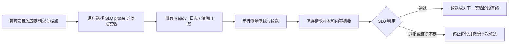

# SLO 对照实验与 Git / snapshot 版本记录

alpha.16 在已有 Bridge 渐进实验上增加可选 SLO 门禁，并提供本地版本记录入口。SLO 默认关闭，只有管理员配置测试场景、用户选择场景并批准实验后才发送请求。Git / snapshot 记录当前用于追溯和完整性核验，不执行集群恢复或生产切流。

## 1. 本版能验证什么



测量的是固定负载下非流式 OpenAI-compatible 请求的完整响应时间、成功率和串行成功请求数/秒；不是 TTFT、TPOT、token 吞吐或饱和容量。协议检查要求 HTTP 200、有效 UTF-8 / JSON、非空答案和 `finish_reason=stop`，可额外要求答案精确匹配。它不等于通用语义质量评测。基线与候选顺序执行，现场应控制预热、背景负载和资源争抢，并重复验证顺序偏差。

## 2. 管理员配置测试场景

创建只有管理员可写、Agent 服务用户可读的目录，例如 `/etc/infernex-agent/slo-profiles/`。在其中保存 `prefix-repeat.json`，将端点和模型名替换为现场已核对的值。端点必须是管理节点可达且确实对应指定服务的完整 chat/completions 地址；本版不自动发现服务路由、不附加认证凭据、不跟随 HTTP 重定向。

```json
{
  "id": "prefix-repeat",
  "version": "v1",
  "approved": true,
  "model": "model-a",
  "endpoints": {
    "models/model-stable": "http://baseline.internal:8000/v1/chat/completions",
    "models/mooncake-trial-s01": "http://candidate.internal:8000/v1/chat/completions"
  },
  "cases": [{"id": "repeat-prefix", "prompt": "Reply with exactly OK.", "exactAnswer": "OK"}],
  "samples": 20,
  "warmup": 2,
  "maxTokens": 16,
  "timeoutMillis": 5000,
  "minSamples": 20,
  "thresholds": {
    "minSuccessRate": 1,
    "maxP95Millis": 2000,
    "maxP95RegressionRatio": 1.2,
    "minThroughputRatio": 0.8
  }
}
```

此示例只演示协议与短答案检查。验证 Mooncake 时应由管理员替换为有代表性的固定长前缀和短输出，记录现场版本、缓存冷热条件和命中证据；重复前缀本身不证明 prefix hit，也不证明交换机根因。`samples` / `warmup` 为每侧每案例的次数，本例共 44 次请求；所有案例、两侧和预热合计最多 400 次，请求还受阶段总超时约束。

在已有 Agent 服务参数文件 `/etc/infernex-agent/agent.conf` 中配置下列选项，并由运维人员安排重启生效。修改目录内 profile 也需要重启重新加载；已经建立的计划保留创建时的固定内容和摘要。

```text
--enable-log-diagnostics
--enable-experiments
--slo-profile-directory=/etc/infernex-agent/slo-profiles
```

保留原有 kubeconfig、命名空间、feature profile 和容量设置。单独配置 SLO 目录而没有启用实验会被拒绝。管理员应预留实验候选资源，不能让测试请求与生产争抢到影响正常业务。

## 3. 从对话中使用并查看证据

先请 Agent 调用 `infernex_list_slo_profiles` 展示场景摘要、目标和请求预算，再选择实验。已有 `infernex_start_experiment` 参数新增 `sloProfile`：

```json
{
  "namespace": "models",
  "baselineName": "model-stable",
  "candidatePrefix": "mooncake-trial",
  "featureProfiles": ["feature-mooncake-v1"],
  "sloProfile": "prefix-repeat",
  "confirm": true
}
```

这是批准后的工具参数示例，`confirm` 不能代替界面的人工批准。候选按 `candidatePrefix-s01`、`-s02` 命名；多阶段 profile 必须显式映射每阶段基线和候选。SLO profile 只选择管理员文件，工具不能临时传入 URL、prompt 或放宽阈值。

`infernex_get_experiment`、`infernex_list_experiments` 和 Dashboard 展示 `sloGateMode`、profile 摘要与阶段 `slo` 结果。未选择 SLO 的旧实验继续只检查 Ready、诊断和浸泡，不会被表示为 SLO 已通过。

每次测量的 intent 和样本保存在 `<state-dir>/slo/<run-id>/`；阶段引用 `runId` 和 `evidenceSha256`。公开结果不含原始测试 prompt、端点或回答正文。证据写入失败、整体超时、恢复未提交的测量或身份/配置漂移都会阻止晋级；保留“证据不足”和“性能退化”的区别。进程中断后的未提交测量不复用为通过，也不把两次不完整窗口拼在一起。

## 4. 保存 Git 配置与快照的关联版本

`record` 需要管理节点可执行本地 `git`；不会联网 fetch 或 push。`show/list/verify` 使用自包含的本地记录，不依赖原 Git 仓库仍存在。示例中快照应在变更前后分别由已有 `cluster-state backup` 采集，Git 配置须已提交；未提交工作树内容不会被当成该 commit 的配置。

```bash
sudo infernex-agent config-version record \
  --name mooncake-prefix \
  --repo /srv/inference-config \
  --ref <实际提交或本地分支> \
  --file models/model-a.yaml \
  --before /srv/evidence/before.json \
  --after /srv/evidence/after.json \
  --slo /var/lib/infernex-agent/slo/<run-id>/evidence.json

sudo infernex-agent config-version list
sudo infernex-agent config-version show --id <返回的版本ID>
sudo infernex-agent config-version verify --id <返回的版本ID>
```

可选 `--experiment`、`--stage`、`--change`、`--slo` 都是本地证据**文件路径**，只绑定文件内容的 SHA-256，不从文件名推断实验已通过。版本目录使用关键词、UTC 时间及短后缀；默认位于 `/var/lib/infernex-agent/config-versions/`，目录 0700、文件 0600。显示命令只返回元数据，原始配置、快照和附件保存在受保护目录；仍应选择不含明文凭据的配置来记录。

```text
mooncake-prefix-<UTC时间>-<短后缀>/
├── record.json       # Git commit/blob、文件摘要、快照引用、范围和限制
├── config.bin        # 指定 commit 内的配置字节，不是当前工作树
├── before.json       # 已核验的 ClusterSnapshot
├── after.json
└── slo.json          # 可选证据副本
```

本版快照仍只覆盖 `InferNexService` 源对象，不包括 `baseRefs` 模板、Helm 全栈、模型权重、流量状态或数据。记录只关联用户选择的配置和快照，不证明它们语义一致、覆盖同一变更或可完整重装。`verify` 验证本地包完整性，不是签名认证，也不重新证明 Git commit 的成员关系。自动选择稳定版本、恢复配置、恢复流量和恢复验收仍是后续能力。
