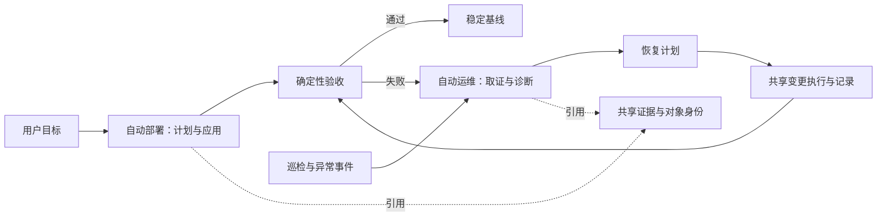

# 自动部署与自动运维：模块边界和 PR 演进计划

本项目按两条业务主线演进：**自动部署**和**自动运维（包含故障处理）**。两者复用同一套
Agent Core、发现、工具、证据和变更记录。Pi/classic chat、MCP 和 Dashboard 是这些能力的入口，
不是另一个业务模块，也不各自维护部署或恢复逻辑。

本文将[服务全生命周期](deployment-lifecycle-zh.md)落实为代码归属和评审范围；具体功能状态仍见
[工具目录](mcp-tool-catalog-zh.md)和 [v0.5 路线图](v0.5-roadmap-zh.md)。表中的“后续”均为计划，
不代表当前已经提供相应工具或通过现场验收。

## 1. 两条主线的责任

| 维度 | 自动部署 | 自动运维（含故障） |
| --- | --- | --- |
| 触发 | 首次引入模型、安装推理栈、调整配置、升级、特性实验 | 周期巡检、告警、人工报障、部署或验收失败 |
| 生命周期 | L0–L5：发现、预检、计划、应用、验收、稳定晋级 | L6 与贯穿各阶段的异常支线 |
| 主要输入 | 目标集群、已有来源/稳定基线、候选配置、资源约束 | 实时状态、对象身份、变更历史、日志/指标和故障时间窗 |
| 当前实现 | Bridge 来源发现、隔离候选创建、Ready 观察、失败回退、单变量实验 | Supervisor、日志关联、固定探针、PlogCapture、CollectorRun、诊断委派、受限 profile 恢复 |
| 主要缺口 | 主 Chart typed install/upgrade/rollback、统一配置版本、serving/eval/soak 验收 | 持久 incident/handoff、计划变更关联、metrics/告警触发、恢复效果验证与关闭 |
| 完成标准 | 已应用且通过本次要求的验收门禁，记录可复用基线和回退输入 | 异常有证据、有处置结果；恢复后再次验证，才能关闭故障 |

“Agent 自身安装到管理节点”属于交付基础；“自动部署”主要指推理栈和模型服务的生命周期。
“创建恢复候选成功”也不等于“故障恢复成功”：当前 remediator 不切换流量，仍须验证候选和实际服务路径。

## 2. 现有代码归属

路径均相对于 `component/InferNex-Agent/`。先明确职责和调用关系，逐个迁移接口；不为目录整齐一次性搬动所有包。

| 归属 | 当前路径 | 责任 |
| --- | --- | --- |
| 自动部署 | `internal/deployer/` | 来源发现、受控创建/删除、部署状态和失败回退 |
| 自动部署 | `internal/experiment/` | 稳定基线、单变量候选、阶段门禁和实验终止 |
| 自动运维 | `internal/supervisor/`、`internal/diagnostics/`、`internal/analyzer/` | 持续观察、确定性问题分类、日志关联和可选模型建议 |
| 自动运维 | `internal/diagnosticexec/`、`internal/plogcapture/`、`internal/collectorrun/` | 固定主动读取探针、有界持续采集、重启恢复 |
| 自动运维 | `internal/delegation/`、`internal/remediator/` | 受限诊断委派、批准 profile 的恢复候选 |
| 共享 Core | `internal/kube/`、`internal/kubeops/`、`internal/observer/` | 当前集群连接、能力发现、原生及 Bridge 事实读取 |
| 共享 Core | `internal/changesafety/` | 变更日志与现有 Bridge 快照；后续统一变更身份与恢复输入 |
| 共享 Core | `internal/localfiles/`、`internal/semanticmemory/`、`internal/skills/` | 证据、报告、带来源的记忆和诊断知识 |
| 入口与交付 | `internal/mcpserver/`、`internal/chat/`、`internal/dashboard/`、`pi/`、`cmd/`、`scripts/`、`chart/` | 工具发布、交互、状态展示、安装和分发 |

Policy 与配置版本目前还有分散实现和设计缺口。不能因为文档提出了 Policy Engine，就把现有启动参数、
本机批准和单次 change journal 视为已经实现统一策略引擎或完整 Configuration Version Manager。

## 3. 跨模块协作契约

以下是后续接口需要满足的契约，不是现有持久对象 schema：

- **目标身份**：集群指纹、namespace、kind/name、UID；配置身份使用 generation/计划 hash 或 Helm revision。
  同名对象重建后，不能继承原对象的部署成功判定或连续故障次数。
- **部署交给运维**：change ID、失败阶段、候选与基线引用、验收结果、Evidence ID 和采集预算。
  首发证据先保存，再决定是否重试或回退。
- **运维交回变更流程**：根因假设、证据引用、建议动作和恢复后的验证要求。诊断 Subagent 不执行部署、
  修改或回退；恢复动作复用统一变更约束，避免建立另一条无记录的写路径。
- **结果分层**：分别记录“调用被接受”“对象已创建”“控制面 Ready”“服务验收通过”“故障已恢复”。
  MCP 返回成功或模型给出结论，均不能替代后置验证。
- **中断与冲突**：观察失败不计入连续故障；目标或配置身份变化后重新观察。进程恢复读取持久事务，
  不靠 Session 文本判断上一次写操作是否完成。

## 4. 当前 PR 的实际关系

以 2026-09-07 拉取的远端提交为基准：

| 分支 / PR | 提交 | 与主线的关系 |
| --- | --- | --- |
| `main` | `fe83317` | 已合并的 v0.3 基线 |
| [PR #8：standalone Agentic onboarding and guarded deployment](https://github.com/lsjfy-open-com/infernex-agent/pull/8) | `7945fd9` | 独立入口、通用发现、上下文、Bridge 部署、安装和 CI 混合变更 |
| [PR #9：Pi-based TUI foundation](https://github.com/lsjfy-open-com/infernex-agent/pull/9) | `9e5c103` | 完整包含 #8，再增加 39 个提交；同时包含证据、记忆、探针、持续采集、诊断委派和设计文档 |

两个 PR 都以 `main` 为 base，不能把它们当作独立的“部署 PR”和“运维 PR”。#9 的标题也不能完整表达
其实际范围。本轮工作基于 #9 的最新提交，避免遗漏未合并实现；该基线仍需现有现场验收，不等于可发布版本。

整理历史建议：保留现有 Draft 作为参考，从干净 `main` 按依赖提取可评审的提交或文件块。先合共享底座，
再展开两个业务模块；若使用堆叠 PR，明确每个 PR 的 base 和依赖。对同时改动 MCP 注册、CLI、脚本和
多个业务包的提交逐块提取，并让每层能够独立编译、测试。不要直接把全部 #9 改动合入“部署”或“运维”之一。

## 5. 首批可独立验收的范围

以下编号是计划标识，不是已创建的 GitHub PR。业务模块各自需要多个 PR。

| 计划 | 内容 | 依赖 | 验收重点 |
| --- | --- | --- | --- |
| F1 共享入口与环境发现 | standalone 启动、通用 K8s/Helm 读取、Bridge 能力发现及最小安装 | `main` | 无 Bridge 仍可发现/读取；不发布无效 Bridge 工具；安装与恢复脚本通过 |
| D1 受控部署与事务正确性 | source discovery、固定候选空间、部署观察、删除/回退及重启恢复 | F1 | 目标更换或发生并发修改时不误报成功、不删除新对象；原有创建/Ready/超时回退仍通过 |
| O1 运维取证与故障触发 | 扫描/诊断、连续故障计数、证据与报告；采集器和委派按后续小 PR 引入 | F1；证据接口 | 观察中断、对象重建和配置切换不继承旧故障；取证有预算且可重启恢复；不误触发写操作 |
| X1 可替换交互 | Pi TUI、Artifact 分页、模型上下文和离线 runtime 分发 | F1 及所调用的工具契约 | 相同工具行为可由 MCP/classic/Pi 验证；工具批准不会因入口不同而绕过；双架构包校验 |

历史提取时，共享 Evidence/记忆如果导致 F1 过大，应继续拆成独立基础 PR。诊断执行、PlogCapture、
CollectorRun、特权 helper、委派 listener 也应各自有增量权限与验收范围，不能塞入单个 O1。

本轮先完成 D1/O1 中已有路径的可靠性修复，并维护上述边界；完整历史重组和新能力实现分后续批次推进。

## 6. 后续演进顺序

两条主线可并行，但写能力需依赖共享契约：

1. **共享变更基础**：批准绑定目标与计划；统一 change/config/evidence 引用；漂移阻断；可恢复日志。
2. **部署主线**：主 Chart 的只读 capture/render/diff → 有版本与批准的 install/upgrade/rollback →
   serving probe → warmup/eval/soak → 稳定晋级。每一步以可运行的纵向场景验收。
3. **运维主线**：持久 incident/handoff → 关联计划 rollout 与非计划重启 → metrics/告警事件 →
   有界取证与诊断 → 恢复计划交给共享变更流程 → 再验证并关闭 incident。

每个 PR 说明改变了什么行为、依赖哪个基础 PR、增加哪些权限、怎样验证、尚未验证哪些环境。
本地 Go 测试不能替代 Kind 的真实控制器回退，更不能替代 openEuler/Ascend A2 的 NPU、网络、
CANN/plog 与模型服务验收。沿用现有[候选验收清单](candidate-validation-zh.md)的现场门槛。

## 7. 2026-09-07 基础修复与验证

本批基于 `9e5c103`，可按三个改动组评审：

- **边界文档**：两条业务主线、共享包、历史 PR 依赖和后续验收范围。
- **部署与删除保护**：部署 change target 保存 UID，监控与回退核验身份；五条已有删除路径使用
  UID/resourceVersion 前置条件；旧代或无代次 Degraded 条件不覆盖当前 Ready。
- **运维恢复门禁**：连续故障计数绑定 UID/generation/恢复策略；观察失败、缺失、取消、诊断预算延期
  和单轮身份混合时重新计数；对象重建不复用旧分析缓存。

在 macOS/arm64、Go 1.26.8 上通过 Agent 模块全量 `go test -race ./...`、`go vet ./...`、
`git diff --check` 和新增文档的本地链接检查。回归覆盖正常完成、同名重建、并发接管/编辑、过期状态、
扫描中断及恢复重新达到阈值。删除竞态用 fake client interceptor 模拟 API 前置条件冲突，
本地未运行真实 Kind API Server 或 openEuler/Ascend A2 验收。
