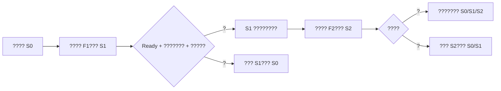

# ???????????????

## 1. ?????

InferNex ???? vLLM?vLLM Ascend?Mooncake?PD ???HCCL/RDMA?
Hermes ???????????????????????????????????

- engine/worker ?????????????????
- UTF-8?JSON?????? tokenizer/???????????
- NPU?CANN?HCCL?RDMA?Mooncake?Prefill/Decode ????????
- ????? Ready??? Ready ??????????????????
- ????????????????????????????

Agent ???????????????

1. ??? `InferNexService` ??? Pod???/???????? Kubernetes
   Event ?????????????????????
2. ??????????????????????????? profile???
   ??????????? Ready ???????????????????
   Ready???????????????????

???????????????????????????????

## 2. ???



???????? `changeId`?Agent ???????????????????
???????????????????????????????? ID?
`changeId` ? Agent ?????????spec ???????????????

??????????????????????????????????????
?? NPU??????????????????????????????????
???????????????????

?? Agent ????????????????????????????????
???????????????????????????????????

## 3. ?????????

???? InferNex Bridge ? `InferNexServiceConfig` ? `baseRefs`???????
vLLM/Mooncake ????Bridge ???????????????????????
???????????? Agent ???? profile ???? `baseRefs` ????

??????????????????

- ?? generation ?? Bridge ?????? Ready?? Degraded?
- ????? `baseRef`?
- `engine`?`components` ? `intelligentGatewayRouting` ?????????
  ??? `baseRefs` ???
- ????????? `model` ? `sourceRef`?

?? profile ????? Bridge ????????????

- ? `agent.infernex.io/approved-experiment-feature=true`?
- ????????????
- ??? `sourceRef`?`model` ??? `baseRefs`?
- ???????? InferNex/vLLM Ascend/Mooncake ??????????

???????

```yaml
apiVersion: infernex.infernex.io/v1alpha1
kind: InferNexServiceConfig
metadata:
  name: feature-mooncake-v1
  namespace: infernex-bridge-system
  labels:
    agent.infernex.io/approved-experiment-feature: "true"
spec:
  components:
    mooncake:
      enabled: true
```

???? Mooncake ????? engine ?????KV connector????????
?????????????????????????????? profile????
? Agent ?????????????? profile ??????????
`InferNexServiceConfig` ??????

?????

```text
feature-vllm-v1-engine-v1
feature-vllm-ascend-prefix-cache-v1
feature-mooncake-kv-transfer-v1
feature-hermes-kv-aware-v1
```

????? digest?CANN ??????? NPU ???????????????
????????Agent ??????????????????????????
?????

## 4. ???????

??????? `infernex.io/owner=<service-name>` ? Pod?????

- init container ??? container?
- ??????????????????????
- ???????????? Kubernetes Event?

????? 15 ????? 50 ? Pod???????? 200 ?? 128 KiB????
??? 24 ???100 ? Pod?1000 ???????? 200 ???????????
????? Authorization?API Key?Token?Secret?Password ? URL ????
????? `[REDACTED]`?

??????????? 10 ????????????????????
`DIAGNOSTICS_DEFERRED` ??????????
`--max-diagnostics-per-scan` / `supervisor.maxDiagnosticsPerScan` ???MCP
?????????????/??????????????

??????????

| ?? | ????/?? |
| --- | --- |
| `npu-device-failure` | NPU/CANN/ACL/HBM/ECC/???? |
| `collective-communication-failure` | HCCL?collective?RDMA ????? |
| `resource-exhausted` | HBM/?? OOM??????? |
| `kv-transport-failure` | Mooncake/NIXL/KV transfer ????? |
| `engine-worker-failure` | vLLM engine/worker ??????SIGSEGV |
| `stream-interrupted` | broken pipe?reset?EOF????? |
| `output-corruption` | ?? UTF-8??? JSON?decode/?????? |
| `operation-timeout` | ?????????? |

??????????????????? NPU/HCCL/Mooncake ????????
worker ???stream ??????????? incident ???????????
???Pod?????????????????????????????????
???Pod ??????

??????????????????????????????????????
??????????????????????????????????
??????????????????? NPU?HCCL?Mooncake?worker ???
????? Ready ???Ready ?????????????????????????

## 5. ????

### 5.1 ??? Helm

```bash
helm upgrade --install infernex-agent ./chart/infernex-agent \
  --namespace infernex-system \
  --create-namespace \
  --set 'rbac.targetNamespaces[0]=models' \
  --set supervisor.diagnostics.logs.enabled=true \
  --set experiments.enabled=true \
  --set-string experiments.templateNamespace=infernex-bridge-system \
  --set changeSafety.persistence.enabled=true
```

??????? cluster-wide RBAC?Chart ???????????
`InferNexService create/delete`?`pods/log get`???????????
`InferNexServiceConfig get`????????? PVC??? Pod ????????
????????????????????Helm ??? `replicaCount=1`????
??????? Kubernetes Lease ??????????????

????????

```bash
./bin/install-agent.sh \
  --target-node master-01 \
  --target-namespace models \
  --dashboard-cidr 10.20.0.0/16 \
  --runtime ctr \
  --enable-experiments \
  --experiment-template-namespace infernex-bridge-system \
  --state-storage-class local-path
```

`--enable-experiments` ????????????

### 5.2 openEuler ????

??????????????????

```bash
sudo ./bin/create-kubeconfig.sh \
  --admin-kubeconfig /etc/kubernetes/admin.conf \
  --target-namespace models \
  --enable-experiments \
  --experiment-template-namespace infernex-bridge-system \
  --output /root/infernex-agent-host.kubeconfig

sudo ./bin/install-host.sh \
  --kubeconfig /root/infernex-agent-host.kubeconfig \
  --scan-namespace models \
  --enable-experiments \
  --experiment-template-namespace infernex-bridge-system
```

?????????? `/var/lib/infernex-agent/experiments/` ?
`/var/lib/infernex-agent/changes/`?

## 6. ???????

?? MCP ?? `infernex_start_experiment`?

```json
{
  "namespace": "models",
  "baselineName": "qwen-pd-stable",
  "candidatePrefix": "qwen-pd-exp-202608",
  "featureProfiles": [
    "feature-vllm-ascend-prefix-cache-v1",
    "feature-mooncake-kv-transfer-v1"
  ],
  "confirm": true
}
```

?????????????? `experimentId` ????

- `infernex_get_experiment`??????????`changeId`?????????
- `infernex_list_experiments`????????
- Dashboard `/api/v1/experiments`?????????????
- Dashboard ??????????????????????

?????????????? `infernex_diagnose_service` ???

## 7. ????

1. ????????????????? `baseRefs` ??????
2. ?? profile ??????????????
3. ?????????????????? profile?
4. ??????????? NPU??????????????????
5. ????????????????????????????
6. ?????????? JSON??? SLO ? NPU ???????????
7. ?????????????????????????????????????

## 8. ????

?????????????????????/Event ??????????????

- ??????????????????????/??????????????
  ????????????????????
- ?? TTFT?TPOT????NPU ????????????
- ?????????????????
- ????/???? profile?
- ????????????? ID ????????

?????????????????????????????????? Gateway
????????/Token/????? UTF-8?SSE/JSON ?????????????
?????????????? URL?Prompt ?????????????????
SSRF?????????????
