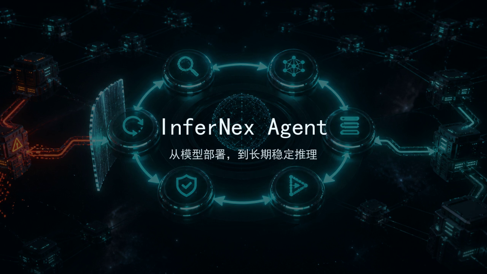

# InferNex Agent 产品理念开场提案

状态：Draft  
适用范围：社区介绍、提案演示、技术分享与产品愿景沟通

## 1. 目的

InferNex Agent 不只是一个执行 Kubernetes 命令的聊天工具。它希望把模型部署、特性实验、故障诊断和长期运维中分散的证据与经验，转化为可执行、可验证、受策略约束且能够回退的系统能力。

这段开场视频用于在较短时间内建立上述认知：

1. 推理集群首先需要理解自己的状态；
2. 日志、指标、配置、拓扑和历史操作需要汇聚为证据；
3. Agent 以“发现、推理、规划、执行、验证、回退”形成闭环；
4. 最终目标不是一次性部署成功，而是让模型服务长期稳定运行。

## 2. 公开版视频

[下载或播放 InferNex Agent 产品理念开场 V1](./assets/infernex-agent-vision-opening-v1.mp4)

视频规格：

- 时长：25 秒；
- 分辨率：1280 × 720；
- 编码：H.264 / AAC；
- 画面：原创生成的推理基础设施视觉；
- 音频：原创合成环境声轨；
- 字幕：中文，画面中不展示模型思维链。

## 3. 叙事结构

| 阶段 | 画面与文案 | 表达重点 |
| --- | --- | --- |
| 集群觉醒 | “当推理集群开始理解自己的状态” | 自动发现与状态感知 |
| 证据汇聚 | “证据不再散落，经验不再沉默” | 跨节点、实例、容器和组件的证据关联 |
| Agent 闭环 | “发现 · 推理 · 规划 · 执行 · 验证 · 回退” | Agentic 工作流与安全治理 |
| 产品落版 | “从模型部署，到长期稳定推理” | 部署 Agent 的长期定位 |

## 4. 《超验骇客》理念引用方案

团队内部概念讨论曾使用电影《超验骇客》（*Transcendence*）官方预告片作为理念参照，重点关注智能进入基础设施、基础设施重构和生命修复等意象。

参考来源：

- [Cinemark 发布的官方预告片](https://www.youtube.com/watch?v=atQTl8zWVJI&t=60)；
- 参考时间点：约 `60s–70s`；
- 基础设施重构与生命修复镜头：约 `138s–141s`。

电影片段不随代码仓分发。公共仓、官网、社区公开视频和 Release 默认只使用原创版。若后续取得权利方许可，可另外制作并发布授权版，且必须保留素材来源、授权范围和有效期限记录。

## 5. 版本与使用边界

视频资产分为三类：

| 类型 | 用途 | 是否进入公共仓 |
| --- | --- | --- |
| Public / Clean | GitHub、社区提案、公开演讲和公开视频 | 是 |
| Reference / Internal | 内部理念讨论和方案评审 | 否 |
| Licensed | 取得第三方素材授权后的正式宣传 | 按授权范围决定 |

后续更新不覆盖既有成片，采用 `v1`、`v2` 等版本号保留。每个公开版本应能够独立确认素材来源，并与产品当期能力保持一致，避免用愿景画面暗示尚未实现的功能已经可用。

## 6. 后续演进

- 使用 InferNex Agent 的正式视觉标识替换当前纯文字落版；
- 增加中英文字幕版本；
- 为社区演讲制作 16:9 版本，为社交媒体制作 9:16 版本；
- 将真实部署、诊断、验证和回退界面作为后续产品实录片段；
- 在每个 Release 中维护“已实现能力”与“愿景能力”的清晰边界。

