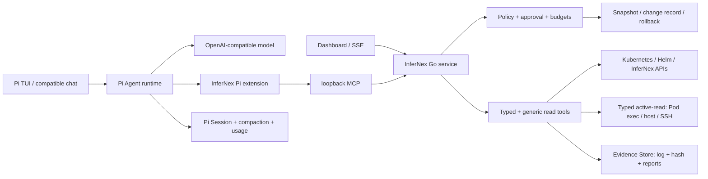

# InferNex Agent v0.5 ?????????

???Draft for review?2026-08-16 ???????????MCP ????????Policy mode???????????

?????InferNex/openFuyao ????????????????????

??????????????????????? AI ?? Agent?????????????

## ?????????

???????? InferNex ?????????? kubectl ????????OpenCode?Claude Code?
Pi?kagent ????? MCP ??? Agent ?????????????????????? InferNex ?
Skill??????????????????????

??????? InferNex ?????? InferNex/openFuyao ??? insight ????????????

1. **?????????**?? BKE ??/??/?????? Helm ? Chart??? Bridge/KServe?
   LWS?Gateway?PD-Orchestrator?vLLM/vLLM-Ascend?Mooncake?CANN ? NPU ??????????
   ???????? owner ??????
2. **??????? MCP**?????????????????? shell ?????? discovery?
   RBAC?Secret ????????owner graph??????????? change ID?
3. **?????????**?desired replicas ? Pod Running ???????????? status???
   topology?Event?runtime ???Gateway serving path?warmup/eval ? soak?
4. **????????**??????????????????????????????????
5. **???????**?Mode ?? Policy ????????????????diff??????????
   ??? prompt ? Skill ???????
6. **????????**????? CRD??? RC endpoint ????????tool-call parser????
   ???? SSE?Node IP ?????????????????????????

????? Agent ???????? Runtime/Experience???????????? MCP??????
Skill + ?? Kubernetes MCP??????? InferNex ?????????????????????
??????????????? Agent ???????????????????????????

????/??????? [MCP ?????????](../mcp-tool-catalog-zh.md)????????
[v0.5 ???](../v0.5-roadmap-zh.md)?

??????????????[OpenCode Tools](https://dev.opencode.ai/docs/tools/) ??? builtin/custom/MCP
??? allow/ask/deny ????? TUI????????????????
[kagent](https://kagent.dev/docs) ?? Kubernetes-native Agent?UI ?????? MCP?????????
????? InferNex ???[Kubernetes MCP Server](https://github.com/containers/kubernetes-mcp-server)
?????? Kubernetes API?toolsets ????????InferNex Agent ????????????
???????typed workflow???/????????????????????? Pod??????

## 0. ???????? InferNex ?????

v0.5 ?????????????????? TUI ????????????????????
???????? InferNex ????? InferNex ???????????????????????
?????????????????????????????????????????????

??????????????????????

1. **????**?????? InferNex ???????????????????????????
   ?????????????????????????
2. **????**?Agent ?? InferNex/openFuyao ??????InferNex ???????? Pi?TUI?
   ????? SDK ? Agent Session ???
3. **????**???????? `InferNexService`?Helm release?LeaderWorkerSet ????????
   ?? CRD??????? API?status?Events?metrics ????
4. **????**?Agent ? InferNex ???????????????? Agent ???????????
   ????????????? Agent Pod?
5. **????**?Agent ??? discovery ? capability negotiation ?? InferNex/openFuyao ?????
   ???? CRD ??????????????
6. **????**????TUI ? Agent ?????? InferNex ?????Agent ??????????
   InferNex ?????????????
7. **?????**?Pi ?????????????????? Pi ???????????????
   ???????????

?????? PR ????????????????????????????????

## 1. ?????

??????????? Kubernetes?Helm?LeaderWorkerSet?vLLM/vLLM-Ascend?Mooncake?
PD-Orchestrator?NPU ???????????????????????????????????
????????????????????

??????????????????????? Kubernetes/Helm ?????????????
???????????? Dashboard????????????????

1. ??????????????? Node ???? CRD ????????????????
2. ?????????????????????????????????????
3. ????? token ????????????????????????
4. readline ??????????????????????????????????

????????????????????? Agent ??????????? openFuyao ????
???? InferNex CRD?????????????????? GLM/Qwen ????? RC ?????
???????????????????????????????? Node IP ????????
??????v0.5 ??????????????????????????????????????

## 2. ????

InferNex Agent ??????????????????????????? kubeconfig ???
InferNex/openFuyao API ?????????????? Agent Pod????? InferNex ????
??????????

??????

```text
???? ? ?????? ? ?????? ? ???????
? ??????? ? ??????? ? ???? ? ???? ? ????
```

????????????????????????????????????????????
?????????

## 3. ??????

### 3.1 ????

- ?? Kubernetes GET/LIST ????????? Agent ?????????? kubeconfig RBAC?
- ?? API discovery????label/field selector ? CRD????????????????
- Secret ????????????? managedFields ?????????
- exec?SSH??????????? API ??????? `diagnose` ??????????????????? active-read??? shell ?????????
- CREATE/UPDATE/PATCH/DELETE?Helm upgrade/rollback ?????????????????????????

### 3.2 ????????

???Events??????????????? Evidence Store?? SHA-256 ??????????
????????????????????? KB ?????????????? evidence ID?
?????????????

### 3.3 ???????????

Agent runtime ? CLI?Dashboard ??? API ????????????????token??????
???????Artifact???????????????????????????????????
???????????

### 3.4 ????????????

- Session????????????????????token ? Artifact ???
- Working memory??????????????????????
- Cluster memory?????????????????????????????
- Safety state????????????????????????????

??????????????????????????????????

## 4. ????



??????????????

| ? | ?? | ??????? |
| --- | --- | --- |
| InferNex/openFuyao | ???????????????????? | Agent ???????? |
| Agent Core?Go? | discovery????????????????????????? | TUI ???????????? |
| Agent Runtime Adapter | ???????????tool-call ?????????? | ?? Core ?????? |
| Experience | TUI??? chat?Dashboard??? API | ??????????? |

?? Agent Core ????? InferNex ??????Runtime Adapter ?????Pi TUI ??? Experience?
?????????? Agent ??? API????????????? InferNex ???

### 4.0.1 ????????????

???????? PD ???? Mooncake ???????Experience ???????????????
?????????Runtime ?????????? Session/????????? Core ? environment?
Helm/Bridge inventory?topology?Event?memory ? configuration-version ???Core ??? kubeconfig
???? API???????????? Evidence??????? kubeconfig???????? Helm?

????????Policy ???? mode ???? modify??? namespace ??? scope???????
???????????????????????? Experience ??? Core ??? canonical diff ?
hash??????????? hash?Core ?? InferNex/Helm ?????????????????
rollout?runtime?warmup?serving path ? soak?????????? stable???????? Evidence?
????? version?????????????????????????? Core?

### 4.0.2 ?????? Go Core

???????? Skill?????????????????????????? prompt injection ??
???????Go Core ??? MCP ????? Pi?classic chat?OpenCode ??? Dashboard/API?
??????????????????????????? UI/Agent runtime??????????
?? InferNex insight?

### 4.0.3 ?????????memory???

- Session ??????? tool event?????????????
- Semantic Memory ??? Session ?????????????incident ????????
- Evidence Store ???????Event???? hash?
- Configuration Version ?????? desired configuration?
- Change Journal ??????????????????/?????
- Supervisor Snapshot ??? Dashboard ?????????????

?????? ID ?????????????????????????????

?????

- ?? Go ?????? `CGO_ENABLED=0`??????????????????? `chat` ???
- ? Pi v0.84.1 ????????????? TUI?Session???/????????? token ???
- ?? InferNex Pi extension???????? MCP ?????? typed tools?????????
- ???? Pi ?? `bash/read/write/edit` ? coding tools??????? MCP??? Pod exec????? SSH ????? Core ??? typed active-read ???
- Pi ??????????Go ???? RBAC??????????????????????
- Artifact ???????????????????? Pi Session?Dashboard ????????
- ????????????? Pi standalone binary?SHA-256?MIT License ?????????? Node/Bun/npm?

### 4.1 ?????? fork ?????? coding agent

Pi ????????????????????????????? InferNex ?????????
system prompt???????????????????????????????????? MCP?
???????????????? UI ???????? Pi TUI ????????Dashboard?
??????????? Go ?????

?????? pinned-version ???????? latest???????????/SBOM???????
OpenAI-compatible ?????????? Session ?????? Pi ????? openEuler aarch64
??????????? `infernex-agent chat` ???????? Agent ?????

### 4.2 ? InferNex ???????

????????????????????????????????

- Agent ??? `component/InferNex-Agent`??? Go package ??? import `cmd`?Pi ????????
- ? InferNex Bridge ????????? API/CRD client ? capability discovery???? controller ???
- openFuyao Helm/BKE ???????????Bridge ???????????????? InferNex ????
- ???????????????? typed tool contract??? Kubernetes ??????????
  ?? shell ??? patch ???????
- Agent ???????? Session?Evidence?Policy decision ? Change journal??????????
  reconcile ?????????????????????????????????
- ????Chart ??????? InferNex ??????????SBOM/???????????????
  ??????? prerelease?????????????????
- ?????????????????????????????????? systemd ??????????
- ?????????????????????????????????? URL ????????

????????????????????????Core ??? discovery?????/??/???
????? CLI ? Dashboard???? Pi TUI ?????????????????????????
??? InferNex ???????Pi ??????? vendor ? InferNex???????????????
???? SBOM ????????

### 4.3 ?????????? taste

?????? Agent ????????? `kubectl`??????????????????????

- **???????????**????????????????Agent ????????/????
  kubeconfig??????Helm release??????????????????????
- **?????? Agent ?????**?`model-a`??? namespace??? CRD ?????????????
  ??????????????????????? k9s ??????????????
- **??????**?????????????????????????????????? InferNex
  CRD ????????????????????
- **?????????**?Node IP?? CRD?Events???? Helm ????????????????
  ?????????????????????readiness ????????
- **???????????**?Pod exec?????????? SSH alias ?????? NPU/CANN/??
  ?????????????????????? mode?action class?target scope???????????
- **??????????????**????? `log + hash` ??????????????????
  ????????????? 160K ??????????
- **?????????????**??????????????????????? Core ????
  glob?grep ?????????????????? metrics/health ???????????????
  ???????? Markdown ??????????? SHA-256??????????????
- **????? plog ??????**?????????????????? `PlogCapture`?? Pod UID
  ????? Evidence Store?? patch ???????? sidecar?Pod ????????????????
- **?? Skill ?????????**?CANN?HiXL?InferNex ???????????? Skill/?????????????????????????????? Markdown Skill?? Skill ??????????????? Policy??????? typed MCP tool ???
- **????????**???????????????????????????????????
  ????????????????????????????????????????? error?
- **????????????**?OpenAI-compatible?GLM?Qwen ??? parser ??????????
  ???? capability profile???????????????????????????????
- **????????????**?PD ???Mooncake???????????????????????
  ??????????? warmup??????????????
- **Agent ??????????**?????????????????????Agent ????????
  InferNex ?????????????????????

????????? system prompt??? contract?????? UI??????????????

### 4.4 MCP ???????

?? MCP ??? 8 ? openFuyao/Kubernetes/Helm ???????5 ? Bridge ???????1 ?
????????4 ?????/?????3 ?????????? 3 ?? Session semantic memory
???`diagnose` ????????? Pod exec/???/SSH ??????????????Pi extension ??? Artifact ??????????????????????????
[MCP ????](../mcp-tool-catalog-zh.md)?

????????????? verb ??? Kubernetes ??????????? toolset?? Chart ?
values/history/render/diff/upgrade/rollback?Configuration Version capture/diff/restore?Gateway
?? plan/publish?infernex-checker?serving warmup?EvalScope ? vLLM/Mooncake/PD ?????
??????????????????? Policy ??????

### 4.5 Mode?Policy?Configuration Version ? Dashboard route

v0.5 ?? `detect`?`diagnose`?`modify`?`install`?`recover` ?????Mode ?????????
? scope/TTL ??????Policy Engine ?? tool action????????????? post-check ???
???????? `detect`?TTL ????????????????

????????? `InferNexService`?Configuration Version Manager ? API Server ???
`helm:<namespace>:<release>` stack ? `UTC-configHash` version ?????? Chart digest???/effective
values?Helm revision?rendered manifest?source resources?????????????? capture?
?????? Evidence ??? Helm rollback?? Chart ?????? values ???

Dashboard ??????? Istio/Gateway??? selector-less Service????????? IP ?
EndpointSlice ? HTTPRoute/VirtualService??????????? token/OIDC/mesh authentication?
TLS?Gateway ?????????????Route Accepted ???????????? Dashboard ???
??????????????????????????
[?????Policy?????? Dashboard ??](../policy-modes-config-versions-zh.md)?

## 5. ????

### ?? A??????????? RC?

- ?? `finish_reason=length`???????????????
- Node/Pod/Service ?????????
- ?? API discovery ?????? GET/LIST??? CRD ????
- ??????? Artifact ???????????????
- `/usage` ???????????? usage ?????? token ?????????
- GLM/Qwen ?????????????????????? tool call ???

?????????? Node ??? IP??? CRD ? spec/status????????? Pod??????
???????????????????????????

### ?? B???? Session ???

- Pi Session ?????/??????? `chat -c`?`chat -r <id>`?`sessions`?`/rename`?
- ??? cluster fingerprint ?????? semantic memory ? search/remember/forget MCP????
  `/memory` ??????TTL???? Session ID ???
- SQLite ??????? usage ??????????????????
- ??????? evidence ID??? ID????????????
- Artifact ???TTL???????
- Dashboard ????????token???????????

???????? SSH ??????????????????????????????????

### ?? C?Agent TUI?Pi foundation?????

- ???????`infernex-agent tui` ???????????? pinned Pi???????? MCP ???
- ?????? Pi ?? coding tools?????????????????????
- ?? Pi ???????? Markdown??????????Session picker???/??????
- ??????????????? `log + SHA-256` Artifact ??????????????????
- ???????? InferNex ??/???Artifact ????????????
- `chat`?`--ask` ? Go ?????????????????

?? C ??????????????????? `chat` ? `tui` ???TUI ?? SSH ?????
Session?????? `bash/read/write/edit`????????? InferNex ??????? change ID?
Pi ???????????? Dashboard?

### ?? D???????

- ???????warmup???? serving-path ???
- EvalScope ??/??????????
- NPU/HCCS/RoCE ???????????? checker?
- PD ???????????/??/???????
- ???????????????????????????????

## 6. ??????

?OpenAI-compatible???????????????? tool calls??????????????
?? tool call?auto tool choice?tool role ???usage?finish_reason ????????????
endpoint capability profile?

???? GLM 5.x?Qwen 3.x ??????????????????????vLLM/vLLM-Ascend
???tool parser?reasoning parser?chat template ?????????????????? tool
calls ????????????????? Agent planner?

## 7. ?????

- ?????????????? RBAC?Secret ????????Artifact ????????
- ??????????????????? change ID??????readiness ????????
- ?? Kubernetes ????? GET/LIST????????? verb?
- ????????????????????????????
- ???????????????????????

## 8. ??????

????? v0.5 milestone ???????????????? RC ????????

1. PR ???????????????? InferNex ???/?????????????????????
   ????????/SBOM/????????? Go race/vet?Kind????????????????????
2. ?? Kind ????????A2/openEuler aarch64 ???????NPU ??????
3. ?? RC ????? amd64/arm64 Release ??SHA-256???????????
4. ????? Session ??????????? issue???????????
5. ??????? InferNex?openFuyao?checker?EvalScope ???????????????

??????????????????? InferNex `origin/master` ??????????????????
?????????????????????? rebase/merge ?????? v0.5 ???????????
??????? RC ???????????????????????????????

??????????? Agent runtime/CLI ?????? InferNex/openFuyao ????????
?? RC ?? A2 ?????????????????????????? A?B?C?D ???
?????? TUI????????????

## 9. v0.5 ????

v0.5 ????????????????????

- ????????Agent ???????????????????
- ????????????????????????????
- ??????token????????????????
- ??????????????????????????
- CLI ? Dashboard ?????????????
- ???????????? openEuler aarch64 ?????????
- ?? InferNex ???????????Agent ??????????????????????????
  ????????Pi ?????????Core??? CLI?????????????
- ????????? InferNex ????????????????? CI?Kind?openEuler aarch64
  ??????/??????????
