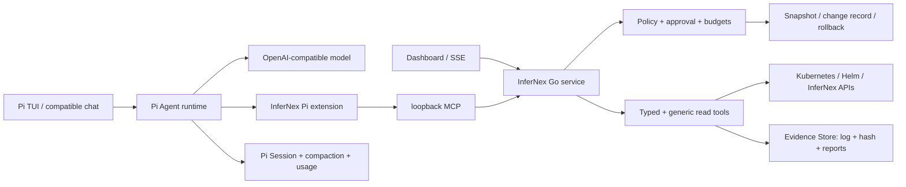

# InferNex Agent v0.5 产品与工程推进提案

状态：Draft for review（2026-08-14 更新：采用 Pi Agent foundation 分支验证）

目标读者：InferNex/openFuyao 维护者、推理平台与运维团队、模型服务团队

提案目标：把当前可安装候选版推进为可持续迭代的 AI 运维 Agent，而不是继续堆叠孤立命令。

## 1. 背景和问题

推理集群的故障通常横跨 Kubernetes、Helm、LeaderWorkerSet、vLLM/vLLM-Ascend、Mooncake、
PD-Orchestrator、NPU 驱动与网络。现有人工流程需要反复切换命令、节点和日志，难以保留证据链，
也难以从一个稳定配置开始逐项验证新特性。

当前候选版已经具备管理节点安装、环境发现、有限 Kubernetes/Helm 读取、模型对话、变更审批、
上下文压缩、安装恢复点和 Dashboard，但实际使用暴露出四类结构问题：

1. 读取能力过度依赖预置工具，遇到 Node 地址或新 CRD 等普通事实也可能回答“不支持”；
2. 长日志和长回答会触发上下文或输出上限，过去缺少可恢复的证据分页和截断续写；
3. 会话、真实 token 用量、任务事件和记忆尚未持久化，退出后不能恢复；
4. readline 终端适合兼容模式，但不能承载多面板工作流、审批、会话选择和证据浏览。

## 2. 产品定位

InferNex Agent 运行在运维人员已有权限的管理节点或引导节点上，通过当前 kubeconfig 和现有
InferNex/openFuyao API 工作。它不要求在业务集群增加 Agent Pod，也不复制 InferNex 的部署、
编排和推理框架实现。

产品闭环是：

```text
理解目标 → 自动发现环境 → 形成可见计划 → 采集和关联证据
→ 必要时向人澄清 → 预览和审批变更 → 验证结果 → 失败回退 → 输出报告
```

模型负责意图理解、规划、工具选择和解释；确定性代码负责权限、数据采集、脱敏、预算、审批、
快照、回退和审计。

## 3. 核心设计原则

### 3.1 读宽写严

- 所有 Kubernetes GET/LIST 和发现请求默认可由 Agent 主动执行，但仍受当前 kubeconfig RBAC；
- 支持 API discovery、分页、label/field selector 和 CRD，不要求每种资源都预置专用工具；
- Secret 只返回元数据，通用结果删除 managedFields 并脱敏凭据型字段；
- exec、端口转发、宿主机文件、任意 shell 不属于通用读取，需要专门能力定义边界；
- CREATE/UPDATE/PATCH/DELETE、Helm upgrade/rollback 和服务重启必须有预览、影响范围、恢复点和人工批准。

### 3.2 证据不等于上下文

日志、Events、资源快照和评测结果先进入本地 Evidence Store，以 SHA-256 标识。模型上下文只放
索引、摘要和当前需要的受限片段，避免把数百 KB 日志反复发送给模型。报告引用 evidence ID，
用户可以回到原始证据核验。

### 3.3 事件驱动而不是黑盒等待

Agent runtime 对 CLI、Dashboard 和未来 API 发布同一组事件：计划、模型调用、token、工具开始、
工具结果摘要、Artifact、澄清、审批、重试、压缩、检查点、失败和完成。展示执行事实与简要说明，
不暴露模型隐藏思维链。

### 3.4 会话、记忆和集群状态分离

- Session：一次可恢复的用户任务、消息、工具事件、token 和 Artifact 引用；
- Working memory：压缩后的本任务事实、假设、决定和未完成项；
- Cluster memory：经工具再次验证或用户确认的稳定拓扑、命名空间和部署入口；
- Safety state：快照、变更记录、审批和回退状态，不允许由模型摘要替代。

模型推测不能直接写入长期记忆。所有记忆必须可查看、修正、过期和删除。

## 4. 建议架构



实现建议：

- 保留 Go 静态二进制和 `CGO_ENABLED=0`，作为管理节点常驻服务、安全边界与兼容 `chat` 入口；
- 以 Pi v0.84.1 为首个固定验证基线，复用其 TUI、Session、分叉/恢复、上下文压缩和 token 展示；
- 新增 InferNex Pi extension，通过本机无状态 MCP 动态加载现有 typed tools，不复制领域实现；
- 固定禁用 Pi 内置 `bash/read/write/edit` 等 coding tools，模型不能绕过 MCP 直接操作宿主机或集群；
- Pi 负责会话和模型循环，Go 服务负责 RBAC、脱敏、证据、审批、快照、验证、回退与审计；
- Artifact 仍以受保护文件保存；后续由统一任务事件把 Pi Session、Dashboard 和报告关联起来；
- 离线宿主机包包含固定版本的 Pi standalone binary、SHA-256、MIT License 和本项目扩展，不要求 Node/Bun/npm。

### 4.1 为什么不直接 fork 成另一个通用 coding agent

Pi 上游明确不是权限沙箱，其默认工具会以启动用户权限执行。因此 InferNex 不能只换品牌或修改
system prompt，而必须用启动参数和扩展形成可测试的硬边界：只加载本项目扩展、只允许本机 MCP、
未标记只读的工具需要交互确认、无 UI 时默认拒绝。即使 Pi TUI 退出，持续扫描、Dashboard、
安装备份和失败回退仍由 Go 服务运行。

上游依赖采用 pinned-version 策略，不直接跟随 latest。每次升级须经过许可证/SBOM、双架构构建、
OpenAI-compatible 模型矩阵、工具审批和 Session 恢复回归。若 Pi 验证不满足 openEuler aarch64
或内部模型兼容性，现有 `infernex-agent chat` 保持可用，不阻断 Agent 后端演进。

## 5. 迭代计划

### 阶段 A：可靠性与读取面（下一 RC）

- 识别 `finish_reason=length`，自动续写并明确最终截断状态；
- Node/Pod/Service 输出完整网络地址；
- 增加 API discovery 和安全的通用 GET/LIST，支持 CRD 与分页；
- 大工具结果进入 Artifact 并渐进读取，重复调用循环阻断；
- `/usage` 展示模型调用数、接口真实 usage 覆盖率、累计 token 和当前上下文比例；
- GLM/Qwen 安装探测保存脱敏能力报告，不再用模型名字推断 tool call 能力。

验收：用户询问“所有 Node 的真实 IP”“某 CRD 的 spec/status”“跨命名空间异常 Pod”时无需新增
专用代码；长回答不能静默半截；所有写操作行为保持不变。

### 阶段 B：可恢复 Session 与记忆

- `chat -c`、`chat -r <id>`、`sessions`、`/rename`、`/memory`；
- SQLite 事件日志与真实 usage 持久化，支持按模型、会话、日期汇总；
- 上下文压缩保留 evidence ID、变更 ID、未完成任务和用户决定；
- Artifact 配额、TTL、导出与清理；
- Dashboard 展示任务时间线、token、上下文、工具和报告。

验收：进程退出或 SSH 断开后可以恢复；恢复不会重新执行已完成写操作；用户能删除会话和记忆。

### 阶段 C：Agent TUI（Pi foundation，已开始）

- 第一纵向切片：`infernex-agent tui` 生成隔离的模型配置，启动 pinned Pi，并动态桥接现有 MCP 工具；
- 默认禁用所有 Pi 内置 coding tools，只读工具自动执行，写工具在终端逐次确认；
- 复用 Pi 的多行编辑、流式 Markdown、工具过程、状态栏、Session picker、恢复/分叉和压缩；
- 第二纵向切片增加 InferNex 计划/审批、Artifact 渐进浏览和报告专用渲染；
- `chat`、`--ask` 和 Go 后端保留为兼容、自动化与回退模式。

阶段 C 的首个验收门槛：同一个现场任务可分别由 `chat` 和 `tui` 完成；TUI 能在 SSH 断开后恢复
Session；模型看不到 `bash/read/write/edit`；所有写工具仍出现 InferNex 变更预览并产生 change ID；
Pi 进程退出不影响后台扫描和 Dashboard。

### 阶段 D：推理专项闭环

- 服务拉起向导、warmup、健康与 serving-path 验证；
- EvalScope 单轮/多轮测试编排与报告；
- NPU/HCCS/RoCE 连通性和时延测试适配现有 checker；
- PD 分离多节点时间线、乱码/中断/性能回退诊断；
- 从稳定配置开始一次只增加一个特性的实验、对照、自动判退和报告。

## 6. 模型兼容策略

“OpenAI-compatible”只描述接口形状，不代表一定支持 tool calls。安装时分别探测：普通对话、
强制 tool call、auto tool choice、tool role 回传、usage、finish_reason 和最大上下文。结果保存为
endpoint capability profile。

至少维护 GLM 5.x、Qwen 3.x 及内部主要模型服务组合的回归矩阵，记录模型、vLLM/vLLM-Ascend
版本、tool parser、reasoning parser、chat template 和已知限制。运行时根据能力降级：没有 tool
calls 的端点只能用于报告总结，不能作为主 Agent planner。

## 7. 安全与边界

- 读操作不是无界数据外传：仍有 RBAC、Secret 屏蔽、凭据脱敏、Artifact 权限和请求预算；
- 写操作必须绑定目标对象、前置快照、幂等 change ID、人工批准、readiness 验证和失败回退；
- 通用 Kubernetes 工具只提供 GET/LIST，不能通过参数切换 verb；
- 模型、日志和资源内容均视为不可信证据，不能改变系统策略；
- 内网默认不启用遥测，任何用量上报必须显式配置。

## 8. 项目推进机制

建议以一个 v0.5 milestone 管理上述四阶段，每一阶段都有独立 RC 和现场验收记录：

1. PR 必须通过 Go race/vet、Kind、离线包重装、管理节点安装和双架构静态构建；
2. 免费 Kind 验证确定性流程，A2/openEuler aarch64 验证真实集群、NPU 和内部模型；
3. 每个 RC 提供唯一的 amd64/arm64 Release 包、SHA-256、变更说明和回退方式；
4. 现场问题以 Session 导出的脱敏事件报告进入 issue，避免只依赖聊天截图；
5. 新能力优先复用 InferNex、openFuyao、checker、EvalScope 和底层框架接口，不复制其实现。

最小持续投入建议是一名 Agent runtime/CLI 开发者、一名 InferNex/openFuyao 集成维护者，以及
可按 RC 提供 A2 集群验收窗口的推理运维人员。若只有单人推进，应严格按 A→B→C→D 顺序，
不要同时扩展 TUI、长期记忆和自动写操作。

## 9. v0.5 完成定义

v0.5 不是“工具数量更多”，而是满足以下结果：

- 用户只提供目标，Agent 能主动发现所需只读信息并在歧义处提问；
- 长任务持续显示状态，不因日志或输出达到上限而无解释中断；
- 会话可恢复，token、工具、证据、审批和变更可审计；
- 任何集群修改都经过预览和批准，并能回退到修改前状态；
- CLI 与 Dashboard 展示同一个任务事件和报告；
- 不依赖在线编译环境，可在 openEuler aarch64 管理节点离线安装。
