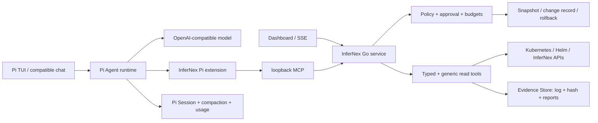

# InferNex Agent v0.5 产品与工程推进提案

状态：Draft for review（2026-08-16 更新：明确差异化价值、MCP 契约、长期记忆、Policy mode、配置版本与外部路由）

目标读者：InferNex/openFuyao 维护者、推理平台与运维团队、模型服务团队

提案目标：把当前可安装候选版推进为可持续迭代的 AI 运维 Agent，而不是继续堆叠孤立命令。

## 提请审议的核心结论

本提案不是申请在 InferNex 旁边再放一个“会执行 kubectl 的聊天机器人”。OpenCode、Claude Code、
Pi、kagent 或任何支持 MCP 的通用 Agent 都可以提供模型循环和界面，也可以加载一个介绍 InferNex 的
Skill；这些通用能力应直接复用，不应由本项目重写。

本项目需要进入 InferNex 的理由，是把 InferNex/openFuyao 的领域 insight 变成长期维护的产品契约：

1. **已经建模的组件关系**：从 BKE 引导/管理/业务集群，到 Helm 主 Chart、可选 Bridge/KServe、
   LWS、Gateway、PD-Orchestrator、vLLM/vLLM-Ascend、Mooncake、CANN 和 NPU 网络，不必每次让模型
   重新搜索接口、猜 owner 或试错命令；
2. **直接可用的领域 MCP**：工具返回稳定的小型结构，而不是任意 shell 文本；已内建 discovery、
   RBAC、Secret 屏蔽、日志限长、owner graph、时间线、写操作批准和 change ID；
3. **推理服务的成功定义**：desired replicas 或 Pod Running 不是成功。必须关联控制面 status、实际
   topology、Event、runtime 日志、Gateway serving path、warmup/eval 和 soak；
4. **稳定基线演进方法**：一次只增加一个特性，保存基线，自动对比、判退、回退并生成证据报告；
5. **可执行安全闭环**：Mode 只是 Policy 权限上限；所有修改绑定配置版本、diff、批准、验证和恢复，
   不能由 prompt 或 Skill 自我约束代替；
6. **现场经验进入回归**：缺少预期 CRD、相邻 RC endpoint 探测差异、超时、tool-call parser、长日志
   膨胀、空 SSE、Node IP 查询受限和安装回退等真实问题会变成测试和兼容矩阵。

因此，通用 Agent 可以替换本项目的 Runtime/Experience，甚至可以直接调用本项目 MCP；但若只保留
Skill + 通用 Kubernetes MCP，就会重新丢失 InferNex 的状态模型、变更事务、配置版本、专项验证和
故障知识。这正是本项目相对通用 Agent 的持续价值，也是合入主仓而非维护一个提示词仓库的依据。

完整当前/计划工具契约见 [MCP 工具目录与组件映射](../mcp-tool-catalog-zh.md)，可执行里程碑见
[v0.5 路线图](../v0.5-roadmap-zh.md)。

业界基线也支持这个边界判断：[OpenCode Tools](https://dev.opencode.ai/docs/tools/) 已提供 builtin/custom/MCP
工具和 allow/ask/deny 权限，说明 TUI、模型循环和基础批准可直接复用；
[kagent](https://kagent.dev/docs) 提供 Kubernetes-native Agent、UI 和多类云原生 MCP，说明通用集群工具
生态不应由 InferNex 重造；[Kubernetes MCP Server](https://github.com/containers/kubernetes-mcp-server)
已经覆盖直接 Kubernetes API、toolsets 和敏感数据脱敏。InferNex Agent 应在这些能力之上贡献推理
领域状态模型、typed workflow、版本/回退、专项验收和现场知识，而不是用“也能列 Pod”申请合入。

## 0. 第一优先级：成为 InferNex 的原生能力

v0.5 的最高优先级不是独立发布速度，也不是 TUI 功能数量，而是最终能够以低风险、可审阅、
可维护的方式合入 InferNex 主仓，并与 InferNex 后续版本无缝演进。任何功能如果会形成第二套资源
模型、第二个控制面、第二套部署编排或长期维护的私有分叉，即使短期效果更快，也不进入主架构。

这里的“无缝衔接”必须满足可验证的工程含义：

1. **仓库原生**：代码始终在 InferNex 仓库结构内开发，遵守其许可证、目录、构建、测试、文档和
   发布惯例；合入时不需要迁移提交历史或重新实现一次；
2. **依赖单向**：Agent 依赖 InferNex/openFuyao 的稳定接口，InferNex 核心控制器不依赖 Pi、TUI、
   模型供应商 SDK 或 Agent Session 格式；
3. **资源复用**：不新增用于复制 `InferNexService`、Helm release、LeaderWorkerSet 或工作负载状态的
   私有 CRD；优先读取已有 API、status、Events、metrics 和日志；
4. **部署可选**：Agent 是 InferNex 的可选管理节点组件，不改变未安装 Agent 时的部署路径，也不要求
   向已有业务集群侵入一个常驻 Agent Pod；
5. **升级兼容**：Agent 能通过 discovery 和 capability negotiation 适配 InferNex/openFuyao 版本差异，
   不以某个 CRD 名称存在作为安装成功的前提；
6. **故障隔离**：模型、TUI 或 Agent 退出不能影响 InferNex 已有实例；Agent 参与的写操作必须能被
   InferNex 原生工具观察、审计和恢复；
7. **上游可替换**：Pi 只是当前验证的交互运行时。移除或替换 Pi 不得丢失领域工具、审批、快照、
   回退、审计和报告能力。

所有里程碑和 PR 都先回答“这是否让未来合入更容易”，再回答“是否增加了新功能”。

## 1. 背景和问题

推理集群的故障通常横跨 Kubernetes、Helm、LeaderWorkerSet、vLLM/vLLM-Ascend、Mooncake、
PD-Orchestrator、NPU 驱动与网络。现有人工流程需要反复切换命令、节点和日志，难以保留证据链，
也难以从一个稳定配置开始逐项验证新特性。

当前候选版已经具备管理节点安装、环境发现、有限 Kubernetes/Helm 读取、模型对话、变更审批、
上下文压缩、安装恢复点和 Dashboard，但实际使用暴露出四类结构问题：

1. 读取能力过度依赖预置工具，遇到 Node 地址或新 CRD 等普通事实也可能回答“不支持”；
2. 长日志和长回答会触发上下文或输出上限，过去缺少可恢复的证据分页和截断续写；
3. 会话、真实 token 用量、任务事件和记忆尚未持久化，退出后不能恢复；
4. readline 终端适合兼容模式，但不能承载多面板工作流、审批、会话选择和证据浏览。

这些判断来自真实安装和试用过程，而不是通用 Agent 的功能清单：我们遇到过 openFuyao 业务集群
没有预期 InferNex CRD、端口已占用、模型端点偶发超时、同一 GLM/Qwen 配置在相邻 RC 中探测结果
不一致、长日志让工具循环失控、回答输出一半静默停止，以及只想查询 Node IP 却被静态工具边界
拒绝等问题。v0.5 必须把这些现场教训变成架构约束和自动化回归，而不是继续依赖安装文档或提示词。

## 2. 产品定位

InferNex Agent 运行在运维人员已有权限的管理节点或引导节点上，通过当前 kubeconfig 和现有
InferNex/openFuyao API 工作。它不要求在业务集群增加 Agent Pod，也不复制 InferNex 的部署、
编排和推理框架实现。

产品闭环是：

```text
理解目标 → 自动发现环境 → 形成可见计划 → 采集和关联证据
→ 必要时向人澄清 → 预览和审批变更 → 验证结果 → 失败回退 → 输出报告
```

模型负责意图理解、规划、工具选择和解释；确定性代码负责权限、数据采集、脱敏、预算、审批、
快照、回退和审计。

## 3. 核心设计原则

### 3.1 读宽写严

- 所有 Kubernetes GET/LIST 和发现请求默认可由 Agent 主动执行，但仍受当前 kubeconfig RBAC；
- 支持 API discovery、分页、label/field selector 和 CRD，不要求每种资源都预置专用工具；
- Secret 只返回元数据，通用结果删除 managedFields 并脱敏凭据型字段；
- exec、端口转发、宿主机文件、任意 shell 不属于通用读取，需要专门能力定义边界；
- CREATE/UPDATE/PATCH/DELETE、Helm upgrade/rollback 和服务重启必须有预览、影响范围、恢复点和人工批准。

### 3.2 证据不等于上下文

日志、Events、资源快照和评测结果先进入本地 Evidence Store，以 SHA-256 标识。模型上下文只放
索引、摘要和当前需要的受限片段，避免把数百 KB 日志反复发送给模型。报告引用 evidence ID，
用户可以回到原始证据核验。

### 3.3 事件驱动而不是黑盒等待

Agent runtime 对 CLI、Dashboard 和未来 API 发布同一组事件：计划、模型调用、token、工具开始、
工具结果摘要、Artifact、澄清、审批、重试、压缩、检查点、失败和完成。展示执行事实与简要说明，
不暴露模型隐藏思维链。

### 3.4 会话、记忆和集群状态分离

- Session：一次可恢复的用户任务、消息、工具事件、token 和 Artifact 引用；
- Working memory：压缩后的本任务事实、假设、决定和未完成项；
- Cluster memory：经工具再次验证或用户确认的稳定拓扑、命名空间和部署入口；
- Safety state：快照、变更记录、审批和回退状态，不允许由模型摘要替代。

模型推测不能直接写入长期记忆。所有记忆必须可查看、修正、过期和删除。

## 4. 建议架构



架构按职责而不是按界面分层：

| 层 | 责任 | 不应承担的责任 |
| --- | --- | --- |
| InferNex/openFuyao | 资源模型、控制器、部署编排、实例生命周期 | Agent 会话和模型提示词 |
| Agent Core（Go） | discovery、领域工具、策略、证据、变更、回退、审计、任务事件 | TUI 布局和供应商专属推理逻辑 |
| Agent Runtime Adapter | 模型循环、上下文预算、tool-call 兼容、重试和中断恢复 | 绕过 Core 直接修改集群 |
| Experience | TUI、兼容 chat、Dashboard、未来 API | 保存不可替代的安全状态 |

其中 Agent Core 是未来合入 InferNex 的稳定内核；Runtime Adapter 是防腐层；Pi TUI 是一种 Experience。
这条边界可以防止通用 Agent 上游的 API、发布节奏或安全假设渗透到 InferNex 核心。

### 4.0.1 一次任务实际怎样穿过各层

以“基于当前稳定 PD 配置打开 Mooncake 并验证”为例：Experience 只负责接收自然语言、显示计划、
工具事件和批准框；Runtime 把目标交给模型并维护 Session/上下文。模型先调用 Core 的 environment、
Helm/Bridge inventory、topology、Event、memory 和 configuration-version 工具。Core 用当前 kubeconfig
访问现有 API，把结果脱敏、限长并写入 Evidence；模型不能拿到 kubeconfig，也不能直接执行 Helm。

形成候选方案后，Policy 检查当前 mode 是否允许 modify、目标 namespace 是否在 scope、配置版本是否
已捕获、是否只增加一个特性、预算是否足够。通过后 Experience 展示由 Core 生成的 canonical diff 和
hash，操作者批准的也是这个 hash。Core 调用 InferNex/Helm 的稳定入口应用配置，随后确定性观察
rollout、runtime、warmup、serving path 和 soak。成功则把候选标记为 stable；失败则保留失败 Evidence，
恢复修改前 version，再验证服务。模型负责解释和决策建议，事务边界始终在 Core。

### 4.0.2 为什么要保留 Go Core

若把全部能力写成 Skill，权限和回退只存在于提示词；换模型、压缩上下文或发生 prompt injection 后，
约束可能消失。Go Core 把同一 MCP 契约提供给 Pi、classic chat、OpenCode 和未来 Dashboard/API，
并独立于模型运行持续扫描、版本存储和恢复。这样可以替换 UI/Agent runtime，而不迁移安全状态或
重写 InferNex insight。

### 4.0.3 数据平面不是一个“memory”目录

- Session 保存完整交互和 tool event，可恢复但不等于集群事实；
- Semantic Memory 保存跨 Session 的已验证事实、决定、偏好、incident 和稳定配置含义；
- Evidence Store 保存原始日志、Event、报告和 hash；
- Configuration Version 保存可恢复的 desired configuration；
- Change Journal 保存一次变更的计划、批准、应用、提交/回退事件；
- Supervisor Snapshot 是当前 Dashboard 观察视图，不能作为回退源。

这些数据通过 ID 关联，但生命周期和可信度不同，不能用一段模型摘要互相替代。

实现建议：

- 保留 Go 静态二进制和 `CGO_ENABLED=0`，作为管理节点常驻服务、安全边界与兼容 `chat` 入口；
- 以 Pi v0.84.1 为首个固定验证基线，复用其 TUI、Session、分叉/恢复、上下文压缩和 token 展示；
- 新增 InferNex Pi extension，通过本机无状态 MCP 动态加载现有 typed tools，不复制领域实现；
- 固定禁用 Pi 内置 `bash/read/write/edit` 等 coding tools，模型不能绕过 MCP 直接操作宿主机或集群；
- Pi 负责会话和模型循环，Go 服务负责 RBAC、脱敏、证据、审批、快照、验证、回退与审计；
- Artifact 仍以受保护文件保存；后续由统一任务事件把 Pi Session、Dashboard 和报告关联起来；
- 离线宿主机包包含固定版本的 Pi standalone binary、SHA-256、MIT License 和本项目扩展，不要求 Node/Bun/npm。

### 4.1 为什么不直接 fork 成另一个通用 coding agent

Pi 上游明确不是权限沙箱，其默认工具会以启动用户权限执行。因此 InferNex 不能只换品牌或修改
system prompt，而必须用启动参数和扩展形成可测试的硬边界：只加载本项目扩展、只允许本机 MCP、
未标记只读的工具需要交互确认、无 UI 时默认拒绝。即使 Pi TUI 退出，持续扫描、Dashboard、
安装备份和失败回退仍由 Go 服务运行。

上游依赖采用 pinned-version 策略，不直接跟随 latest。每次升级须经过许可证/SBOM、双架构构建、
OpenAI-compatible 模型矩阵、工具审批和 Session 恢复回归。若 Pi 验证不满足 openEuler aarch64
或内部模型兼容性，现有 `infernex-agent chat` 保持可用，不阻断 Agent 后端演进。

### 4.2 与 InferNex 主仓的合入契约

为避免“开发完成后再讨论怎么合入”，从当前分支开始执行以下契约：

- Agent 保持在 `component/InferNex-Agent`，公共 Go package 不反向 import `cmd`、Pi 扩展或界面代码；
- 与 InferNex Bridge 的集成优先使用公开 API/CRD client 和 capability discovery，不复制 controller 逻辑；
- openFuyao Helm/BKE 形态作为一等运行模式，Bridge 能力缺失时降级，而不是判定“不是 InferNex 集群”；
- 新增写能力前先定义稳定、可审计的 typed tool contract；通用 Kubernetes 能力只读，不能演化为
  任意 shell 或任意 patch 的旁路控制面；
- Agent 自有持久化只保存 Session、Evidence、Policy decision 和 Change journal，不缓存一份需要持续
  reconcile 的集群真相；读取结论带采集时间、来源和资源版本，使用前可重新验证；
- 二进制、Chart 和离线包应复用 InferNex 的版本号、制品命名、SBOM/许可证与发布流水线规范；在正式
  合入前允许独立 prerelease，但不能长期形成互不兼容的发行线；
- 安装、升级、卸载不修改现有业务实例；默认宿主机模式只增加一个可停止的 systemd 服务和本地数据目录；
- 文档同时说明“独立候选验证”和“合入后组件安装”路径，避免把临时分支 URL 固化为产品接口。

建议主仓合入拆成可独立审阅的提交序列：先合目录、Core 与只读 discovery，再合策略/证据/审计，
然后合兼容 CLI 和 Dashboard，最后把 Pi TUI 作为可选制品接入。每一步均可构建、测试、关闭，并且
不改变 InferNex 现有默认行为。Pi 的第三方源码不 vendor 进 InferNex；发布时使用固定版本、校验值、
许可证和 SBOM 组装可选运行时。

### 4.3 从现场经验提炼的产品 taste

本项目与通用 Agent 的差异不在于能调用 `kubectl`，而在于如何对待一个正在提供推理服务的集群：

- **先观察，再解释，再行动**：自然语言目标不应立刻变成命令。Agent 先自动发现控制面/业务面、
  kubeconfig、命名空间、Helm release、工作负载和已有稳定实例，再形成可核验计划；
- **不要让用户替 Agent 填环境模板**：`model-a`、固定 namespace、固定 CRD 等占位符不能成为安装参数。
  除模型接口及真正无法发现的凭据外，环境信息应像 k9s 一样从当前权限范围自动发现；
- **未知不是失败**：发现结果与预期形态不同，先展示事实并扩大只读探索；不能因为没有某个 InferNex
  CRD 就退出，也不能把模型推测伪装成集群事实；
- **读取应广，修改应窄**：Node IP、新 CRD、Events、日志和 Helm 元数据应能通用采集；修改必须进入
  领域化工具、影响预览、人工审批、前置快照、readiness 验证和回退闭环；
- **证据留在本地，语义进入上下文**：长日志用 `log + hash` 落盘，渐进读取和关联分析；不要把工具
  原始输出反复塞回模型，导致 160K 上下文也被快速耗尽；
- **历史证据不能只依赖实时重采**：允许运维人员显式登记重启前保存的日志目录，由 Core 提供有界
  glob、grep 和分页读取；默认过滤可解释、可关闭的 metrics/health 探针噪声，异常探针行优先保留；
  源日志只读，最终 Markdown 报告保存源路径、时间与 SHA-256，并通过批准后写入保护目录；
- **领域 Skill 渐进加载且不能提权**：CANN、HiXL、InferNex 组件经验以带来源和版本的 Skill/参考文件离线发布，先按描述选择、再按症状读取；用户可安装内部 Markdown Skill，但 Skill 不执行脚本、不新增工具、不绕过 Policy，实时事实仍由 typed MCP tool 获取；
- **长任务必须有心跳**：工具调用、重试、压缩、等待、截断和失败原因对用户可见。展示事实与简要
  阶段说明，但不展示模型私有思维链；遇到歧义应主动询问，而不是耗尽工具轮次后返回一个 error；
- **模型兼容靠探测，不靠标签**：OpenAI-compatible、GLM、Qwen 或某个 parser 名称都不是能力保证。
  保存端点 capability profile，并把相邻版本行为差异纳入回归；短暂超时使用有上限的退避重试；
- **稳定基线一次只加一个变量**：PD 分离、Mooncake、量化、并行策略等组合实验从最近稳定配置克隆，
  一次改变一个特性，自动 warmup、对照、判退并生成证据报告；
- **Agent 不能成为新的单点故障**：安装前备份，变更前快照，失败前保留现场；Agent 自身异常时，已有
  InferNex 服务继续运行，运维人员仍可用原生命令接管。

这些原则应同时进入 system prompt、工具 contract、测试用例和 UI，而不能只存在于提案文字中。

### 4.4 MCP 工具分层与现状

当前 MCP 已覆盖 8 个 openFuyao/Kubernetes/Helm 通用只读工具、5 个 Bridge 服务观察工具、1 个
跨组件诊断工具、4 个受控部署/变更工具、3 个渐进实验工具，以及 3 个跨 Session semantic memory
工具。Pi extension 另提供 Artifact 分页工具。每个工具的组件映射、输入、发布条件和边界见
[MCP 工具目录](../mcp-tool-catalog-zh.md)。

下一阶段不会增加一个可切换 verb 的万能 Kubernetes 工具，而是补齐以下领域 toolset：主 Chart 的
values/history/render/diff/upgrade/rollback、Configuration Version capture/diff/restore、Gateway
路由 plan/publish、infernex-checker、serving warmup、EvalScope 和 vLLM/Mooncake/PD 专项观察。
这既提高模型效率，也使每种写操作有独立 Policy 和恢复语义。

### 4.5 Mode、Policy、Configuration Version 与 Dashboard route

v0.5 定义 `detect`、`diagnose`、`modify`、`install`、`recover` 五个模式。Mode 只是由操作者设置、
带 scope/TTL 的权限上限；Policy Engine 仍按 tool action、目标、预算、版本、批准和 post-check 对每次
调用作决定。默认 `detect`，TTL 到期自动降级，模型不能切换模式。

完整回退不能只保存 `InferNexService`。Configuration Version Manager 按 API Server 指纹、
`helm:<namespace>:<release>` stack 和 `UTC-configHash` version 建索引，保存 Chart digest、用户/effective
values、Helm revision、rendered manifest、source resources、路由和验证引用。修改前强制 capture，
失败版本保留 Evidence 后优先 Helm rollback；跨 Chart 版本不能只靠 values 恢复。

Dashboard 后续可复用现有 Istio/Gateway：创建 selector-less Service、指向管理节点内网 IP 的
EndpointSlice 和 HTTPRoute/VirtualService。但自动发布前必须补齐 token/OIDC/mesh authentication、
TLS、Gateway 到节点连通性、主机防火墙、Route Accepted 验证和配置版本回退。当前 Dashboard 无内建
认证，因此不能把匿名暴露包装成“自动化”。详细设计见
[运行模式、Policy、配置版本与 Dashboard 路由](../policy-modes-config-versions-zh.md)。

## 5. 迭代计划

### 阶段 A：可靠性与读取面（下一 RC）

- 识别 `finish_reason=length`，自动续写并明确最终截断状态；
- Node/Pod/Service 输出完整网络地址；
- 增加 API discovery 和安全的通用 GET/LIST，支持 CRD 与分页；
- 大工具结果进入 Artifact 并渐进读取，重复调用循环阻断；
- `/usage` 展示模型调用数、接口真实 usage 覆盖率、累计 token 和当前上下文比例；
- GLM/Qwen 安装探测保存脱敏能力报告，不再用模型名字推断 tool call 能力。

验收：用户询问“所有 Node 的真实 IP”“某 CRD 的 spec/status”“跨命名空间异常 Pod”时无需新增
专用代码；长回答不能静默半截；所有写操作行为保持不变。

### 阶段 B：可恢复 Session 与记忆

- Pi Session 已支持恢复/分叉；继续统一 `chat -c`、`chat -r <id>`、`sessions`、`/rename`；
- 已实现 cluster fingerprint 隔离的结构化 semantic memory 和 search/remember/forget MCP；继续补
  `/memory` 浏览、编辑、TTL、导出和 Session ID 关联；
- SQLite 事件日志与真实 usage 持久化，支持按模型、会话、日期汇总；
- 上下文压缩保留 evidence ID、变更 ID、未完成任务和用户决定；
- Artifact 配额、TTL、导出与清理；
- Dashboard 展示任务时间线、token、上下文、工具和报告。

验收：进程退出或 SSH 断开后可以恢复；恢复不会重新执行已完成写操作；用户能删除会话和记忆。

### 阶段 C：Agent TUI（Pi foundation，已开始）

- 第一纵向切片：`infernex-agent tui` 生成隔离的模型配置，启动 pinned Pi，并动态桥接现有 MCP 工具；
- 默认禁用所有 Pi 内置 coding tools，只读工具自动执行，写工具在终端逐次确认；
- 复用 Pi 的多行编辑、流式 Markdown、工具过程、状态栏、Session picker、恢复/分叉和压缩；
- 第二纵向切片已提供大工具结果的 `log + SHA-256` Artifact 化、头尾预览、受限渐进读取和状态栏；
- 下一纵向切片增加 InferNex 计划/审批、Artifact 折叠浏览和报告专用渲染；
- `chat`、`--ask` 和 Go 后端保留为兼容、自动化与回退模式。

阶段 C 的首个验收门槛：同一个现场任务可分别由 `chat` 和 `tui` 完成；TUI 能在 SSH 断开后恢复
Session；模型看不到 `bash/read/write/edit`；所有写工具仍出现 InferNex 变更预览并产生 change ID；
Pi 进程退出不影响后台扫描和 Dashboard。

### 阶段 D：推理专项闭环

- 服务拉起向导、warmup、健康与 serving-path 验证；
- EvalScope 单轮/多轮测试编排与报告；
- NPU/HCCS/RoCE 连通性和时延测试适配现有 checker；
- PD 分离多节点时间线、乱码/中断/性能回退诊断；
- 从稳定配置开始一次只增加一个特性的实验、对照、自动判退和报告。

## 6. 模型兼容策略

“OpenAI-compatible”只描述接口形状，不代表一定支持 tool calls。安装时分别探测：普通对话、
强制 tool call、auto tool choice、tool role 回传、usage、finish_reason 和最大上下文。结果保存为
endpoint capability profile。

至少维护 GLM 5.x、Qwen 3.x 及内部主要模型服务组合的回归矩阵，记录模型、vLLM/vLLM-Ascend
版本、tool parser、reasoning parser、chat template 和已知限制。运行时根据能力降级：没有 tool
calls 的端点只能用于报告总结，不能作为主 Agent planner。

## 7. 安全与边界

- 读操作不是无界数据外传：仍有 RBAC、Secret 屏蔽、凭据脱敏、Artifact 权限和请求预算；
- 写操作必须绑定目标对象、前置快照、幂等 change ID、人工批准、readiness 验证和失败回退；
- 通用 Kubernetes 工具只提供 GET/LIST，不能通过参数切换 verb；
- 模型、日志和资源内容均视为不可信证据，不能改变系统策略；
- 内网默认不启用遥测，任何用量上报必须显式配置。

## 8. 项目推进机制

建议以一个 v0.5 milestone 管理上述四阶段，每一阶段都有独立 RC 和现场验收记录：

1. PR 先通过“主仓合入检查”：没有复制 InferNex 控制器/资源模型、没有形成反向依赖、默认行为不变、
   新增依赖有许可证/SBOM/替换策略；然后通过 Go race/vet、Kind、离线包重装、管理节点安装和双架构构建；
2. 免费 Kind 验证确定性流程，A2/openEuler aarch64 验证真实集群、NPU 和内部模型；
3. 每个 RC 提供唯一的 amd64/arm64 Release 包、SHA-256、变更说明和回退方式；
4. 现场问题以 Session 导出的脱敏事件报告进入 issue，避免只依赖聊天截图；
5. 新能力优先复用 InferNex、openFuyao、checker、EvalScope 和底层框架接口，不复制其实现。

每个阶段同时维护一份合入差异清单：相对 InferNex `origin/master` 的目录、依赖、构建入口、运行时权限、
持久化数据和默认行为变化。主仓发生更新时持续 rebase/merge 验证，不能等 v0.5 完成后一次性解决漂移。
建议至少在每个 RC 前执行一次上游同步演练，并把冲突原因转化为接口或目录边界改进。

最小持续投入建议是一名 Agent runtime/CLI 开发者、一名 InferNex/openFuyao 集成维护者，以及
可按 RC 提供 A2 集群验收窗口的推理运维人员。若只有单人推进，应严格按 A→B→C→D 顺序，
不要同时扩展 TUI、长期记忆和自动写操作。

## 9. v0.5 完成定义

v0.5 不是“工具数量更多”，而是满足以下结果：

- 用户只提供目标，Agent 能主动发现所需只读信息并在歧义处提问；
- 长任务持续显示状态，不因日志或输出达到上限而无解释中断；
- 会话可恢复，token、工具、证据、审批和变更可审计；
- 任何集群修改都经过预览和批准，并能回退到修改前状态；
- CLI 与 Dashboard 展示同一个任务事件和报告；
- 不依赖在线编译环境，可在 openEuler aarch64 管理节点离线安装；
- 相对 InferNex 主仓的合入差异已审计，Agent 可作为默认关闭的可选组件合入，关闭后不改变现有构建、
  安装和运行行为；Pi 不可用或被移除时，Core、兼容 CLI、审计和回退能力仍然完整；
- 至少完成一次从最新 InferNex 主线开始的干净合入演练，并通过主仓 CI、Kind、openEuler aarch64
  现有集群升级/卸载与故障隔离验收。
