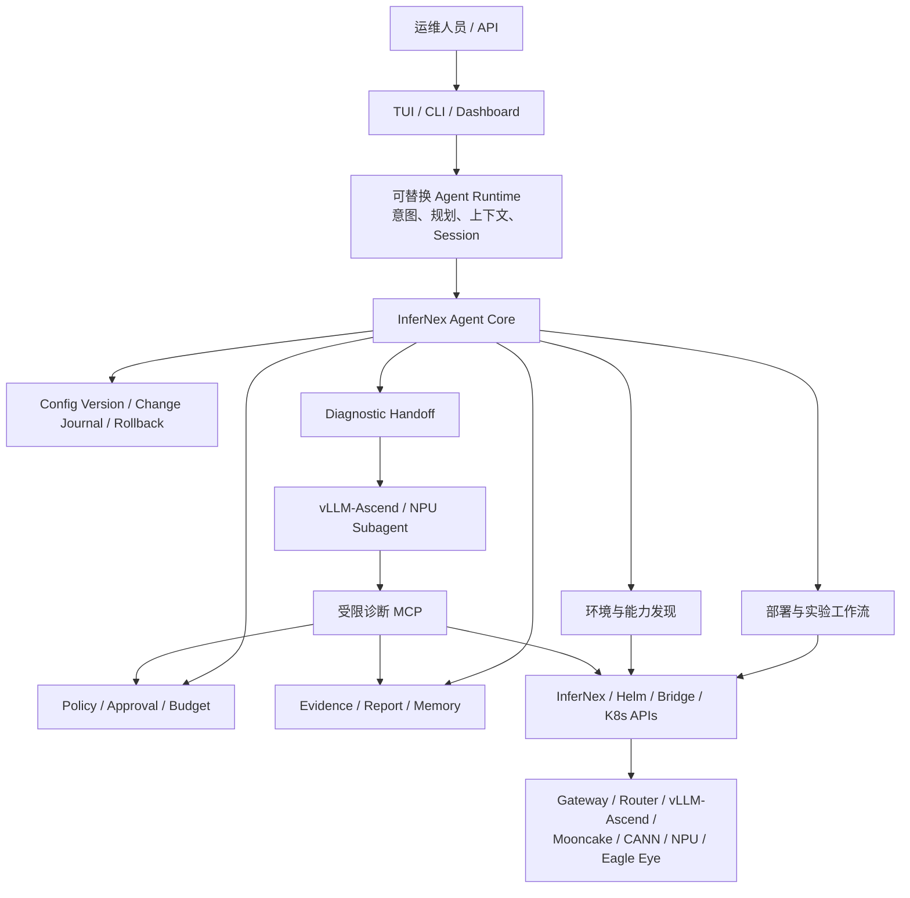

# oFEP 草案：InferNex 智能部署、故障诊断与长期运维 Agent

> 状态：Draft for author review，尚未提交 openFuyao 社区。
>
> 正式提交位置：`openFuyao/ofep/ofeps/sig-ai-inference/`。提案通过后，在
> `openFuyao/InferNex` 建立关联 Issue、里程碑和分阶段实现 PR。

| 字段 | 值 |
| --- | --- |
| title | InferNex 智能部署、故障诊断与长期运维 Agent |
| ofep-number | TBD（由社区分配） |
| authors | Jiawenliu, Zishan11, Haozhong, zifanma, ds_13571877104 |
| owning-sig | sig-ai-inference |
| participating-sigs | AgenticOps SIG（建议，待双方确认） |
| status | provisional |
| creation-date | 2026-08-18 |
| reviewers | TBD |
| approvers | TBD |
| stage | alpha |
| latest-milestone | alpha |
| milestone | alpha / beta / stable |
| feature-gates | InferNexAgent（暂定） |
| disable-supported | true |
| metrics | 见“可观测性与成功指标” |

## 1. 发布签核清单

- [ ] 在 InferNex 建立增强 Issue，并关联本 oFEP；
- [ ] oFEP 获得 SIG AI Inference 审批，状态变为“可实施”；
- [x] 已形成需求、产品边界、架构和安全设计草案；
- [x] 已完成独立候选验证和部分纵向能力开发；
- [ ] 与 InferNex 最新主线完成干净合入演练；
- [ ] 完成 openEuler aarch64、Ascend NPU 和 PD 分离真实环境验收；
- [ ] 完成生产可用性审查、用户文档和维护者交接。

## 2. 摘要

InferNex 已经能够把 Kubernetes、Gateway、Hermes Router、vLLM/vLLM-Ascend、Mooncake、
PD-Orchestrator、弹性伸缩和可观测组件组合成完整推理服务。然而，在真实的新模型部署和加速特性
演进过程中，操作者仍需人工完成环境发现、参数组合、跨组件日志关联、故障定位、配置对比、
warmup、性能评测、稳定性观察和失败回退。该流程横跨管理节点、多个 Kubernetes 节点、Pod、
container、NPU、CANN/HCCL/HiXL 和服务路由，知识门槛高、重复劳动多，且现场证据容易在 Pod
替换后丢失。

本提案建议把一个可选的 **InferNex Deployment Agent** 建设为 InferNex 原生管理能力：用户在已有
管理节点或引导节点安装并配置一个 OpenAI-compatible 模型接口后，即可通过自然语言完成“发现环境
—部署模型—验证服务—诊断失败—单特性实验—性能对比—稳定晋级—长期运维”的闭环。

本提案的主线是部署，而不是建设独立日志平台。当前优先投入故障诊断，是因为 vLLM-Ascend 与
InferNex 部署新模型、开启 PD 分离或逐项增加加速特性时，故障和性能回归是部署闭环中最耗费人工的
阻塞点。专项故障诊断 Subagent 接入后，它负责提供证据化结论；主 Agent 仍负责部署目标、配置实验、
批准、验证和回退。

该能力不复制 InferNex 控制器，也不要求在业务集群常驻一个高权限 Agent Pod。它复用 InferNex、
openFuyao 和 Kubernetes 已有 API、Helm Chart、状态、Event、metrics、日志与运维接口，并以
Policy、Evidence、Configuration Version 和 Change Journal 把 AI 推理过程限制在可审计、可回退的
工程边界内。

## 3. 动机与急迫性

### 3.1 “安装成功”距离“稳定推理服务”仍有较长路径

Pod Running 或 desired replicas 达标，不代表模型服务已经可用。生产部署至少要继续验证：

1. InferNex/Bridge/LWS 等控制面状态与实际拓扑一致；
2. vLLM-Ascend 各 rank 正常初始化，NPU、CANN、HCCL/HiXL 和 PFC 链路正常；
3. Gateway、Hermes Router、Prefill/Decode、Mooncake 等服务路径可达；
4. OpenAI-compatible 流式和非流式请求正确，无乱码、中断或异常 tool-call 行为；
5. warmup、单轮/多轮 EvalScope、并发、长稳和故障恢复通过；
6. TPS、TTFT、TPOT、错误率和资源占用相对稳定基线没有回归。

这些检查目前通常由运维人员在多个终端中人工完成。失败后还要跨 Node、Pod、container 和组件按
时间线重新取证，容易遗漏真正的首发错误。

### 3.2 特性组合增长使人工试验不可持续

InferNex 推理栈中的模型、拓扑、并行策略、vLLM/vLLM-Ascend 版本、PD 分离、Mooncake、KVCache、
路由策略、批处理、量化、通信协议和硬件版本会形成大量组合。生产团队通常不会同时打开所有特性，
而是从上一份稳定配置出发，一次只增加一个变量，观察 readiness、warmup、性能和长稳结果后再决定
晋级或回退。

该方法本身正确，但依靠人工执行会带来三个问题：实验周期长；测试口径和证据不一致；失败配置、
稳定配置和结论无法可靠复用。随着支持模型和加速能力增加，成本会近似随组合数增长，自动化已经
从“效率优化”变为保障发布质量的必要能力。

### 3.3 公开问题已经反映出部署链路的复杂性

InferNex 社区已有问题覆盖 PD-Orchestrator 部署卡住、vLLM-Ascend 多 DP 部署失败、检查器与实际
驱动兼容性判断不一致等场景：

- [开启 PD-Orchestrator 后部署卡住](https://gitcode.com/openFuyao/InferNex/issues/40)；
- [默认 vLLM-Ascend 配置部署 Qwen3-8B 多 DP 失败](https://gitcode.com/openFuyao/InferNex/issues/53)；
- [检查器提示驱动不匹配但实际可部署](https://gitcode.com/openFuyao/InferNex/issues/79)。

这些问题不意味着某个组件质量不足，而是说明推理集成部署天然存在版本、配置、状态和环境的交叉
影响。仅增加静态 FAQ 或单点 checker 无法覆盖部署执行中不断出现的新组合，需要一个能观察当前
环境、执行确定性工具、保留证据并围绕稳定基线迭代的 Agent。

### 3.4 通用 Agent 或 Skill 不能单独完成这一闭环

通用 coding/operations Agent 可以提供 TUI、模型循环、Session、MCP 和基础 Kubernetes 工具，这些
能力应直接复用，不应由 InferNex 重复实现。Skill 也适合承载 CANN、vLLM-Ascend 等领域知识。

但只有通用 Agent + Skill 时，每次任务仍需重新发现 InferNex 组件接口、推断 owner 关系、拼接命令、
判断成功语义并设计回退。提示词不能可靠地强制快照、批准、资源版本前置条件和恢复验证；上下文压缩
或替换模型后，这些约束还可能消失。

InferNex 原生 Agent 的价值是把社区 insight 固化为可测试契约：

- InferNex/openFuyao 组件关系和 capability discovery；
- 面向部署、检查、评测和恢复的 typed tools；
- 推理服务专用的 readiness/warmup/eval/soak 成功门槛；
- 一次增加一个特性的稳定基线实验；
- 配置版本、变更记录、人工批准和失败回退；
- vLLM-Ascend、Mooncake、CANN、HCCL/HiXL、NPU 的专项证据与诊断接口；
- 来自真实部署问题的兼容矩阵和回归用例。

通用 Agent Runtime 可以替换，专项诊断 Subagent 也可以替换，但上述领域内核应由 InferNex 社区
维护，才能随 InferNex 接口和发布版本持续演进。

## 4. 目标与非目标

### 4.1 目标

1. 在管理节点提供安装后可用的自然语言部署入口，自动发现已有 openFuyao/InferNex 环境；
2. 复用 InferNex 现有部署接口，完成模型服务规划、预检、部署、warmup、评测、验收和报告；
3. 从稳定配置开始逐项开启特性，统一记录变量、证据、性能和结论；
4. 在部署失败或性能回归时，自动关联跨组件、跨实例、跨节点证据并委派专项诊断；
5. 对修改执行“预览—快照—批准—应用—验证—提交/回退”的确定性事务；
6. 支持长期运维中的异常解释、配置漂移、性能回归和版本升级辅助；
7. 以可选、可禁用、低侵入方式合入 InferNex 主仓和发布流程。

### 4.2 非目标

1. 不复制或替代 InferNex、Bridge、PD-Orchestrator、Hermes Router、Eagle Eye 等控制器；
2. 不建设第二套 Kubernetes 资源模型或长期 reconcile 的私有集群真相；
3. 不默认向每个业务 Pod 注入 sidecar，也不默认持续抓取全部底层日志；
4. 不允许模型通过任意 shell、任意 YAML patch 或裸 kubeconfig 绕过 Policy；
5. 不把模型生成的建议直接视为部署成功、故障根因或可恢复快照；
6. 不在 alpha 阶段承诺无人值守修改生产集群。

## 5. 用户故事

### 5.1 部署新模型

作为推理平台运维人员，我希望只描述模型路径、目标规模和服务目标，由 Agent 自动发现集群与现有
InferNex 能力，生成部署计划和配置差异；经我批准后完成部署，并通过实际 serving path、warmup、
EvalScope 和稳定性观察确认服务，而不是要求我先填写一组难以理解的模板参数。

### 5.2 演进加速特性

作为性能工程师，我希望从当前稳定版本复制候选配置，每次只增加一个加速特性，在相同模型、拓扑、
数据集和并发条件下比较 TPS、TTFT、TPOT、错误率和资源占用；达标则晋级为新稳定版本，否则自动
保留失败证据并恢复基线。

### 5.3 部署失败的专项诊断

作为 vLLM-Ascend/NPU 诊断开发者，我希望通过有版本的诊断接口获得授权范围内的拓扑、Event、
current/previous logs、Pod exec 固定探针、节点与硬件采集材料，并返回引用原始 Evidence 的结构化
报告，而不需要接管部署权限或耦合主 Agent 的 UI 与模型 Runtime。

### 5.4 长期运维

作为值班人员，我希望 Agent 了解已验证的稳定配置和历史 incident。当非升级窗口发生 Pod 异常删除、
重建、性能回归或服务不可达时，Agent 能及时保存必要证据、解释影响并提出恢复方案；任何实际修改仍
遵守当前 Policy 和人工批准。

## 6. 提案

### 6.1 总体架构



各层职责如下：

| 层 | 职责 | 边界 |
| --- | --- | --- |
| InferNex/openFuyao | 资源模型、Chart、控制器、部署编排和实例生命周期 | 不依赖模型供应商或 Agent Session |
| Agent Core | discovery、领域工具、Policy、Evidence、配置版本、变更和回退 | 不复制控制器，不把推测写成集群事实 |
| Agent Runtime | 自然语言规划、模型调用、上下文压缩、Session 和工具循环 | 不直接接触 kubeconfig，不绕过 Core 修改集群 |
| Experience | TUI、CLI、Dashboard 和未来 API | 不持有唯一安全状态 |
| Diagnostic Subagent | 某一领域的故障推理和证据化报告 | 不拥有部署、配置修改或回退权限 |

### 6.2 管理节点优先、集群内可选

默认形态运行在运维人员本来就使用的管理节点或引导节点，继承其受控 kubeconfig 和必要的宿主机
权限。安装 Agent 不改变已有 InferNex 实例，也不要求在业务集群常驻高权限 Agent Pod。

当某些环境强制由 Kubernetes 管理生命周期时，可提供集群内部署形态，但必须采用最小 RBAC、独立
Secret、NetworkPolicy 和短期凭据。两种形态共享同一 Agent Core 和工具契约，不形成两套产品。

### 6.3 部署闭环

一次部署任务按以下状态推进：

```text
理解目标
  → 自动发现集群、InferNex 形态和可用组件
  → 读取或建立稳定基线
  → 生成候选配置和 canonical diff
  → preflight/checker
  → 人工批准绑定 diff hash 与目标 resourceVersion
  → 通过 InferNex/Helm/Bridge 稳定入口应用
  → rollout/readiness
  → serving path/warmup/eval/soak
  → 成功：晋级稳定版本并输出报告
  → 失败：诊断委派、保留证据、回退并再次验证
```

模型负责理解、规划和解释；状态机、权限、快照、批准、超时、成功门槛和回退由确定性代码负责。

### 6.4 单特性实验与性能优化

Agent 为每次实验记录：基线版本、唯一变量、InferNex/vLLM-Ascend/CANN 等版本、模型与拓扑、测试
数据、并发条件、时间窗、Evidence 和指标。只有候选通过正确性、性能和稳定性门槛后才能标记为
stable。比较口径不同或证据不完整时，Agent 不自动得出“性能提升”结论。

目标不是自动搜索所有参数，而是先把生产团队已经采用的稳健方法标准化：从最近稳定配置出发，
一次改变一个可解释变量，失败即可恢复。后续可在预算内增加受约束的自动实验策略。

### 6.5 故障诊断 Subagent 接入

主 Agent 在部署、warmup、EvalScope 或 soak 失败后创建 Diagnostic Handoff，至少包含：

- deployment/change/configuration version ID；
- 本次唯一特性 delta；
- 模型、拓扑、版本和失败阶段；
- namespace、目标 UID 和故障时间窗；
- 已有 Evidence 索引、允许的采集通道与预算。

专项 Subagent 通过独立认证端点获取授权能力，可读取跨 Node/Pod/container 的日志、Event、拓扑，
调用固定 Pod/host/SSH 探针，或启动有时限和容量上限的 plog/CollectorRun。原始材料先存入 Evidence
Store，Subagent 通过 glob、grep、过滤、分页和 SHA-256 引用渐进读取，避免海量日志直接挤占模型
上下文。

Subagent 返回的报告必须区分事实、假设、置信度、证据引用、缺失证据和建议操作。建议回到主 Agent
后，任何配置修改、重启、重新部署或回退仍经过主 Agent Policy。

### 6.6 日志采集时机

默认策略是 `event-triggered-burst`，不是安装后持续采集：

- 正常状态只读取健康、拓扑、关键指标和必要日志；
- 已批准 rollout 期间只采集部署验收所需证据；
- 非升级情况下出现 Pod restart、unexpected deletion/replacement、节点异常或性能回归时，触发短时
  previous logs、plog 和底层诊断采集；
- 操作者或集群策略可显式启用持续采集，但必须单独配置保留期、容量和敏感数据策略；
- 若已经存在 Eagle Eye、Prometheus、Loki、hostPath 或其他日志平台，优先登记和查询已有证据。

容器内未外置的 plog 在 Pod 完全删除后无法恢复，因此异常观察器需要在 terminating/replacement
阶段尽早留证。这是物理限制，不能通过事后 Agent 分析弥补。

### 6.7 长期运维与记忆

Agent 的长期能力分为四类，不使用一段不可审计的“模型记忆”代替：

1. Session：用户任务、消息、工具事件和 token 使用；
2. Semantic Memory：经用户确认或工具验证的环境事实、procedure、incident 和配置含义；
3. Evidence Store：不可变原始日志、Event、评测结果、报告和 SHA-256；
4. Safety State：Configuration Version、Change Journal、批准和回退状态。

所有长期记录必须可查看、过期、导出和删除；模型推测不能直接进入长期事实。执行下一次部署前，
Agent 仍需重新验证可能变化的集群状态。

## 7. 与 InferNex 现有能力的关系

本提案遵循“复用而非重做”：

| 现有能力 | Agent 使用方式 |
| --- | --- |
| InferNex Helm Chart / examples | 作为配置来源、部署入口和版本对象，不复制模板 |
| InferNexService / Bridge / KServe | 通过 discovery 和公开 API 读取、创建或观察，不复制 controller |
| LWS / PD-Orchestrator | 读取 owner、generation、status、Event 和实际拓扑，作为部署 gate |
| infernex-checker | 复用确定性预检，并把结构化结果纳入计划与报告 |
| Hermes Router / Gateway | 验证真实 serving path、路由和流式/非流式请求 |
| vLLM/vLLM-Ascend | 维护版本 capability profile、参数兼容矩阵和 runtime 诊断工具 |
| Mooncake / cache-indexer | 验证 KVCache 链路、配置与性能，不重写缓存管理 |
| Eagle Eye / Prometheus | 优先使用已有指标和长期观测数据，避免重复采集 |
| CANN/HCCL/HiXL/NPU 工具 | 通过版本化固定 profile 和专项 Subagent 使用，不开放任意 shell |

若目标集群不存在某个预期 CRD 或组件，Agent 应展示 discovery 事实并降级能力，而不是把整个环境判定
为“非 InferNex 集群”。openFuyao 管理面/业务面、主 Chart 和 Bridge/KServe 形态均是一等兼容目标。

## 8. Policy、安全与回退

### 8.1 读宽写严

- Kubernetes GET/LIST、API discovery、日志与指标读取默认允许，但受当前 RBAC、scope、脱敏和预算约束；
- Pod exec、宿主机、SSH 和硬件检查属于 `active-read`，只能调用版本化固定 profile；
- Secret payload、任意 shell、任意路径读取和任意资源 patch 不提供给模型；
- create/update/delete、Helm upgrade/rollback、重启和性能压测按照风险要求人工批准。

### 8.2 Mode 与 Policy

建议提供 `detect`、`diagnose`、`modify`、`install` 和 `recover` 模式。Mode 只是权限上限，实际决策还
要结合 operator、namespace/target、action class、数据风险、时间/容量/并发预算、是否具有快照、
批准 hash 和 post-check。高权限模式应支持 TTL，超时自动退回只读模式。

### 8.3 配置版本与回退

任何修改前必须捕获可恢复基线，包括 Helm history、用户/effective values、Chart digest、相关非 Helm
资源、路由和验证报告引用。Secret 采用加密备份或外部引用；无法证明可恢复时阻断高风险变更。

批准绑定候选配置 hash、目标 UID/resourceVersion 和配置版本。应用后发生漂移时批准失效。失败后
先保留失败 Evidence，再恢复前一稳定版本并重新执行 serving 验证；恢复失败时停止级联自动操作并
请求人工接管。

## 9. API 与兼容性原则

1. 优先提供版本化 typed tool/MCP contract，输入输出使用小型结构而非任意命令文本；
2. 新增可选字段保持向后兼容；不兼容变更提升 `apiVersion`；
3. alpha 阶段不要求新增 Kubernetes CRD，任务、Evidence 和变更状态可先保存在管理节点；
4. 如后续确需多实例协调或 Kubernetes-native 生命周期，再单独评审 CRD，而非把实现细节提前固化；
5. Pi、OpenCode 或其他 Runtime 只是适配器，替换 Runtime 不丢失 Policy、Evidence、版本和回退能力；
6. Agent 版本声明兼容的 InferNex、openFuyao、Kubernetes、vLLM-Ascend、CANN 和模型接口矩阵；
7. 未安装或禁用 Agent 时，InferNex 原有安装和推理路径完全不变。

## 10. 当前验证与开发状态

社区正式接受本提案之前，提案发起方已进行独立候选验证，以降低概念风险。当前原型已完成：

- 管理节点一键在线/离线安装，支持 linux/amd64、linux/arm64 和 openEuler 使用方式；
- 自动发现 Kubernetes、Helm、openFuyao 主 Chart 与 Bridge 形态；
- OpenAI-compatible 模型配置、CLI/TUI、上下文压缩、长输出和 Session 基础能力；
- Kubernetes/Helm/InferNex 只读诊断、Node/Pod/container 日志与受控 active-read；
- 本地历史日志 glob/grep/分页、噪声过滤、Evidence 和 Markdown 报告；
- 部分 plog、PFC、HCCL/CANN 采集 profile 与 CANN/HiXL Skill；
- 独立故障诊断 Subagent MCP 端点，具备 Token、namespace 和资源预算边界；
- Agent 自有变更记录、部分部署/渐进实验、安装恢复点和回退纵向切片；
- Go 单测/vet、Helm render、Kind 冒烟、微型模型部署/推理、离线重装和双架构制品流水线。

这些结果只证明架构可以实现，不代表已达到生产可用。仍需社区确认接口边界，并完成 InferNex 主线
合入、A2/NPU、PD 分离、Mooncake、EvalScope、故障注入和恢复演练。

建议在正式 PR 中附上当前原型仓库、验证流水线和设计文档链接，但不要求社区直接接受全部原型代码。
代码应按可独立评审的纵向切片逐步贡献。

## 11. 分阶段实施计划

### 11.1 Alpha：原生只读内核与部署验证

- 在 InferNex 主仓建立可选 Agent 目录、owner 和构建边界；
- 合入 environment/capability discovery、只读 typed tools、Evidence 与基础报告；
- 对齐主 Chart、Bridge、LWS、Gateway 和 checker 接口；
- 完成管理节点安装、禁用开关、双架构构建和离线制品；
- 使用现有 InferNex 示例完成部署、warmup 和 serving-path E2E。

### 11.2 Beta：受控部署、实验、诊断和回退

- 完成 Configuration Version Manager 与 Change Journal；
- 合入主 Chart values/history/render/diff/upgrade/rollback typed workflow；
- 完成一次一个变量的实验、EvalScope、性能基线和 soak gate；
- 完成 Diagnostic Handoff、专项 Subagent 联调和异常事件短时留证；
- 完成 openEuler aarch64 与真实 Ascend PD 分离环境测试。

### 11.3 Stable：长期运维与生产准备

- mode/policy profile、TTL、统一审计和多租户 scope；
- 性能回归、配置漂移和异常 replacement 检测；
- 与 Eagle Eye/日志平台集成，明确数据保留和隐私策略；
- 升级/降级、备份恢复、故障注入和生产可用性审查；
- 建立 InferNex/vLLM-Ascend/CANN 兼容矩阵和社区维护流程。

## 12. 测试计划

### 12.1 单元与契约测试

- Policy allow/deny/approval/snapshot/defer 决策；
- Secret 脱敏、scope、日志/时间/token/并发预算；
- typed tool schema 与兼容性；
- Evidence hash、分页、截断、噪声过滤和报告引用；
- Configuration Version、change 状态机、失败回退和重启恢复；
- OpenAI-compatible streaming、tool-call parser、重试与上下文压缩。

### 12.2 集成测试

- Kind：主 Chart/Bridge discovery、Helm render、部署、warmup、验证和回退；
- 安装：在线/离线、升级、卸载、失败恢复、amd64/arm64；
- Diagnostic Subagent：鉴权、scope、跨 Pod 日志、预算、报告和越权拒绝；
- Runtime：不同 OpenAI-compatible 模型、长工具循环、空流和长报告。

### 12.3 真实环境 E2E

- openEuler aarch64 + Ascend NPU；
- 聚合和 PD 分离部署；
- vLLM-Ascend、Mooncake、Hermes Router、Gateway 和 Eagle Eye；
- 新模型部署、单特性实验、EvalScope 单轮/多轮和性能对照；
- Pod 异常删除/重建、rank 启动失败、通信异常、服务不可达和性能回归故障注入；
- 基线恢复后确认业务服务可用且配置、路由和指标回到预期状态。

## 13. 毕业标准

### 13.1 Alpha

- 默认关闭或只读启用，不影响现有 InferNex 安装；
- 在支持矩阵内能自动发现环境并生成准确的部署/诊断报告；
- 管理节点在线和离线安装、禁用、卸载通过；
- 不向模型暴露 kubeconfig、Secret payload 或任意 shell。

### 13.2 Beta

- 至少完成聚合与 PD 分离各一条真实部署闭环；
- 部署失败能关联 Evidence、调用专项诊断并恢复稳定基线；
- 至少一个新模型完成“部署—warmup—eval—soak—报告”；
- 至少一个加速特性完成可重复的单变量 TPS/TTFT 对比；
- 所有修改均可关联批准、配置版本、change ID 和 post-check。

### 13.3 Stable

- 支持矩阵和升级策略明确，关键兼容组合进入 CI/E2E；
- 完成生产可用性、安全、数据保留和灾难恢复审查；
- Agent/模型/诊断 Subagent 故障不影响已运行的 InferNex 服务；
- 现场部署时间、人工操作数、首因定位时间和失败恢复时间达到约定改进目标。

## 14. 可观测性与成功指标

建议采集以下产品指标，默认不包含模型输入、Secret 或原始业务内容：

- deployment workflow 成功率、各阶段耗时和人工交互次数；
- 从任务开始到首个有效 serving response 的时间；
- 从异常发生到 Evidence 保存、初步诊断和恢复的时间；
- 自动发现覆盖率、工具失败率、被 Policy 拒绝/请求批准的操作数；
- 回退成功率和恢复后 serving-path 验证成功率；
- 单特性实验可重复率、稳定版本晋级率；
- 模型调用、tool-call、上下文压缩和 token 使用；
- 用户采纳、修改或拒绝 Agent 建议的比例。

社区应在真实环境基线建立后确定具体 SLO，草案阶段不虚构提升百分比。

## 15. 风险与缓解措施

1. **模型错误建议或循环调用**：使用 typed tools、预算、确定性 gate、tool-loop 上限和人工批准；
2. **高权限造成集群风险**：读宽写严，active-read 固定 profile，高风险 Mode 使用 TTL，修改前强制快照；
3. **日志泄露或上下文膨胀**：脱敏、Evidence 本地化、hash/分页、容量和保留期限制；
4. **Agent 与 InferNex 版本漂移**：capability discovery、版本兼容矩阵和 N-1/N+1 契约测试；
5. **形成第二套控制面**：不复制 controller/CRD，不保存需 reconcile 的集群真相，写操作走现有稳定入口；
6. **依赖某个通用 Agent Runtime**：Core 与 Runtime 分层，Pi/OpenCode 等只作可替换适配器；
7. **默认持续采集成本过高**：默认事件触发短采，复用 Eagle Eye/Loki/hostPath，持续采集显式启用；
8. **自动回退扩大故障**：回退只针对已记录版本和目标，恢复失败立即停止并请求人工接管。

## 16. 替代方案

### 16.1 只维护部署文档和 FAQ

成本最低，但无法根据当前集群状态选择路径，也不能自动保留证据、比较实验或安全回退。适合作为知识
来源，不足以完成部署闭环。

### 16.2 只提供 checker 和脚本集合

确定性强，适合单项预检；但用户仍需决定何时、在哪些节点/Pod、以什么顺序执行，并人工关联结果。
本提案应复用 checker 和脚本，把它们注册为可版本化、可测试的 typed tools/profile。

### 16.3 通用 Agent + Kubernetes MCP + Skill

可以快速验证交互，但缺少 InferNex 配置版本、部署状态机、专项成功门槛和恢复事务。该组合适合作为
Runtime 和知识载体，不应成为安全内核。

### 16.4 默认常驻采集所有日志

有利于事后分析，但存储、性能、隐私和运维成本高，并与已有 Eagle Eye/日志平台重复。本提案选择
必要指标常规观测 + 异常事件短时留证 + 显式持续采集。

### 16.5 新建独立于 InferNex 的长期项目

短期迭代灵活，但容易形成第二套组件模型、发布节奏和部署入口。本提案允许在社区评审前独立验证，
但第一优先级是按 InferNex 目录、接口、版本和 CI 规范分阶段上游贡献。

## 17. 所需基础设施与社区协作

- InferNex 主仓 Issue、组件 owner、评审者和分阶段里程碑；
- SIG AI Inference 负责 InferNex 接口、部署成功标准和发布兼容性评审；
- 建议邀请 AgenticOps SIG 参与 Agent Runtime、MCP、Policy、审计和安全边界评审；
- vLLM-Ascend/NPU 故障诊断团队通过版本化 Subagent contract 解耦贡献；
- 社区提供可重复的 Ascend 测试窗口或现有 CI/E2E 接入方式；
- 发布流水线复用 InferNex 的版本、SBOM、许可证、双架构和离线制品规范。

## 18. 实施历史

- 2026-08-17：简要需求描述和规划
- 2026-08-18：形成 oFEP 草案；明确部署为产品主线，专项诊断服务于部署闭环；明确默认按事件短时
  采集而非持续采集；记录已有候选验证和分阶段上游贡献方案。

## 19. 待社区决策事项

1. 该能力作为 `component/InferNex-Agent` 进入 InferNex 主仓，还是采用其他社区命名与目录；
2. owning SIG 是否为 SIG AI Inference，AgenticOps SIG 是否作为 participating SIG；
3. alpha 阶段首批合入范围：建议只读 Core、Evidence、安装和部署验证，暂不合高风险修改；
4. InferNex 主 Chart、Bridge/KServe 两条部署入口的稳定 API owner 与兼容承诺；
5. Ascend/PD 分离真实环境的验收资源、测试数据和故障注入范围；
6. Agent 随 InferNex 主版本发布，还是先保留独立 alpha feature gate；
7. 模型接口、日志和长期记忆在社区环境中的数据治理要求。

## 附录 A：术语

| 术语 | 含义 |
| --- | --- |
| Deployment Agent | 以部署稳定推理服务为目标，能够规划、执行、验证和回退的主 Agent |
| Diagnostic Subagent | 受限的专项故障分析角色，只返回证据和建议，不拥有部署控制面 |
| Evidence | 带来源、时间、目标 UID 和 SHA-256 的原始日志、Event、指标、评测或报告 |
| Configuration Version | 可比较、可恢复的 InferNex/Helm/相关资源配置版本 |
| Change Journal | 记录计划、批准、应用、验证、提交或回退的追加写事件 |
| Stable Baseline | 已通过 readiness、serving、eval 和 soak 的稳定配置及其验证证据 |
| Active-read | 可能进入 Pod/节点或产生有限负载、但不修改 desired state 的固定诊断动作 |
| Event-triggered burst | 异常或验证失败时启动的有界短时证据采集策略 |
